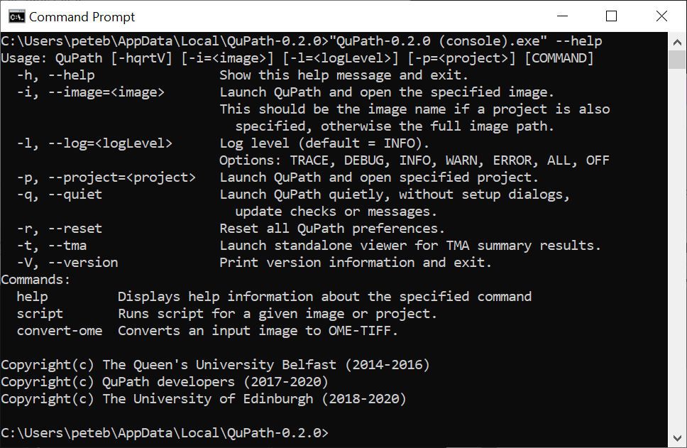
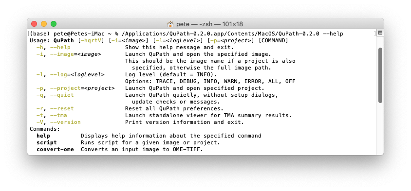
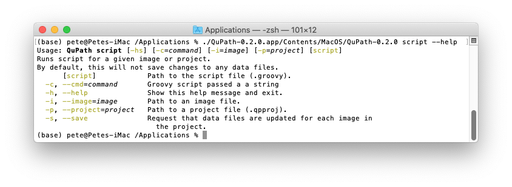

************
Command line
************

QuPath is *mostly* designed to be an interactive application, and this remains the main priority.

However, v0.2.0 introduces a new command line, which makes it possible to:

* Launch QuPath with specific options (e.g. a logging level)
* Run scripts headlessly
* Convert images to OME-TIFF
  
.. tip::
  
  The order in which command line arguments are passed can be important.
  See `this forum post <https://forum.image.sc/t/unexpected-command-line-usage-in-0-2-0-m10-and-greater/38548/2>`_.

Viewing command line options
****************************

The general way to view the command line options is with:

.. code-block:: bash

  QuPath-0.2.0 --help
  
However, there are some platform-specific details on Windows and Mac.

Windows
=======

On Windows, there are two executable files for QuPath.
It is necessary to use *"QuPath (console).exe"* here to be able to view the output, e.g.

.. code-block:: bash

  "QuPath-0.2.0 (console).exe" --help

Mac
===

On macOS, the executable is buried inside the ``.app`` file and therefore you need something like:

.. code-block:: bash

  ./QuPath-0.2.0.app/Contents/MacOS/QuPath-0.2.0 --help

  

Subcommands
***********

Some of the command line functionality is available via *subcommands*, such as ``script``.
Help is available for these separately.

.. code-block:: bash

  QuPath-0.2.0 script --help

