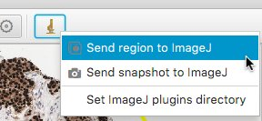
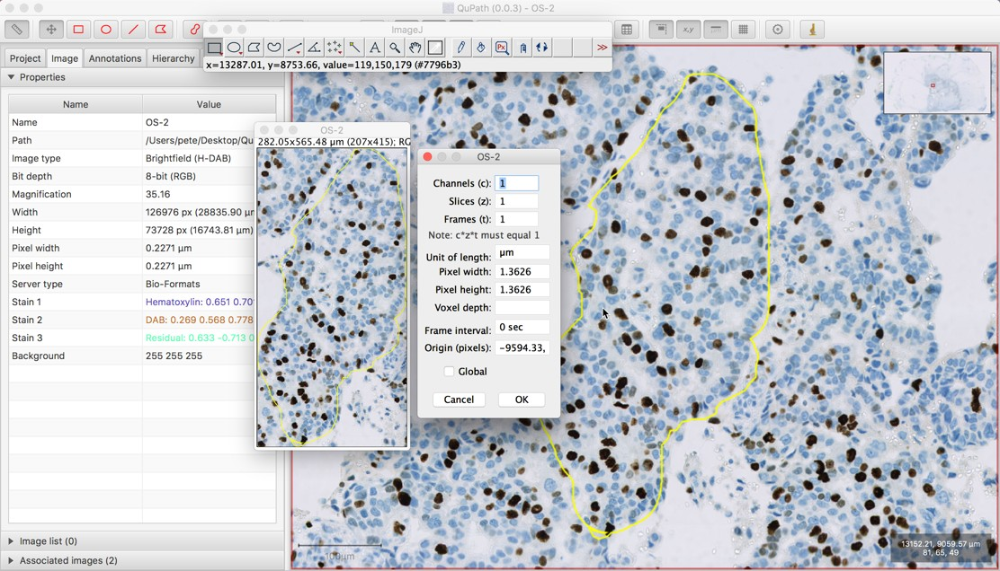
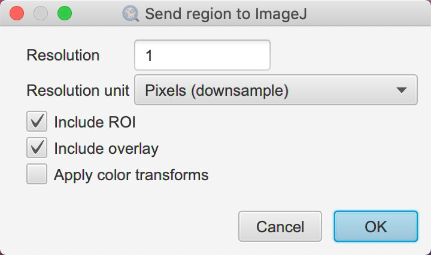
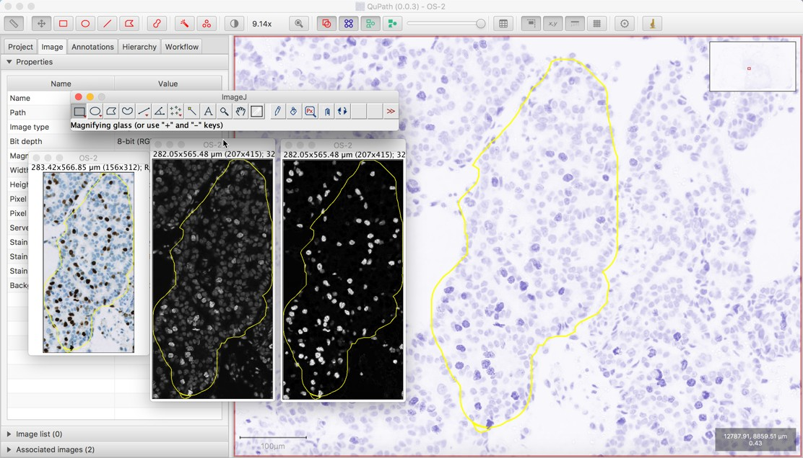
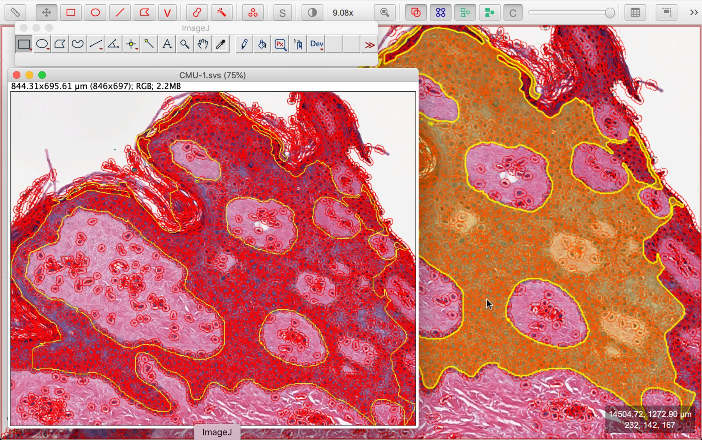
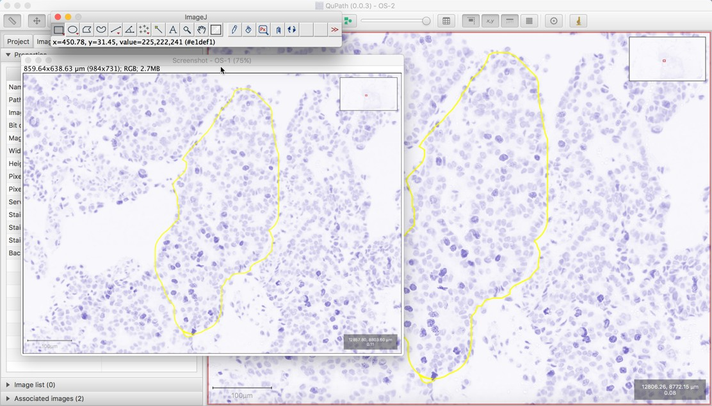
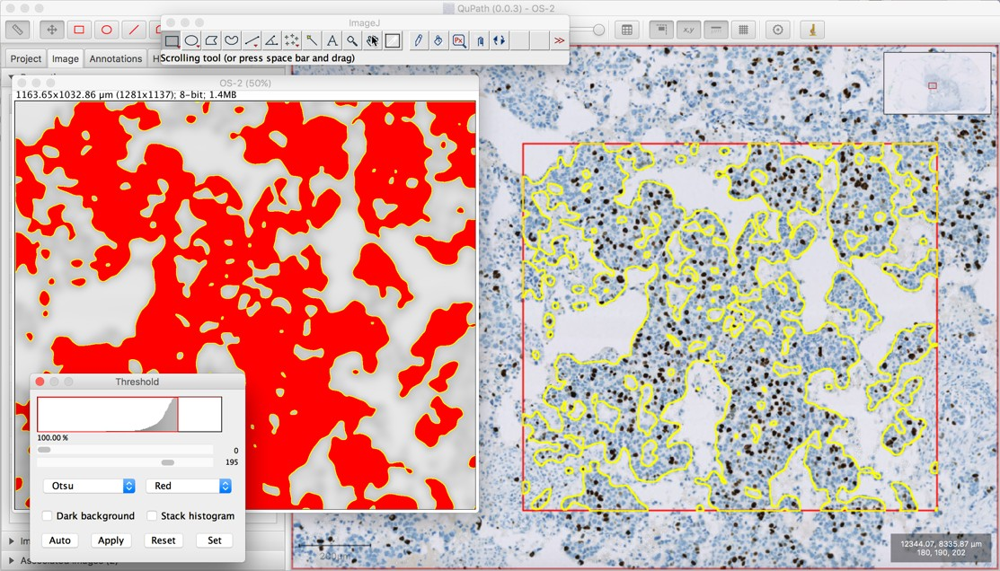
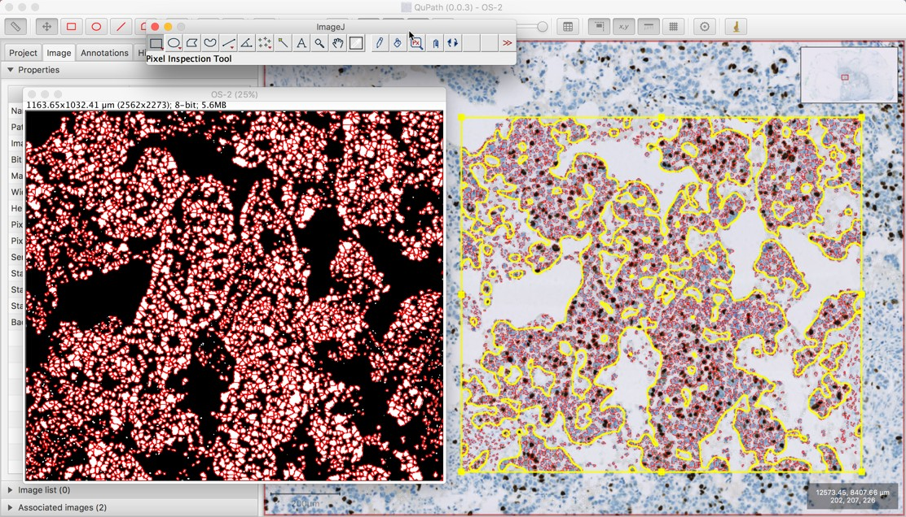

******
ImageJ
******

.. include:: ../tools.txt

QuPath was created by someone who was (and is) a big fan of ImageJ.

Because of this, there is a considerable amount of ImageJ inspiration that has gone into QuPath's design, and a conscious decision made to try to make QuPath more immediately accessible to someone with ImageJ experience.
This ranges from the design of the icons in the toolbar to the choice of some shortcuts.

Part of ImageJ's success comes from its fantastic extensibility, as seen in the `huge range of plugins that have been written for it <https://imagej.nih.gov/ij/plugins/index.html>`_ and the popularity of `Fiji <http://fiji.sc>`_ as an ImageJ distribution for the life sciences.
In fact, QuPath started life as a collection of ImageJ plugins that aimed to extend it for digital pathology, but over time the situation flipped around... so that QuPath was rewritten from scratch as a completely new application, which uses ImageJ as an extension.

.. NOTE::
  Currently, QuPath only integrates directly with the 'original' `ImageJ <http://imagej.nih.gov>`_ - and not with `ImageJ2 <http://www.imagej.net>`_.

There's a lot that QuPath can do that ImageJ can't, especially when it comes to working with whole slide images and object classification.
But it works the other way too: there's also a lot that's possible with ImageJ, but which isn't possible with QuPath alone.
Fortunately, since they are both open source, it's not necessary to choose one or the other - and they can be used together.

Finding ImageJ commands
=======================

The commands described here are accessible from the *ImageJ toolbar button* in QuPath, and also in the :menuselection:`Extensions --> ImageJ` submenu.

  ImageJ menu in the QuPath toolbar

.. NOTE:
  The toolbar button will only be available if you have the ImageJ extension installed.
  But since it's included by default in the main QuPath distribution, you probably do.

Sending image regions to ImageJ
===============================

In general, ImageJ can't open whole slide images directly - the images are just too big (often up to 40 GB when uncompressed), and ImageJ requires all that to be read into the computer's RAM.
QuPath gets around this by quickly pulling out only the bits of the image that it needs at any one moment, and remembering what it has seen before for as long as its memory can cope with.

Using the excellent `Bio-Formats plugin for ImageJ <https://www.openmicroscopy.org/site/support/bio-formats/users/imagej/>`_ it's possible to open some cropped regions of whole slide images within ImageJ, but this involves entering the coordinates for the desired region - which isn't always very easy to do.

The alternative is to open the image within QuPath, and interactively draw an annotation around any region of interest.
Then by clicking on the *Send region to ImageJ* command |icon_extract_image|, ImageJ can be launched and passed the pixels from within the selected region.

  Sending an image region to ImageJ

Downsampling and image calibration
----------------------------------

When running :menuselection:`Send region to ImageJ`, you are requested to choose how much **downsampling** to apply to the region that is passed.

ImageJ menu in the QuPath toolbar
---------------------------------

  ImageJ downsample value

The downsampling effectively determines how much to scale (down) the region.
Higher numbers indicate smaller images or, equivalently, lower magnification.
If the downsampling factor is 1, then the full resolution image will be sent.
If it is 2, then the width and height will both be divided by 2 and the image rescaled accordingly.

This is extremely important, since sending a very large region at the maximum high resolution (i.e. downsample of 1) is quite likely to fail because of the amount of memory required by ImageJ to store the region.
Therefore the area of the region selected to send, along with the downsampling, together control how large an image (in terms of pixels, and therefore memory) will be sent.

In the screenshot above, the downsampling value was set to 4.
However, this information is not lost.
If you open the image properties in ImageJ (:menuselection:`Image --> Properties...`), you see that the pixel size is 4 times larger than it is in QuPath.
This means that measurements made within QuPath and ImageJ should be comparable, because the images in both places have been calibrated accordingly.

.. note::
  The *'Image Properties...'* shown above also indicates that the 'Origin' of the image in ImageJ has been set to something other than the default of (0, 0).
  This tells ImageJ that the image it has was extracted from something larger, and indicates where in the larger image it came from.

  This is what makes it possible to send information from ImageJ back to QuPath, and have it rescaled and translated appropriately.

Color transforms
----------------

The *Send region to ImageJ* command also works with color transforms that can be applied in QuPath using the *Brightness/Contrast...* dialog (or by pressing one of the numeric keys).
These include techniques such as *color deconvolution* to digitally separate stains.

When such a color transform has been applied, QuPath will pass the transformed pixels, not the raw values.

  Sending a color-transformed image region to ImageJ

In the screenshot above, the original image was sent first by running the *Send region to ImageJ* command, and then hematoxylin and DAB transformed images were also sent (separately) in the same way, after applying the appropriate transformed within QuPath.

.. note::
  If you look closely at the screenshot, you should see that the color-transformed images were sent using a different downsample factor compared to the original (RGB) image.
  This is evident not only from the sizes of the images as they are displayed, but also from the text at the top of each of the three image windows - where it can be confirmed that the transformed images are have different sizes in terms of pixels.\

  However, because QuPath sets the image properties (i.e. pixel sizes) while taking the downsampling into consideration, the sizes of the fields of view in µm are almost identical.

QuPath objects and ImageJ ROIs
------------------------------

The closest thing that ImageJ has to a :doc:`QuPath object <../concepts/objects>` is an ImageJ `ROI <https://imagej.nih.gov/ij/docs/guide/146-10.html#toc-Section-10>`_ (*Region Of Interest* - sometimes also called a *Selection*).
Similarly, where QuPath stores multiple objects relating to a single image in a :doc:`hierarchy <../concepts/object_hierarchy>`, ImageJ uses `overlays <https://imagej.nih.gov/ij/docs/guide/146-11.html>`_.

ImageJ ROIs and overlays cannot represent all the same information that can be contained within QuPath objects and hierarchies, but they can contain some.
Consequently, when sending an image region to ImageJ, QuPath uses them to make its best effort to convert its objects into the most ImageJ-friendly form that it can.

  Sending an image region & objects to ImageJ

The screenshot above depicts how this works.
The selected object within QuPath defines the region that will be sent, and - so long as it isn't a rectangle - this becomes converted into a selected ROI in ImageJ (shown in yellow in both applications).
All other QuPath objects within the region are converted into ROIs and added to the ImageJ overlay.

The names of the ROIs are also set according to how they appear in QuPath, often based upon their :doc:`classification <../concepts/classifications>`.
In the above screenshot, the ImageJ command :menuselection:`Image --> Overlay --> To ROI Manager` was run to create the list that is shown, where each ROI's name can be seen.

.. note::
  The selected object from QuPath is only set as an ImageJ ROI if it is not a rectangle, because a rectangle would be identical to the entire image region - so does not contain any additional, useful information.

  If such a 'whole image' rectangular ROI is required in ImageJ, it can easily be created on the ImageJ side with the :menuselection:`Edit --> Selection --> Select All` command.

Sending snapshots
-----------------

Finally, there is also a *Send snapshot to ImageJ* |icon_screenshot|.

This will also launch ImageJ, this time giving it a screenshot from the current viewer instead of raw pixel values.
The result will be similar to what is generated in QuPath with the :menuselection:`Edit --> Copy view to clipboard` command.

  Sending a snapshot image to ImageJ

Note that the snapshot command is really **only** for creating screenshots - not **not** for transferring images for further analysis.
The snapshot that is available within ImageJ will be RGB, and does not contain the pixel values or calibration information that is available when *Send region to ImageJ* is used instead.

Accessing ImageJ plugins
========================

One application of passing image regions to ImageJ is simply to use ImageJ's commands to save the image regions or to create figures.
But it can also be helpful to apply some extra processing within ImageJ, including external plugins such as `ImmunoRatio <http://jvsmicroscope.uta.fi/sites/default/files/software/immunoratio-plugin/index.html>`_.

Because QuPath keeps its own version of ImageJ internally, which does not match with any one you might have installed elsewhere on your computer, it won't necessarily have immediate access to the plugins you want.
However, you can set QuPath's ImageJ to use whichever plugins directory you like - including the plugins directory for an existing ImageJ with :menuselection:`Extensions --> ImageJ --> Set ImageJ plugins directory`.

Sending objects to QuPath
=========================

Sometimes, after you've got an image into ImageJ and done some processing there, you might want to get some information back.
Currently, there are two custom ImageJ plugins provided by QuPath that will allow you to do this.
These are found inside ImageJ's *Plugins* menu (probably at the bottom).

Send ROI to QuPath
------------------

  Sending a ROI from ImageJ to QuPath

Running :menuselection:`Plugins --> Send ROI to QuPath` will take whichever ROI is currently active in ImageJ, and send it to QuPath as an annotation object.
All rescaling etc. will happen automatically.

Send Overlay to QuPath
----------------------

  Sending an overlay from ImageJ to QuPath

Running :menuselection:`Plugins --> Send Overlay to QuPath` will take **all** the ROIs on the current ImageJ overlay, and send them back to QuPath as either annotation or detection objects.
Furthermore, the measurement list for each object can optionally be populated by ImageJ measurements, according to ImageJ's :menuselection:`Analyze --> Set Measurements` specifications - in the same ways as this command is used to specify measurements for the :menuselection:`Analyze --> Analyze Particles...` command.

This provides a way to (for example) run some custom cell detection plugin written for ImageJ, which ends up putting the detected cells only an overlay, and then send back the results to QuPath.

.. note::
  The :menuselection:`Analyze Particles` command has the option of creating ROIs and adding them to an overlay - so this can be a good step along the way to creating an overlay in a QuPath-friendly format.

Running macros
==============

Another excellent feature of ImageJ is its `macro language <http://rsb.info.nih.gov/ij/developer/macro/macros.html>`_, which enables automation in a similar way to QuPath's scripts.
Using this, it's possible to develop custom detection algorithms to apply.
However, applying these one by one via copious use of the *Extract region* command would quickly become tiresome.

Here, QuPath offers an **ImageJ macro runner**.
This enables any ImageJ macro to be run based on extracting image regions from one or more QuPath objects, and optionally return annotations or detections.

Together, these integration features add up to both enabling ImageJ to operate with support for whole slide images, and providing QuPath with a wide-range of pixel-based functionality to supplement its existing object-based tools.

.. note::
  Unfortunately, it is not currently possible to send color-transformed pixels from QuPath to ImageJ through the macro runner.

Macros and parallelization
--------------------------

In QuPath ``v0.1.2``, an 'experimental' ability to run macros in parallel was added (which can be turned on or off in the macro runner dialog).
Parallelization can speed up processing, however it can also have unintended consequences - and therefore is turned off by default.

In particular, if your macro creates additional images (e.g. by duplication, or by splitting color channels), then this can cause a parallelized macro to fail (since macros work with an 'active' image, which changes unpredictably under these circumstances).
The solution in this case is simply to turn off parallelization and run the processing sequentially.

.. admonition:: Technical note

  Integrating QuPath and ImageJ isn't straightforward.

  One of the primary reasons for this is that QuPath's user interface is written using **JavaFX**, while ImageJ (mostly) uses **Java AWT**.

  JavaFX and AWT don't live very happily with one another.
  Each of these has a particular thread used for interacting with the GUI... and it is (`officially, at least <https://bugs.openjdk.java.net/browse/JDK-8087465?focusedCommentId=13763730&page=com.atlassian.jira.plugin.system.issuetabpanels:comment-tabpanel#comment-13763730>`_) a different thread in each case.
  This can lead to some stability problems or errors appearing.

  The data exchange functions within QuPath try to take care of this using the ``Platform.runLater`` and ``EDT.invokeLater`` methods.
  Any developer looking to develop any further ImageJ plugins or QuPath extensions to share data will need to be cautious about this too.

  Finally, JavaFX vs. AWT is the cause of an `irritating bug <https://github.com/qupath/qupath/issues/6>`_ within QuPath whereby the ImageJ menubar is appended to the end of the QuPath menubar whenever ImageJ is launched - and it doesn't go away easily.
  Any fixes for this issue would be much appreciated...
