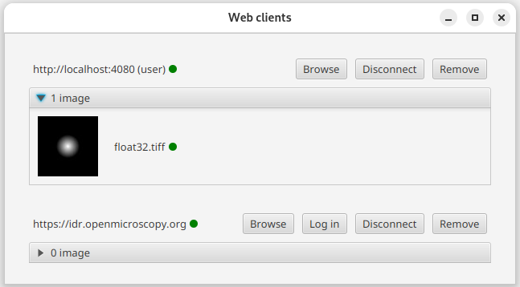

*****
OMERO
*****

This page describes how to use the built-in OMERO extension in QuPath to access and interact with images hosted on OMERO servers. The installation instructions for this extension can bse found `here <https://github.com/qupath/qupath-extension-omero>`_.

.. warning::

  This extension makes use of the `OMERO JSON API <https://docs.openmicroscopy.org/omero/5.6.0/developers/json-api.html>`_, which currently only allows rendered images to be accessed. If you need the raw pixels for your analysis, consider downloading your files locally rather than accessing them from OMERO via QuPath.

Adding OMERO images to your project
===================================

QuPath can import OMERO images to a project via their links. This can be done in three ways:

* :menuselection:`File --> Open URI...` (Shortcut :kbd:`Ctrl + Shift + O`) and enter the URL of your OMERO image.
* :menuselection:`File --> Project --> Add images` and click 'Input URL' or 'From clipboard'.
* Via the OMERO Browser (see `Browsing an OMERO server`_).

Should the server require authentication, QuPath will prompt you to enter your credentials and will handle the permission issues. For more information about OMERO accounts in QuPath, see `Managing OMERO clients`_.

.. admonition:: URL formats

  QuPath only accepts the following OMERO URL formats:

  * ``https://<server>/webclient/?show=image-<imageId>``
  * ``https://<server>/webgateway/img_detail/<imageId>/?dataset=<datasetId>``
  * ``https://<server>/iviewer/?images=<imageId>&dataset=<datasetId>``
  * ``https://<server>/webclient/img_detail/<imageId>/?dataset= <datasetId>``

  E.g. http://idr.openmicroscopy.org/webclient/?show=image-1920093

.. tip::
  QuPath now also accepts links to datasets and projects (screens/wells/plates are not yet implemented), in which case all the compatible images inside them will be fetched and added to the current project. The supported URL formats for projects and datasets are the following:

  * ``https://<server>/webclient/?show=project-<projectId>``
  * ``https://<server>/webclient/?show=dataset-<datasetId>``

Browsing an OMERO server
========================

You can browse OMERO servers via the :menuselection:`Extensions --> OMERO --> Browse server...` command.

The menu will list all the servers that were opened in the current QuPath session, from which you can choose the one to browse.

.. figure:: images/omero_browse_new_servers.JPG
  :class: shadow-image
  :align: center
  :width: 87%

  How to browse an OMERO server

.. note::
  The list of servers is the same one used in the OMERO web client window (see `Managing OMERO clients`_).

Alternatively, you can provide a new OMERO server (with which no connection was previously established) to browse by clicking on 'New server...'.
The URL to provide should not contain any `URL query <https://en.wikipedia.org/wiki/Query_string>`_ or unnecessary characters.

.. figure:: images/omero_browse_new_server_link.JPG
  :class: shadow-image
  :align: center
  :width: 87%

  E.g. ``https://<server>.com``, **not** ``https://<server>.com/webclient/?show=image-001)``

The browser will display all the projects, datasets and images filtered by OMERO group and owner. The design is very similar to OMERO's webclient.

.. figure:: images/omero_browser.JPG
  :class: shadow-image
  :align: center
  :width: 87%

  The OMERO browser (http://idr.openmicroscopy.org)

You can add an individual image to your project by double-clicking on it. Alternatively, select the relevant projects/datasets/images and click 'Import OMERO project/dataset/image/selected'.

.. Tip::
  You can display more OMERO information on the selected file such as tags, key-value pairs and comments with :menuselection:`right click --> More info...`.

To query a file on the OMERO server, one can also access the 'Advanced...' feature, which will search the dataset for the input query. Again, the results can be opened by either double-clicking on them or by selecting them and clicking 'Import project/dataset/image/OMERO objects'.

  Advanced search

Send objects back to your OMERO server
======================================

When working on an image from a remote OMERO server, QuPath can send annotations and detections back to the OMERO server. To do so, select the objects that you want to send back on your image, then click :menuselection:`OMERO --> Send selection to OMERO server` and confirm the operation.

As the object classes between OMERO and QuPath are different, some information might be ignored/lost. For instance, all QuPath objects (**annotation** and **detection** objects) will be represented as OMERO **ROIs** when sent back.

.. list-table::
   :widths: 50 50
   :align: center

   * - |pic1|
     - |pic2|
   * - Two QuPath annotations
     - Two OMERO ROIs

.. |pic1| image:: images/fully_reproducible_qupath.jpg
   :width: 100%
   :class: shadow-image

.. |pic2| image:: images/fully_reproducible_omero.jpg
   :width: 100%
   :class: shadow-image

Managing OMERO clients
======================

.. sidebar:: Status refresh

  Disconnection/reconnection to any OMERO server forces the window to refresh, so connection statuses should always be accurate.

QuPath allows you to manage all active OMERO clients.
To display a pane with all active and non-active OMERO clients used in the current session, navigate to :menuselection:`Extensions --> OMERO --> Manage server connections`.

There, a window displaying the servers to which a previous connection was made, allows you to log in, log out and remove (forget) it.

If an account with authentication is currently connected to the server, its username will be written in parenthesis next to the server’s URL.

The green circle next to a server indicates whether the account is logged in to it (which will always be green if the server is public). The green circle next to the images’ URI indicates whether the image can be accessed with the current account.

  Manage OMERO server connections

In the example above, the second server (http://idr.openmicroscopy.org) has public user configured and can be reached without credentials (no username/password).

.. Note::
  You can still attempt a login to a public server, which is sensible if you have some private data requiring authentication hosted on it.

If clicking 'Log out' next to the first server, the following will happen:

.. figure:: images/omero_manage_clients_not_logged_in.png
  :class: shadow-image
  :align: center
  :width: 87%

  Logging out of an OMERO server

In the example above, the first client (MelvinGelbard) is no longer logged in to the server (https://ome-demoserver.openmicroscopy.org). QuPath can neither reach the server nor open the image listed. You can either log back in ('Log in') or remove the client altogether.
The second server (http://idr.openmicroscopy.org) is public - therefore requires no username - and can be reached.

.. Note::
  * Different OMERO accounts can be logged in to different remote servers simultaneously (e.g. account A to server X and account B to server Y). But a remote server can only be reached with **one** OMERO account simultaneously.
  * Be aware that the 'Manage server connections' window displays how QuPath handles OMERO webclients. It does not directly relate to your project. E.g. deleting a project entry or switching projects will not affect the OMERO connections in any way, and vice-versa.
