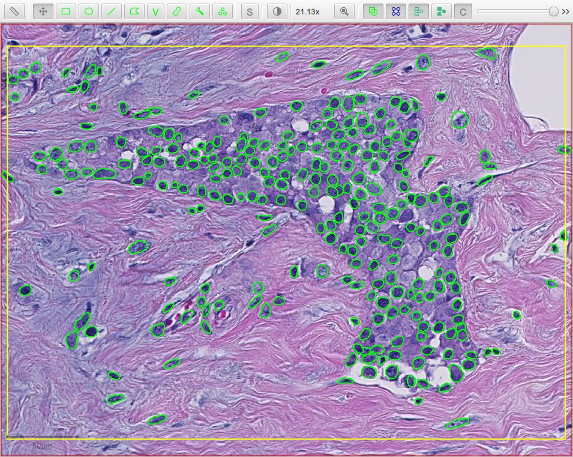
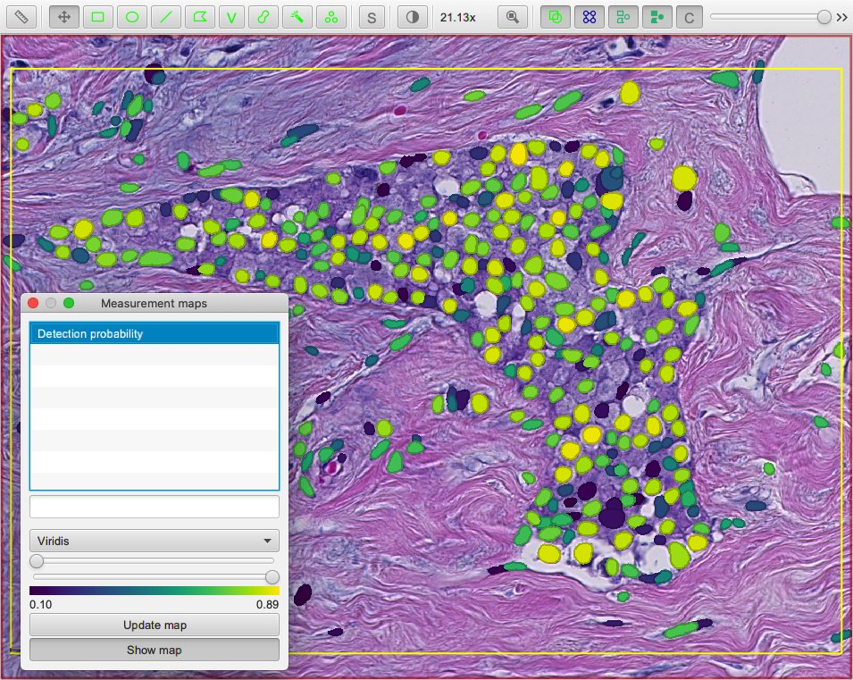

********
StarDist
********

StarDist is a fantastic, deep-learning-based method of 2D and 3D nucleus detection from Martin Weigert and Uwe Schmidt.
It exists as a `Python library <https://github.com/mpicbg-csbd/stardist>`_ and `Fiji plugin <https://github.com/mpicbg-csbd/stardist-imagej>`_.

This page describes how to start using StarDist 2D directly within QuPath as an alternative method of cell detection.

.. admonition:: Cite the paper!
  
  If you use StarDist in a publication, be sure to cite it:
  
    * Uwe Schmidt, Martin Weigert, Coleman Broaddus, and Gene Myers. `Cell Detection with Star-convex Polygons <https://arxiv.org/abs/1806.03535>`_. *International Conference on Medical Image Computing and Computer-Assisted Intervention (MICCAI)*, Granada, Spain, September 2018.
  
  (And if you use it in combination with QuPath, be sure to :doc:`cite the QuPath paper too <../intro/citing>`!)

.. warning:: 
  
  This is a provisional feature, hastily created for the NEUBIAS webinar on QuPath in April 2020, and released under mild duress from attendees.
  You can find both the StarDist and QuPath webinars on the `NEUBIAS YouTube channel <https://www.youtube.com/c/neubias>`_.
  
  If it already works for you, great!
  If not, please be patient -- and be aware that it may change substantially as QuPath is developed further.

Building QuPath with TensorFlow
===============================

StarDist requires TensorFlow, which is not currently included in the main QuPath distributions.

To get this, you will need to build QuPath and enable the optional TensorFlow module.
See :doc:`../reference/building` for details.

You will need to add either ``-Ptensorflow-cpu=true`` or ``-Ptensorflow-gpu=true`` parameters, depending upon whether TensorFlow should use a graphics card or not.
For example:

.. code-block:: bash
  
  gradlew clean build createPackage -Ptensorflow-cpu=true
  

.. tip::
  
  It is highly recommended to use ``-Ptensorflow-cpu=true`` unless you are happy to independently resolve the inevitable GPU troubles (e.g. installing the right versions of CUDA, CuDNN).
  
  Because TensorFlow is being used only for inference (not training), and because the deep learning prediction forms only one part of the full cell detection algorithm, the differences in speed from switching between CPU and GPU can be quite modest.
  

Getting pretrained models
=========================

You will need a StarDist model that has been pretrained on a wide range of images to identify nuclei that are (somewhat) similar to the nuclei in your images.

Currently, you can find several such models from the authors of StarDist at `<https://github.com/mpicbg-csbd/stardist-imagej/tree/master/src/main/resources/models/2D>`_.

The two we will consider here are:

* *dsb2018_heavy_augment.zip* - for fluorescence images (one detection channel)
* *he_heavy_augment.zip* - for brightfield H&E (three detection channels, RGB)

You can download and unzip the models so they can be used with QuPath.

.. tip::
  
  See the original StarDist papers and GitHub repos for information about training your own models.

.. tip::
  
  The *he_heavy_augment* model is capable of more than one might legitimately expect.
  
  .. figure:: images/stardist_madness_small.gif
    :class: shadow-image
    :width: 75%
    :align: center

    StarDist applied to region of OS-3.ndpi
  
  

Detecting nuclei
================

QuPath's current early StarDist support is **only available by scripting** and is rather limited in terms of reporting progress.
You can run it and... wait.

The following script applies the *he_heavy_augment* StarDist model to a brightfield H&E image:

.. code-block:: groovy
  
  import qupath.tensorflow.stardist.StarDist2D

  // Specify the model directory (you will need to change this!)
  def pathModel = '/path/to/he_heavy_augment'

  def stardist = StarDist2D.builder(pathModel)
        .threshold(0.5)              // Prediction threshold
        .normalizePercentiles(1, 99) // Percentile normalization
        .pixelSize(0.5)              // Resolution for detection
        .build()

  // Run detection for the selected objects
  def imageData = getCurrentImageData()
  def pathObjects = getSelectedObjects()
  if (pathObjects.isEmpty()) {
      Dialogs.showErrorMessage("StarDist", "Please select a parent object!")
      return
  }s
  stardist.detectObjects(imageData, pathObjects)
  println 'Done!'

  StarDist applied to region of OS-1.ndpi

.. tip:: 
  
  You can copy the model directory outside QuPath (e.g. in Windows Explorer, Mac Finder) and then paste it in the script editor.
  QuPath will paste in the path to the directory.
  
  Be sure to keep the quotation marks around the path!

The following script applies the *dsb2018_heavy_augment* model to the DAPI channel of a fluorescence image:

.. code-block:: groovy
  
  import qupath.tensorflow.stardist.StarDist2D

  // Specify the model directory (you will need to change this!)
  def pathModel = '/path/to/dsb2018_heavy_augment'

  def stardist = StarDist2D.builder(pathModel)
          .threshold(0.5)              // Probability (detection) threshold
          .channels('DAPI')            // Specify detection channel
          .normalizePercentiles(1, 99) // Percentile normalization
          .pixelSize(0.5)              // Resolution for detection
          .build()

  // Run detection for the selected objects
  def imageData = getCurrentImageData()
  def pathObjects = getSelectedObjects()
  if (pathObjects.isEmpty()) {
      Dialogs.showErrorMessage("StarDist", "Please select a parent object!")
      return
  }
  stardist.detectObjects(imageData, pathObjects)
  println 'Done!'

.. figure:: images/stardist_nuclei_luca.jpg
  :class: shadow-image
  :width: 75%
  :align: center

  StarDist applied to region of *LuCa-7color_[13860,52919]_1x1*

.. tip:: 
  
  For a fluorescence image with more than one channel, the channel used for detection needs to be specified either using its number (starting from 0) or name.
  

Customizing detection
=====================

The 'builder' used in the scripts above introduce many ways to easy customize how the StarDist detection is applied and the final outputs.

One of the most important options is the ``pixelSize``, which is defined in terms of the pixel calibration units for the image (often µm, but sometimes 'pixels' if the calibration information is not available).
QuPath will automatically rescale the image as required before input to TensorFlow.

The 'best' value will depend upon the resolution of the images used to train the StarDist model.
You can experiment with different values.

.. tip::
  
  I find that the pretrained models work best at around 0.5 µm/pixel.

Viewing probabilities
---------------------

Another customization is to include the probability estimates as measurements for each detection.

.. code-block:: groovy
  
  import qupath.tensorflow.stardist.StarDist2D

  // Specify the model directory (you will need to change this!)
  def pathModel = '/path/to/he_heavy_augment'

  def stardist = StarDist2D.builder(pathModel)
          .threshold(0.1)              // Prediction threshold
          .normalizePercentiles(1, 99) // Percentile normalization
          .pixelSize(0.5)              // Resolution for detection
          .includeProbability(true)    // Include prediction probability as measurement
          .build()

  // Run detection for the selected objects
  def imageData = getCurrentImageData()
  def pathObjects = getSelectedObjects()
  if (pathObjects.isEmpty()) {
      Dialogs.showErrorMessage("StarDist", "Please select a parent object!")
      return
  }
  stardist.detectObjects(imageData, pathObjects)
  println 'Done!'
  

These probabilities can then be visualized in QuPath through measurement tables or maps.
This can be useful to help choose appropriate threshold values; you could set a much lower detection threshold to 'over-detect' (as in the above script) and use the output probabilities to determine an appropriate cutoff threshold for the future.

  StarDist with probability estimates applied to region of OS-1.ndpi
  
.. tip::
  
  In principle, you could *always* use a low detection threshold and discard false positives later.
  However, QuPath does need to work quite hard to resolve overlapping detections - and so performance should be substantially improved if you can restrict your initial detections to only cells you will want to keep.
  

Cell expansion & measurements
-----------------------------

QuPath's built-in :doc:`cell detection <../tutorials/cell_detection>` can optionally expand nuclei to approximate the full cell area, and then make measurements of different cell compartments (nucleus, cytoplasm and both).

A similar distance-based expansion can also be used with StarDist, with optional measurements.

.. code-block:: groovy

  import qupath.tensorflow.stardist.StarDist2D

  // Specify the model directory (you will need to change this!)
  def pathModel = '/path/to/dsb2018_heavy_augment'

  def stardist = StarDist2D.builder(pathModel)
          .threshold(0.5)              // Probability (detection) threshold
          .channels('DAPI')            // Select detection channel
          .normalizePercentiles(1, 99) // Percentile normalization
          .pixelSize(0.5)              // Resolution for detection
          .cellExpansion(5.0)          // Approximate cells based upon nucleus expansion
          .cellConstrainScale(1.5)     // Constrain cell expansion using nucleus size
          .measureShape()              // Add shape measurements
          .measureIntensity()          // Add cell measurements (in all compartments)
          .includeProbability(true)    // Add probability as a measurement (enables later filtering)
          .build()

  // Run detection for the selected objects
  def imageData = getCurrentImageData()
  def pathObjects = getSelectedObjects()
  if (pathObjects.isEmpty()) {
      Dialogs.showErrorMessage("StarDist", "Please select a parent object!")
      return
  }
  stardist.detectObjects(imageData, pathObjects)
  println 'Done!'

.. figure:: images/stardist_cells_luca.jpg
  :class: shadow-image
  :width: 75%
  :align: center

  StarDist + QuPath cell detection and measurement

StarDist stops after nuclei have been detected; everything after that is 'pure QuPath'.

Nevertheless, the script above provides access to some additional features not (currently) available in QuPath's default cell detection.
These include:

* Slightly different (improved!) measurements
* Measurements also made in the predicted 'membrane'
* Extra cell expansion constraint; in addition to distance, the nucleus can be constrained so that it does not grow to more than a multiple of the nucleus size

.. warning::
  
  The cell expansion currently uses an elaborate, geometry-based method -- rather than the pixel-based approach in the built-in cell detection command.
  
  This gives much smoother results independent of image resolution, but it can produce artifacts in some (hopefully rare) cases.
  
  These artifacts are not present if StarDist is used without cell expansion.
  
  .. figure:: images/stardist_expansion_artifacts.jpg
    :class: shadow-image
    :width: 60%
    :align: center

    Artifacts to look out when using geometry-based cell expansion.

More options
------------

There are more options available than those described here in detail.
Here is an example showing more of them:

.. code-block:: groovy

  def stardist = StarDist2D.builder(pathModel)
          .threshold(0.5)              // Probability (detection) threshold
          .channels('DAPI')            // Select detection channel
          .normalizePercentiles(1, 99) // Percentile normalization
          .pixelSize(0.5)              // Resolution for detection
          .tileSize(1024)              // Specify width & height of the tile used for prediction
          .cellExpansion(5.0)          // Approximate cells based upon nucleus expansion
          .cellConstrainScale(1.5)     // Constrain cell expansion using nucleus size
          .ignoreCellOverlaps(false)   // Set to true if you don't care if cells expand into one another
          .measureShape()              // Add shape measurements
          .measureIntensity()          // Add cell measurements (in all compartments)
          .includeProbability(true)    // Add probability as a measurement (enables later filtering)
          .nThreads(4)                 // Limit the number of threads used for (possibly parallel) processing
          .simplify(1)                 // Control how polygons are 'simplified' to remove unnecessary vertices
          .doLog()                     // Use this to log a bit more information while running the script
          .build()

.. tip::
  
  In the event that you want to measure 'a ring around the nucleus' and avoid all the computational kerfuffle involved in preventing overlaps, use ``ignoreCellOverlaps(true)``.

Differences from StarDist Fiji
==============================

While inspired by the Fiji plugin, the QuPath implementation does not use any of the same code - and the method has been adapted and augmented in several ways to be more QuPath-friendly.
These include:

* More customization options (e.g. specifying resolution, input channels)
* Cell boundary estimation by expansion
* Adding measurements (including prediction probabilities)

Another difference is in how overlapping nuclei are handled.
The Fiji plugin allows overlaps, controlled with an overlap threshold parameter.

QuPath does not permit overlapping nuclei.
Rather, it handles overlaps by retaining the nucleus with the highest prediction probability unchanged, and removing overlapping areas from lower-probability detections - discarding these detections only if their area decreases by more than 50%.
