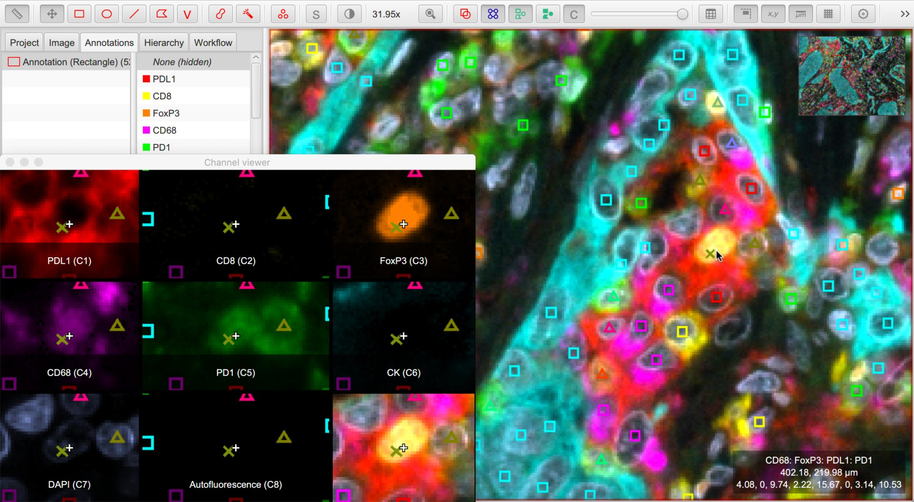

****************
Classifications
****************

:doc:`Objects <objects>` in QuPath can each have one classification.

Sometimes the classification is `null`, indicating that the object is 'unclassified'.
At other times the classification might have been set manually by the user, or automatically using machine learning.

Both processes of setting classifications :doc:`have already been described <../tutorials/cell_classification>`; here, our focus is on how the classification really works.

=========================================
Classifications & derived classifications
=========================================

The fact that an object has only *one* classification initially seems very limiting.

However, a lot of information can be encoded within the classification.
This is because classifications in QuPath can optionally be *derived* from other classifications.

A common example of this is when cells are subclassified according to staining intensity.
The :doc:`../tutorials/cell_classification` tutorial shows the example of cells being classified firstly as *Tumor* or *Stroma*.
These are the *base* classifications.
The cells were then subclassified as *Positive* or *Negative*.

This two-step process produced four distinct classifications:

* *Tumor: Positive*
* *Tumor: Negative*
* *Stroma: Positive*
* *Stroma: Negative*

Each cell then had one of these four classifications.

There is nothing special about the base classifications *Tumor* and *Stroma*; these could be swapped for anything.
But the key thing is that all four classifications are distinct and can be applied to any object, yet all four encode information that enables QuPath to determine their similarities.

Consequently, QuPath is able to automatically give not only the numbers of cells with each classification, but also the numbers of tumor cells and stromal cells separately, and the percentages of positive tumor and stromal cells (both separately and combined).

.. admonition:: Hierarchies of objects & hierarchies of classifications

  One can think of classifications and subclassifications like a hierarchy, with 'base' classifications and then other classifications derived from them.
  
  .. figure:: images/classification_hierarchy.png
    :width: 60%
    :align: center

  This is reminiscent of the :doc:`object hierarchy <object_hierarchy>`, but in practice they are quite distinct.
  
  One important difference is that each classification knows the classification from which it has been derived (if any).
  But it does *not* know any classifications that have been derived from it.
  
  In other words, one can take the classification *Tumor: Positive* and immediately see that it has a parent classification *Tumor*.
  But if we have the classification *Tumor*, we don't immediately know what - if any - subclassifications exist.
  This is unlike the object hierarchy, where you can start with any object and then query both its parent and its children.
  
  This makes sense: the actual classification applied in QuPath is the one that contains *all* the required information.
  One can then 'look upwards' to determine all the pieces of information that have been encoded within that classification by checking the names of the classifications from which it has been derived.

=========================
Intensity classifications
=========================

From the classifications mentioned above, there is nothing special about *Tumor* and *Stroma*.

There *is* however something special about *Positive* and *Negative*.
These are examples of *intensity classifications*, and they are used by QuPath to automatically create :doc:`summary statistics <measurements>` such as the percentage or density of positive cells.

Other intensity classifications are *1+*, *2+*, *3+*, which are used to indicate weakly, moderately and strongly positive staining - used to dynamically calculate *H-scores*.

.. admonition:: H-scores

  H-scores are commonly used in pathology, as they are (somewhat) amenable to visual evaluation in a (kind of) quantitative(ish) way.
  
  H-scores are calculated by estimating (or otherwise determining) the percentage of cells in each category (Negative, 1+, 2+, 3+) and multiplying this by the number associated with the category (0, 1, 2, or 3) - then summing the results.
  
  The results then range from 0--300, where 0 indicates 'all cells are negative', and 300 indicates 'all cells are strongly positive'.
  There are different routes to H-scores that fall between these limits.

================================
Double-positive, triple-positive
================================

The standard intensity classifications above are fine if there is *one* thing that each object might be positive for.

It isn't enough if there are *multiple* things, e.g. counting double-positive or triple-positive cells.
In such cases, we need to find a more creative way of applying QuPath's classifications.

The :doc:`../tutorials/multiplex_analysis` tutorial shows this in action.
Here, we create derived classifications where each component of the classification indicates that the cell is considered positive for the marker with that name.

We no longer need *Positive* and *Negative* subclassifications; rather, if a cell is (for example) *CD3 +ve* then its classification contains one component with the name *CD3*.
If its classification does not, the cell is considered to be *CD3 -ve*.

========================
Ignored* classifications
========================

There is one other classification concept, which is a relatively recent addition to QuPath: that of 'ignored' classes.

These are like normal classifications, but under some particular circumstances they are... well, ignored.
This includes when making measurements or converting classifications to objects.

You can distinguish these classes by the asterisk at the end of their name, e.g. *Ignore** and *Region**.

.. admonition:: Why have ignored classes?
   
  Ignored classes fill the gap between objects with meaningful classifications and those that are completely unclassified.
  One reason this is necessary is because unclassified annotations cannot be used to train a classifier -- but we often still need to identify regions we *aren't* interested in so that we can distinguish them from the regions we *are* interested in.

  They are basically a way to express 'I want you to find this, so that you can ignore it'.
    
  Ignored classes are also useful with :doc:`thresholding <../tutorials/thresholding>` for situations where you wish to identify regions but don't necessarily care what classification they might have.

.. tip::
  
  I typically use *Ignore** for areas of whitespace or artifact.

  I use the *Region** class to define areas where I don't care what the classification is -- but I do still want to distinguish it from anything that is unclassified.
  
