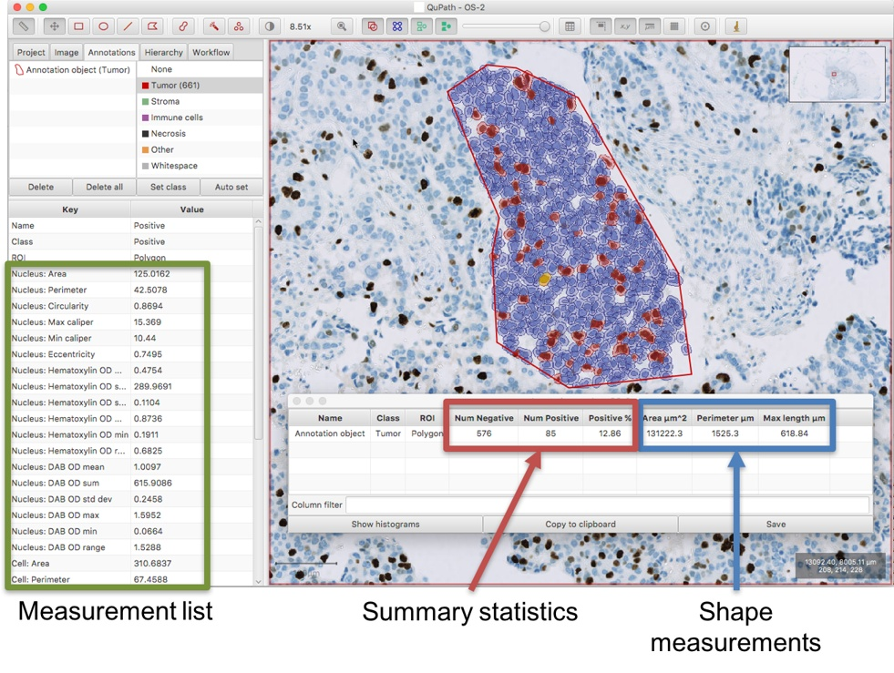
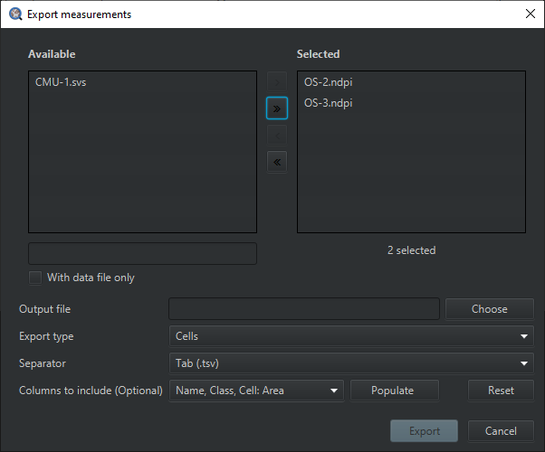

************
Measurements
************

In :doc:`Objects <objects>`, it was stated that all objects have their own measurement lists.
While true, this is not the whole story.

==============================
Different kinds of measurement
==============================

There are actually three main sources of measurements for individual objects within QuPath:

1. **Measurement lists** (static)
2. **Shape statistics** (dynamic)
3. **Summary statistics** (dynamic)

The main difference between them is whether they are static (i.e. unchanging) or dynamic (i.e. updating automatically).

Measurement lists
=================

**Measurement lists** are, as the name suggests, basically just lists of measurement names and their numeric values.
These values are usually fixed when the objects is created, or added or updated by running a specific command (e.g. feature smoothing, or to add intensity features).

They are mainly important with **detections**, and provide the features used when training a classifier (see :doc:`../tutorials/cell_classification`).

Shape statistics
================

**Shape statistics** are calculated for each ROI.
They are mainly used with **annotations** and important when manually measuring structures.

QuPath can show the shape statistics for each annotation, adapted for the ROI type (e.g. length for lines, areas for areas, counts for numbers of points).
They are not stored statically in measurement lists because it is possible that the ROI for an annotation changes (e.g. if it is being drawn or moved).

Summary statistics
==================

**Summary statistics** are calculated for each **annotation** or **TMA core object** based upon whatever is known about it.

This could be the number of child or descendant objects of a particular class, or the percentage of positive cells falling within it.
These are important as the final output for biomaker scores, e.g. to provide Allred or H-scores.

====================
Viewing measurements
====================

When viewing a results table, the actual measurements can be pulled from any or all of these sources.
The user generally doesn't have to care where the measurements came from, but the distinction is crucial when scripting or trying to decipher the details of what is going on.

Of particular importance, measurement lists need to be explicitly updated and so should be used for 'permanent' measurements.
The other measurements need to be calculated dynamically.

In this regard, it is strongly preferable that summary statistics are dynamic because it's usually the case that the numbers and classifications of descendant objects could change at any moment... and it's essential to ensure that when a parent object is asked for summary measurements, they are always up-to-date.

  Illustration of the different measurement types within QuPath. |br|
  The measurement list on the left relates to the individual selected cell shown in yellow (a **detection** object).
  The measurement table contains both summary and shape statistics for the polygonal **annotation** object.

The summary statistics are based upon the detection objects descended from the annotation.
More information is given in :doc:`object_hierarchy`.

======================
Exporting measurements
======================

The cleanest way to export different types of measurements in QuPath is with the **Measurement Exporter**.
Provided that your images are stored in a :doc:`project <../tutorials/projects>`, you can access it through :menuselection:`Measure --> Export measurements`.

  The Measurement Exporter

From there, you can decide from which image(s) the measurements will the be exported (similarly to the `Run for project <https://qupath.readthedocs.io/en/latest/docs/scripting/workflows_to_scripts.html#running-a-script-for-multiple-images>`_ command in the script editor).
Below the image selection, a small amount of parameters will allow you to shape your output file as you desire:

1. **Output file**: The desired `full path` location of your output file
2. **Export type**: The measurement type to be exported (e.g. cells)
3. **Separator**: The character that will be written to separate the measurement values (e.g. comma)
4. **Columns to include** (optional): The list of measurements to include in the export (if left empty, all existing measurements are included)

.. note::
  If you wish to **only** export specific measurements, the **Populate** button is what you need. This will populate a list from which you can choose the exact columns to include in the export.
  Therefore, you will need to have images selected (
  This list is constructed after performing a scan of all the selected images to check which measurements exist, and should only take a couple of seconds.

  Note that if an image is missing measurements for a specified column, empty values will be written to the output file.

.. important::

  If you have an open image in an active viewer, be sure to always save your data before running the measurement exporter.
  A small red-colored warning will appear to notify you if this is the case.

==================================
A warning about summary statistics
==================================

It is important to be aware that **not all summary measurements are necessarily dynamic**.
The most common ones for pathology that are built-in to QuPath (e.g. H-score, Positive %) are dynamic, but others that are added elsewhere may not be.
It really depends upon how the person who wrote the code to make the measurement designed it.

For example, if you run a particular script to calculate a new measurement somewhere, it is possible that it creates a static measurement and adds it to a measurement list - in fact, this is actually quite likely, because it is easiest for the developer of the script to do it this way.
This means that, if you want this measurement to be updated later whenever you make further changes, you probably need to run the script again.

Therefore be careful with measurements, and try to always check that you have definitely measured what you think you have, e.g. by moving or deleting an object that you predict should have an effect on the measurement to see if the measurement in question updates (i.e. it is dynamic) or not.

.. note::

  Because this can be confusing, in the future QuPath may make it clearer when measurements are dynamic and when they are not.
  It is also planned to make it easier for developers to write their own dynamic measurements.
