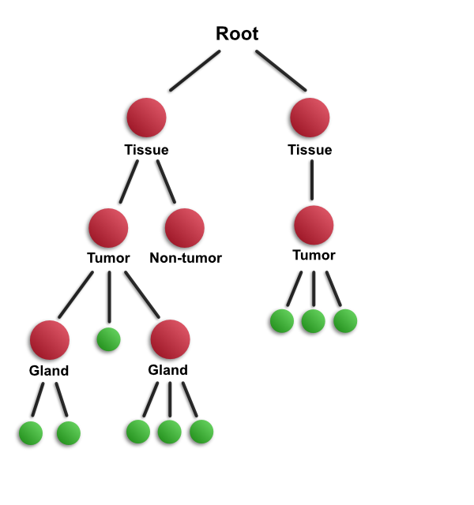
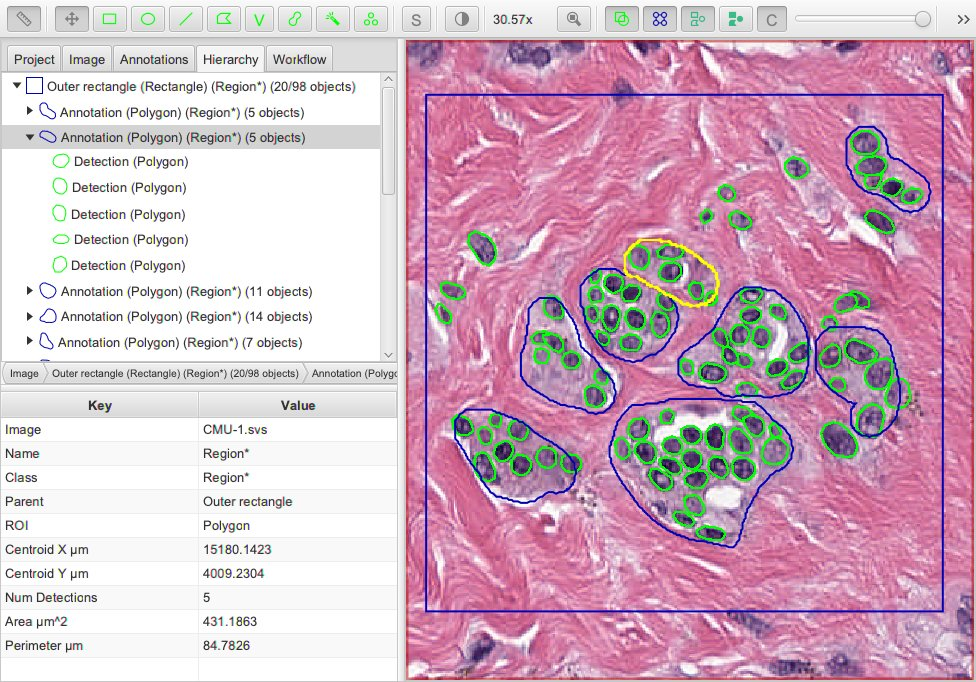

****************
Object hierarchy
****************

:doc:`Objects <objects>` in QuPath need to be stored somewhere - and that place is the *object hierarchy*.  

.. important::
  
  The hierarchy behavior has changed in v0.2.0! |br|
  If you are familiar with the old behavior, be sure to read :ref:`Differences from QuPath v0.1.2`.
  
The name comes from the fact that the objects are all stored in a hierarchical, tree-like structure.
This is achieved by each object having having a reference to:

* One **parent object**
* Zero or more **'child' objects**

You can think of a bit like a family tree, except for the fact that an object only ever has one parent.
'Child objects of child objects' can be considered descendants.

Representing parent/child relationships makes it possible to use simple objects as the building blocks for more complex representations of image content within QuPath.

For example, an entire tissue section could be considered as one (large) object, and inside it there might be tens of smaller child objects representing different structures (e.g. vessels, tumor and stromal regions), and inside each of these there may be hundreds of further child objects that are smaller still - the individual cells.
There might even be additional, subcellular structures.

Once we can identify the objects in an image and their key relationships, generating image analysis results typically involves simply summarizing this information.

  
  Schematic illustration of an object hierarchy in QuPath.
  Annotations are shown in red, detections in green.
  

.. admonition:: How important is the object hierarchy?
  
  Not every analysis application needs this hierarchy information, and it can be computationally expensive to maintain all the relationships unnecessarily.
  Sometimes it is better to treat objects in QuPath as simply existing in a single flat list.
  
  In QuPath v0.2.0, you can choose to what extent you rely on maintaining hierarchical relationships between objects.
  But regardless of how much you use it, it's important to know the concept exists.

=================================
The root object & its descendants
=================================

At the base of the object hierarchy is the **root object**.

The root differs from the :doc:`annotation and detection objects <objects>` we met previously in two main ways:

* the root object doesn't have a parent
* the root object doesn't have a region of interest (ROI); rather, it relates to the entire image

Each image in QuPath has only one root object associated with it.
Every other object is either one of the direct children of the root, or a more distant descendant.

=========================
Visualizing the hierarchy
=========================

The tree structure of the object hierarchy can be visualized under the :guilabel:`Hierarchy` tab.
The root object is omitted, but all other objects can be displayed.

  
  Viewing the object hierarchy in QuPath.

.. tip::
  
  In QuPath, it is common to have hundreds of thousands - or even millions - of objects in a single hierarchy.
  Usually, most of these are detection objects.
  
  Showing such large numbers of objects under the 'Hierarchy' tab can slow down the application.
  Therefore if you right-click on the hierarchy view, you can choose not to show detections.
  This can make QuPath much faster in cases where many detections are present.
  

===========================
Understanding relationships
===========================

Where an object falls in the hierarchy (i.e. who is its parent, who are its children) depends upon two things:

1. how the object was created
2. whether the default relationships have been overridden

The first happens automatically.
The second allows the user (or programmer) to adjust the automatic behavior where needed to support more complex scenarios.

1. How the object was created
=============================

Most detection commands in QuPath involve selecting a specific parent object (usually an annotation) first.
This defines the region of interest used for detection.

In this case, everything detected within the region of interest defined by the parent object will be assigned as a child of that parent object.

This helps preserve knowledge about how the detections were generated, and means that if the parent object is later deleted its children can (optionally) be removed as well.

.. note::
  
  The parent is usually :doc:`locked <../starting/annotating>` when used to define a ROI for detection, so that the relationship cannot be lost by accidentally moving it.

2. Setting the hierarchy location
=================================

In many cases, the automatic assignment to a hierarchy location is fine.

But sometimes you might want to override this, perhaps because annotation objects have been added by other means (not via detection commands) and the hierarchical relationships between these should be somehow represented.

QuPath provides one built-in way to do this through :menuselection:`Objects --> Annotations... --> Resolve hierarchy`.

This applies the following rules to set object relationships:

* An *annotation* object becomes a child of another *annotation* object if its *entire ROI* is contained within the potential parent annotation
* A *detection* object becomes a child of another *annotation* object if *its ROI centroid* is contained within the potential parent annotation

Two consequences of these rules are:

* A detection is never the parent of an annotation
* Surprises can happen with detections that are very large/have weird shapes, so that their centroid falls outside the bounds of the ROI

.. tip::
  
  If you want to apply these rules to only on few objects (not the whole hierarchy), you can select the relevant objects and choose :menuselection:`Objects --> Annotations... --> Insert into hierarchy`.
  
  
.. admonition:: Note for scripters
  
  You can also access objects programmatically and set parent/child relationships however you like, but this should be done cautiously - since it could give some strange or counter-intuitive results.
  
  Programmatically overriding the normal behavior is best restricted to cases where the built-in rules are excessively strict (e.g. one annotation is *almost* completely contained with another, but perhaps a few pixels fall outside).
  
  Any time you do some weird hierarchy manipulations by scripting, be sure to call ``fireHierarchyUpdate()`` so that QuPath is notified that something has changed.
  This is crucial because the ``PathObjectHierarchy`` class uses spatial caching and other tricks to keep track of where everything is.
  

==============================
Differences from QuPath v0.1.2
==============================

In QuPath v0.1.2, the hierarchy was resolved automatically (without asking) and this was *essential* to make sense of the measurements.

The behavior of the object hierarchy has changed in QuPath v0.2.0, with the aim of making the software faster, more powerful, and more intuitive.
In v0.2.0 the details of the hierarchy can very often be ignored, and exists only to support sophisticated workflows where it might be needed.

`This blog post <https://petebankhead.github.io/qupath/2019/11/17/changing-the-hierarchy.html>`_ describes the reasons why it changed.
To read about the earlier behavior see `Object hierarchies <https://github.com/qupath/qupath/wiki/Object-hierarchies>`_ on the old wiki.
