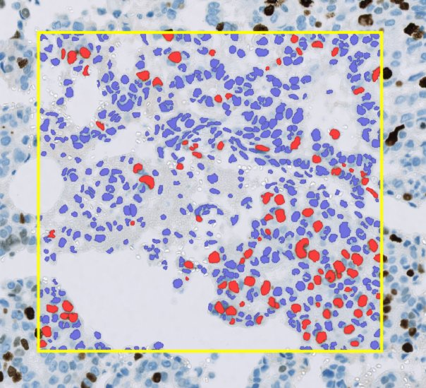
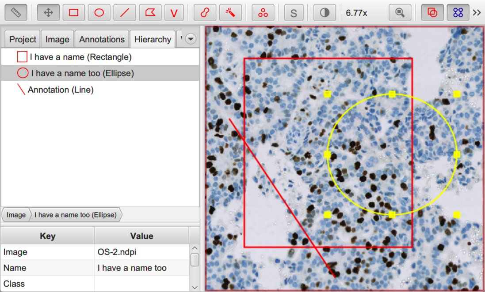
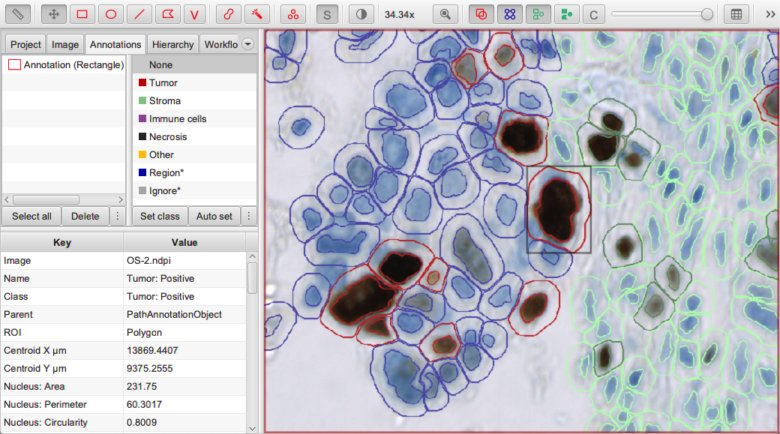
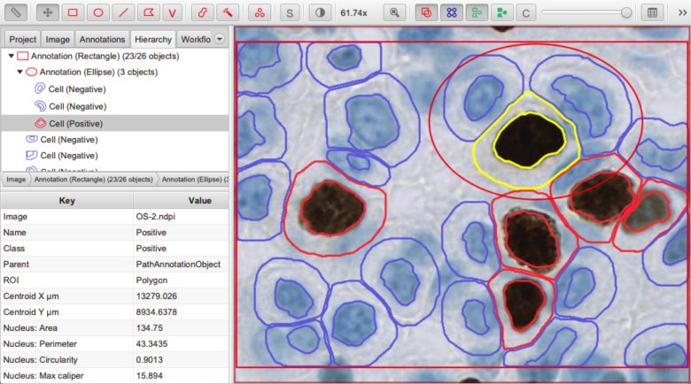

*******
Objects
*******

**Objects** play a central role in QuPath.

An object can be thought of as a 'thing' within the image in a very general sense, e.g. a cell, a vessel, a gland, an area of tumor, a biopsy.
The object encapsulates not only the shape of the thing, but also some properties about it.

The reason for extracting objects from images is that objects are easier to summarize, quantify and interpret than :doc:`billions of raw pixel values <images>`.

Objects themselves are simple, but the idea is powerful as it enables us to generate and query a complex but intuitive representation of the image as lists or hierarchies of objects.
This is the QuPath approach to :doc:`image analysis <processing_and_analysis>`.

===============
Types of object
===============

As described above, objects can relate to very different kinds of thing.
QuPath provides three main **object types** to help manage these differences:

  **Annotation objects** |br|
  *Example: Hand-drawn region of interest* |br|
  Often drawn by the user, but sometimes also created (semi-)automatically where a larger region of interest is needed, e.g. using pixel classification to help identify an area of tissue.

  **Detection objects** |br|
  *Example: Cell* |br|
  Usually something small and detected by running a QuPath command, e.g. a cell or cell nucleus.

  **TMA core objects** |br|
  *Example: Tissue microarray core* |br|
  Similar to annotations, but specifically for tissue microarray analysis.
  TMA core objects have an extra *isMissing* property to indicate whether the core should be analyzed and included in any exported results, and can be linked together to form a *TMA Grid*.
  
Each object type can be independently shown and hidden using toolbar buttons and shortcut keys.

  
  Show/hide buttons for *annotations* (shortcut: ``A``), *TMA cores* (``G``) and *detections* (``D``) respectively.

We will focus only on annotations and detections, because TMA cores are rather specialized and act very much like annotations anyway.

  
  A rectangular annotation (yellow) containing over 600 detections (red and blue).

Annotations & detections
========================

The key distinction between object types is:

* **Annotations are flexible.**
  There are usually only no more than a few hundred annotations per image.
  They may be edited manually.
  They are often used to define regions within which detections might be generated.
* **Detections are efficient.**
  There are often hundreds of thousands (or even millions) of detections per image.
  They can be deleted, but otherwise not edited.

.. tip::
  
  Because annotations aim for flexibility over efficiency, QuPath can become sluggish when working with very large numbers of annotations.
  
  Some of these performance issues have been addressed in v0.2.0, and it is now feasible to work with tens of thousands of annotations in some cases.
  Nevertheless, working with annotations remains rather more computationally expensive compared to working with detections.

.. admonition:: Special examples of detections

  In addition to the types defined above, there are two more specialized detection subtypes:

    **Cell objects** |br|
    This has two ROIs - the main one represents the cell boundary, while a second (optional) ROI represents the nucleus.

    **Tile objects** |br|
    Differs from a standard detection in that a tile has less intrinsic 'meaning' in itself - i.e. it does not directly correspond to a recognizable structure within the image.
    See :doc:`../tutorials/superpixels` for an example of tiles in action.
  
  Most of the time this distinction can be ignored: cells and tiles are both still detections.
  It really only matters if you need to mix detection subtypes within the same image (e.g. to represent both cells & sub-cellular structures).

====================
Anatomy of an object
====================

What unifies the different object types in QuPath is that they all have the following properties:

.. sidebar:: Cells & ROIs

  A **cell** is the only QuPath object with *two* ROIs: one representing the boundary, and another (optional) ROI representing the nucleus.

* A **name**
* A **region of interest (ROI)**
* A **classification**
* A **measurement list**

Name
====

The **name** is simply a short description that might be added for identification.
It is frequently left empty.

  
  Annotations with (ellipse, rectangle) and without (line) names.
  
.. tip::
  
  To set the name of an annotation, select it in the viewer and press the :guilabel:`Enter`.
  

ROI
===

The **ROI** is what makes an object 'visible': it is the shape drawn on top of the image to show the region the object refers to.
It may be a rectangle, line, ellipse, polygon or more complex 2D shape.

.. figure:: ../starting/images/drawings.jpg
  :class: shadow-image
  :width: 75%
  :align: center
  
  ROIs of different shapes.

Classification
==============

The **classification** can be used to identify objects that are in some way similar.
Different objects may share the same classification.

Taking the example where each object is a cell, the classification is what distinguishes between cells of different types, e.g. tumor cells and lymphocytes.
Knowing the classification makes it possible to do more interesting things, e.g. to count the numbers of each class of cell, or measure the distance from each cell to the closest cell of a different class.

*Sub-classifications* can also be derived from classifications to encode multiple pieces of information about an object's class.

  
  Detected nucleus assigned the *sub-classification* ``Tumor: Positive``.

Measurement list
================

The **measurement list** can be interesting in itself, but it can also be useful in terms of automatically figuring out what the classification of the object should be :doc:`by training a machine learning classifier <../tutorials/cell_classification>`.

  
  Measurement list (bottom left) for a selected detection object.

=============================
Relationships between objects
=============================

In addition to the above, each object has two other important properties:

* A **parent object**
* A **collection of 'child' objects**

These store the relationships between different objects, in a **hierarchical** (or 'family-tree-like') way.
This is illustrated under the *Hierarchy* tab (see also the figure above).

Representing parent/child relationships makes it possible to use simple objects as the building blocks for more complex structures within QuPath.
For example, an entire tissue section could be considered as one (large) object, and inside it there might be tens of smaller child objects representing different structures (e.g. vessels, tumor and stromal regions), and inside each of these there may be hundreds of further child objects that are smaller still - the individual cells.
There might even be additional, subcellular structures.

All this is described in more detail in :doc:`object_hierarchy`.

.. tip::
  Not every analysis application needs this hierarchy information, and it can be computationally expensive to maintain all the relationships unnecessarily.
  Sometimes it is better to treat objects in QuPath as simply existing in a single flat list.
  
  In QuPath v0.2.0, you can choose to what extent you rely on maintaining hierarchical relationships between objects.
  But regardless of how much you use it, it's important to know the concept exists.

=======
Summary
=======

A conceptual overview of how many images can be analyzed in QuPath is:

1. Extract objects from the image (e.g. with tissue or cell detection)
2. Classify the objects, and establish relationships between them if necessary
3. Explore and interrogate the classified objects and their relationships
