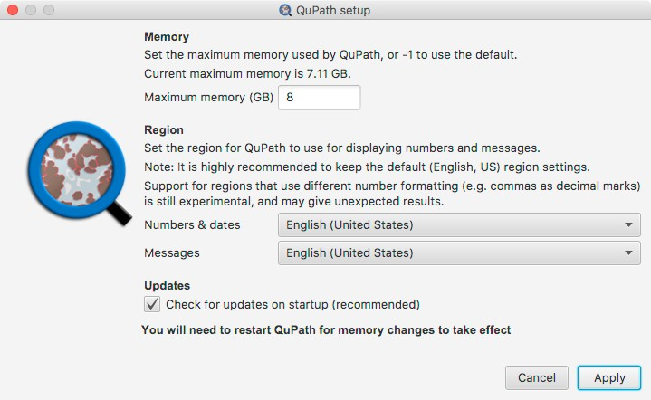
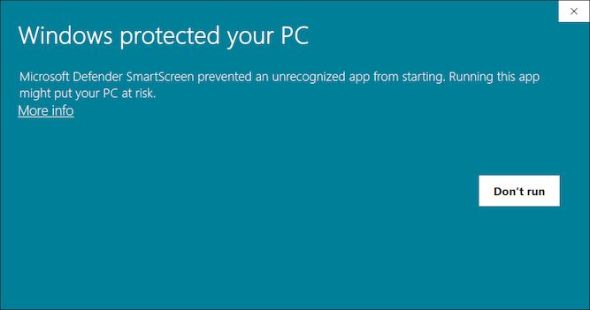
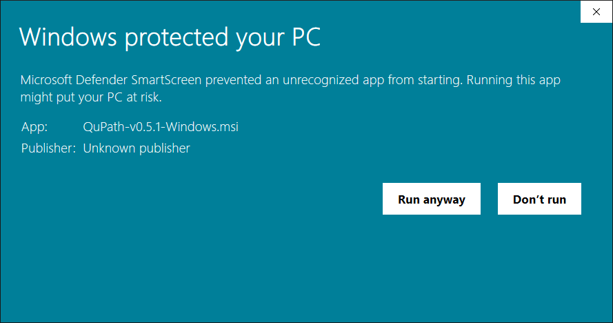
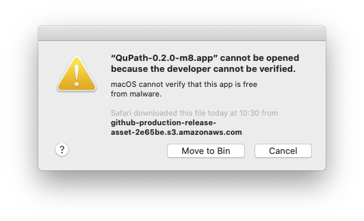
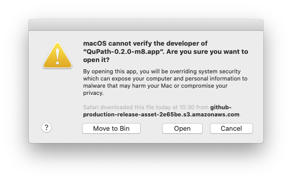
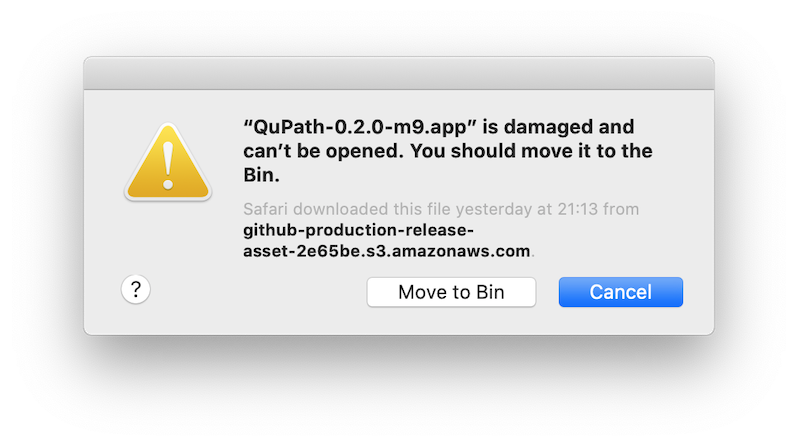
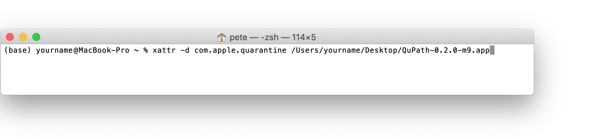

************
Installation
************

==================
Download & install
==================

Download QuPath for your platform (Windows, Linux, macOS) from `GitHub <https://github.com/qupath/qupath/releases/latest>`_ and install 'as normal':

* On **Windows**, if you downloaded an ``.msi`` file then double-click on it to launch the installer
* On **Windows**, if you downloaded a ``.zip`` then extract its contents and run the ``QuPath.exe`` file
* On **macOS**, if you download a ``.pkg`` file then double-click on it to launch the installer
* On **macOS**, double-click on the ``.dmg`` file and drag ``QuPath.app`` to wherever you want to keep it
* On **Linux**, download and extract the ``.tar.xz`` file

.. tip::

  Recent security changes in Windows and macOS are likely to complicate installation slightly. |br|
  See :ref:`Troubleshooting` for more information.

=============
Setup options
=============

When running QuPath for the first time, you will be prompted to specify some setup options.

  Setup options shown on startup.

The default is that QuPath will request 50% of the total memory available.
This is generally a reasonable choice, but be aware that the amount of memory available to QuPath is one of the main factors influencing how well the software will perform - and how complex the analysis can be.

.. sidebar:: Why does the 'Region' matter?

  See `here <https://github.com/qupath/qupath/issues/18>`_ for a note explaining why the *Region* setting exists.

You can also specify the *Region*, where it is recommended to leave the default of *English (United States)* for consistency.

This will help ensure behavior should match with what is shown in this documentation, and seen by other users on the forum.

.. tip::
  You can revisit the setup options later under :menuselection:`Help --> Show setup options`

.. tip::
  If you encounter trouble, :menuselection:`Edit --> Reset preferences` can be more effective than reinstalling.

===============
Troubleshooting
===============

If QuPath installs but you can't set the memory limit, see :ref:`Set max memory`

If you have trouble installing at all, please see below...

Windows (.zip)
==============

If QuPath does not start, make sure that you are not trying to run it directly from within the ``.zip`` file that you downloaded.
It is important to first *extract* the files into their own 'QuPath' folder, and then run ``QuPath.exe`` from within that.

Windows (.msi)
==============

The QuPath installer gives a scary warning
------------------------------------------

It is expected that Windows will give a scary-looking warning whenever the QuPath installer is first run, as it tries to protect you from software it does not know.

  Windows warning

If you would like to get past this screen, press *'More info'* and the option to *'Run anyway'* appears.

  Windows warning run anyway

The QuPath installer does not start
-----------------------------------

If the QuPath installer does not start at all, you may not have administrator privileges on your computer - and therefore cannot install it.  Try downloading the ``.zip`` file instead, which should not need such privileges.

.. important::

    Running QuPath on 32-bit Windows is not supported.

macOS
=====

Mac users may see one of two similar security message to that experienced by Windows users running the QuPath pkg installer or dmg image.

QuPath cannot be opened
-----------------------

If you see the message that QuPath cannot be opened because the developer cannot be verified, you can try right-clicking on the QuPath icon and select *Open* from the popup menu that appears.

  Gatekeeper on macOS on double-click.

You should then see an option to open QuPath that should work.

  Gatekeeper on macOS after right-clicking and selecting 'Open'.

QuPath is damaged and can't be opened
-------------------------------------

Recent macOS changes (first reported in February 2020) may give a different message that QuPath.app is damaged.

  Damaged message (macOS Catalina)

This appears to occur because macOS Catalina flags downloads from 'unidentified developers' as quarantined, and will not permit them to be opened.

One way to work around this is to remove the flag by opening `/Applications/Utilities/Terminal.app` and typing

.. code-block:: bash

  xattr -d com.apple.quarantine /Users/yourname/path/to/QuPath.app

.. warning::

  Since macOS (presumably) has your best interests at heart, circumventing its security settings routinely is probably not advisable.

  However, the time and resources needed to distribute QuPath as a signed/notarized app to avoid these warnings are currently lacking.

.. note::

    These alternative methods to start QuPath should only be necessary the first time you run it - double-clicking as normal should work afterwards.

.. tip::

  The quarantined flag does not always appear to be set, depending upon how the application is downloaded.
  For example, these problems may not arise if it is obtained using ``wget``, e.g.

  .. code-block:: bash

    wget https://github.com/qupath/qupath/releases/download/v0.2.0-m9/QuPath-0.2.0-m9-Mac.dmg

Linux
=====

QuPath for Linux was compiled on Ubuntu, with best efforts made to include all dependencies, although in the case of OpenSlide this wasn't entirely successful.
You may need to install OpenSlide separately through your package manager.
