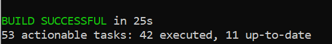
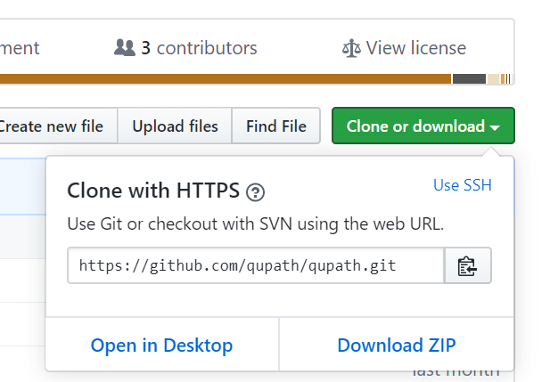
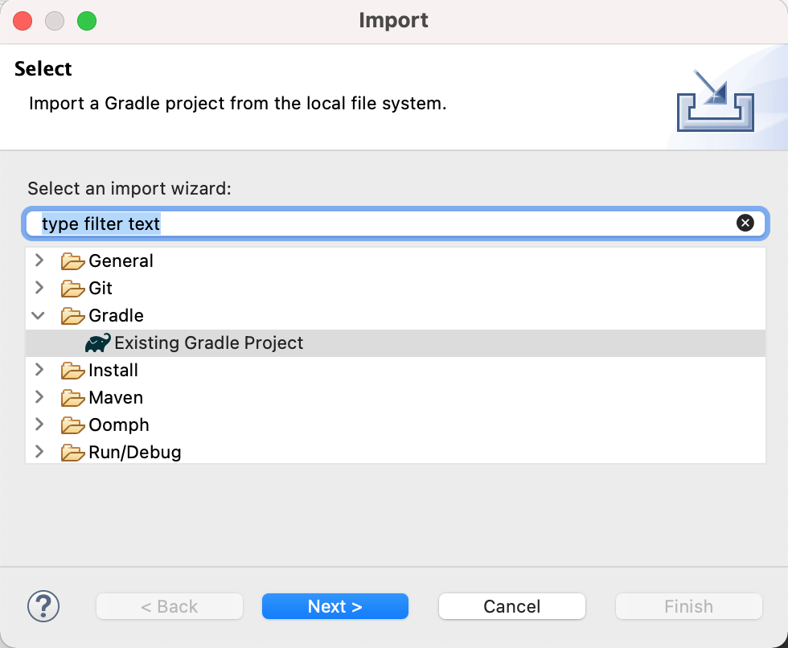
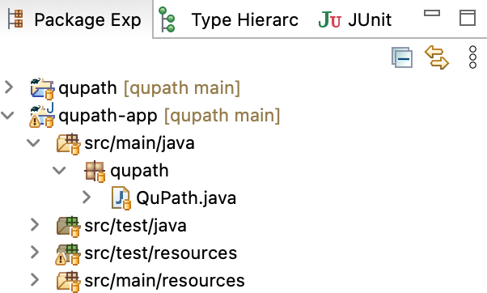
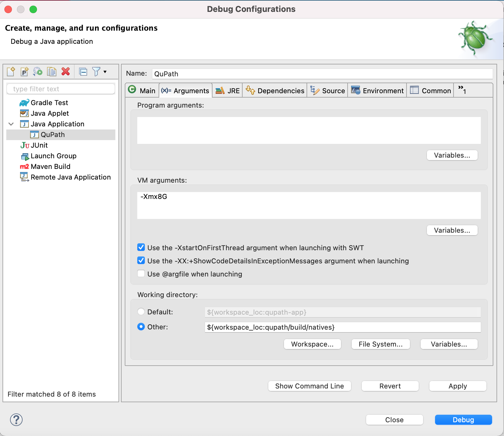

********************
Building from source
********************

Building software can be tricky, but hopefully this won't be - thanks to Gradle_.

.. _Gradle: http://gradle.org

.. admonition:: Do you need this?!

  Most people using QuPath won't need to build QuPath from source!
  Just download an existing installer from `qupath.github.io <https://qupath.github.io>`__ and use that instead.

============
Command line
============

If you're moderately comfortable working from a command line, there's not much required to build QuPath:

1. Install git, e.g. from https://git-scm.com

2. Install OpenJDK 16, e.g. from https://adoptopenjdk.net

3. Open a command prompt in an empty directory and run the following:

.. tabbed:: Windows

   .. code-block:: bash
   
     git clone https://github.com/qupath/qupath
     cd qupath
     gradlew clean jpackage
     
.. tabbed:: macOS/Linux

  .. code-block:: bash
  
    git clone https://github.com/qupath/qupath
    cd qupath
    ./gradlew clean jpackage
          
It will take a few minutes to download everything required and build the software.
If all goes well, you should see a triumphant message that the build was successful.

**That's it!**
You can find QuPath inside the ``./build/dist/`` subdirectory.

.. admonition:: Which Java version do I need?
  :class: tip
  
  If you already have Java installed, you might be able to skip Step 2.
  Most Java versions >= 8 should work to launch Gradle, which will then automatically download the version it needs.
  However, since QuPath currently requires OpenJDK 16, we recommend just installing that and saving Gradle the extra effort.
  
  Note that some problems have been reported using a version of OpenJDK based on OpenJ9, such as may be provided by some package managers.
  Switching to an OpenJDK distribution based on HotSpot may help -- see `here <https://github.com/qupath/qupath/issues/484>`_ for details.

Customizing the build
=====================

Creating installers
-------------------

If you need to create an installer for QuPath, you can use

.. tabbed:: Windows

   .. code-block:: bash
   
     gradlew clean jpackage -Pqupath.package=installer
     
.. tabbed:: macOS/Linux

  .. code-block:: bash
  
    ./gradlew clean jpackage -Pqupath.package=installer
    

Note that for this to work on Windows you'll need to install `WIX Toolset`_.

.. _WIX Toolset: https://wixtoolset.org/

Building a specific version
---------------------------

QuPath releases are associated with different git tags.
You can get the code associated with QuPath |release| by using the command

.. parsed-literal::
   git checkout tags/v\ |release|\  -b\  v\ |release|

You can then try building it as above, however *note that some different versions may require different build commands* (e.g. the steps for v0.2.3 are slightly different from v0.3.0).
Check out the docs associated with the specific version if this is the case.

=============
Other options
=============

A few other ways to obtain and/or build QuPath's code are described below.
These might be better if you a) don't like the command line much, or b) want to make changes to the software.

GitHub Desktop
==============

If you're using either Mac or Windows, `GitHub Desktop`_ provides a friendly way to get the QuPath code.
The main steps are

* Install Atom_ (a text editor - not essential, but helpful)
* Install `GitHub Desktop`_
* Navigate to `https://github.com/qupath/qupath <https://github.com/qupath/qupath>`__ in a browser
* Press :guilabel:`Clone or download` and choose :guilabel:`Open in Desktop`

.. _QuPath's GitHub repository: https://github.com/qupath/qupath
.. _Atom: https://atom.io/
.. _GitHub Desktop: https://desktop.github.com/

You can now open a command prompt in the correct directory directly from GitHub Desktop by choosing :menuselection:`Repository --> Open in Command Prompt`.

.. admonition::
  Installing Git or not?

  At this point you may be asked if you want to install Git.

  You don't have to (I think...), but if you do then you'll be ask a lot of questions during the installation.
  One of them is to choose a text editor, where you can select *Atom*.

Finally, the command needed to build QuPath is then the same as above:

.. tabbed:: Windows

   .. code-block:: bash
   
     gradlew clean jpackage
     
.. tabbed:: macOS/Linux

  .. code-block:: bash
  
    ./gradlew clean jpackage

.. admonition:: Updating the code

  Once you've built QuPath once, updating it to use the latest source code in *GitHub Desktop* should be easier.
  The right-most button on the main toolbar serves two purposes: to :guilabel:`Fetch` information about the latest changes (from GitHub) and to :guilabel:`Pull` the changes down to your computer.

  .. figure:: images/building-branches.png
    :class: shadow-image
    :align: center
    :width: 90%

  If the option is :guilabel:`Fetch origin`, when you press the button the text will switch to :guilabel:`Pull origin` if any changes are available, with info about the number of changes.

  You can press it again to pull those changes, and then rebuild QuPath using ``gradlew``.

  .. figure:: images/building-pull.png
    :class: shadow-image
    :align: center
    :width: 50%
  

Download release
================

You can circumvent the need to use git entirely by downloading the QuPath code associated with a specific release from http://github.com/qupath/qupath/releases

Simply choose the *Source code (zip)* or *Source code (tar.gz)* option.
You can then build it from a command prompt as described above.

Running from an IDE
===================

You should be able to import QuPath into any IDE (e.g. *eclipse*, *IntelliJ*) that supports Gradle.

Eclipse
-------

I personally use `Eclipse`_ for QuPath development, which allows me to run the software in debug mode -- and even change the code while it is running.

.. _Eclipse: https://www.eclipse.org

To do this, first download and build QuPath once as describe above.
Then use :menuselection:`File --> Import...` from within Eclipse and select *Existing Gradle project*.

After selecting the QuPath directory and importing (usually accepting the default import options is fine), right-click on *QuPath.java* (the main launch class) as shown below:

Now choose :menuselection:`Debug As --> Java Application` from the context menu

This should launch QuPath, but it will fail to find the native libraries it needs to use OpenSlide.
To fix that, use :menuselection:`Run --> Debug configurations...` to adjust the arguments for your configuration as shown below, changing ``-Xmx`` if needed to customize the memory available.

  
Finally, press the :guilabel:`Debug` button in the bottom right, and QuPath should launch with OpenSlide intact.
This works because it starts inside the ``${workspace_loc:qupath/build/natives}`` directory, which should contain the OpenSlide native libraries assuming you have build QuPath at least once before.

You can now use :menuselection:`Run --> Debug History --> QuPath` to launch QuPath with the same configuration in the future.

The useful thing about using debug mode is that you can make changes to the QuPath code *while QuPath is running* and, providing they aren't *too* extreme, they will be incorporated into the software without needing to relaunch it.
