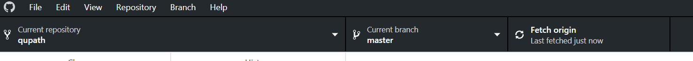
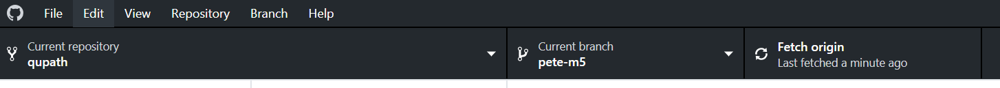
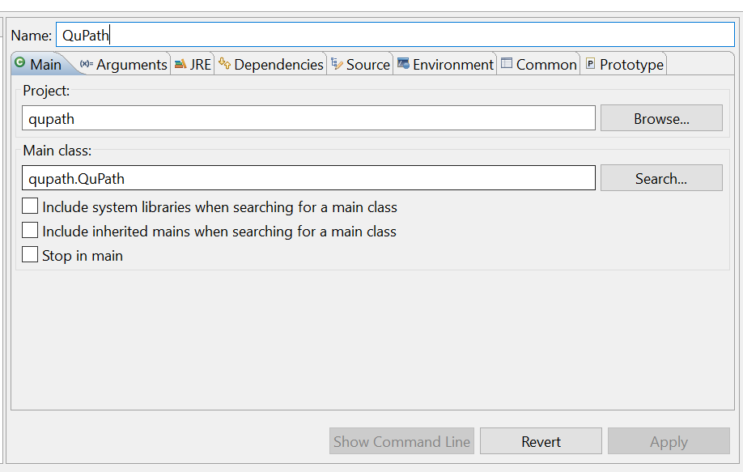
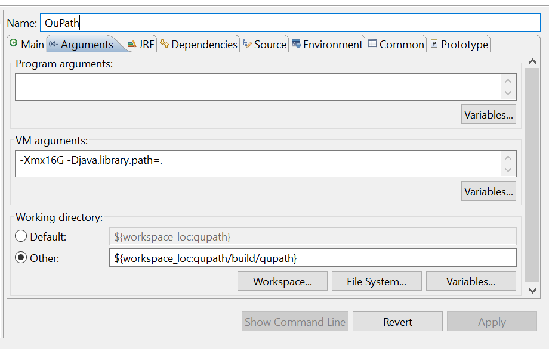

********************
Building from source
********************

Building software can be tricky, but hopefully this won't be - thanks to Gradle_.

.. _Gradle: http://gradle.org

The following instructions assume:

* You're starting from scratch
* You're not an expert in building software

If you *are* an expert, you'll know which steps you can skip or amend.

.. admonition:: Do you need this?!

  Most people using QuPath won't need to build QuPath from source!
  Just download an existing installer from `qupath.github.io <https://qupath.github.io>`__ and use that instead.

================================
Step 1: Installing prerequisites
================================

Install a Java Development Kit (JDK)
====================================

QuPath requires OpenJDK 14 (or later).
Typically, the latest stable JDK is used.
There are a few places where you can find pre-built OpenJDK binaries - a popular source is AdoptOpenJDK_.

.. _AdoptOpenJDK: https://adoptopenjdk.net/

.. tip::

  During installation you may be asked if you want to add the JDK to your PATH.
  It usually makes things easier if you do.

  If you can't (e.g. because of some other Java software needing the PATH set to something else) I'm afraid I'll leave resolving that up to you.
  
.. warning::
  
  Problems have been reported on Linux using some JDK distributions.
  Switching to HotSpot (rather than OpenJ9) may help -- see `here <https://github.com/qupath/qupath/issues/484>`_ for more details.

==================================
Step 2: Get the QuPath source code
==================================

You can get the QuPath source code from `QuPath's GitHub repository`_.

If you're using either Mac or Windows, the following steps may help.

* Install Atom_ (a text editor)
* Install `GitHub Desktop`_
* Navigate to `https://github.com/qupath/qupath <https://github.com/qupath/qupath>`__ in a browser
* Press :guilabel:`Clone or download` and choose :guilabel:`Open in Desktop`

.. _QuPath's GitHub repository: https://github.com/qupath/qupath
.. _Atom: https://atom.io/
.. _GitHub Desktop: https://desktop.github.com/

.. figure:: images/building-clone.png
  :class: shadow-image
  :align: center
  :width: 50%

.. admonition:: Note for Linux-users

  At the time of writing *GitHub Desktop* is not available through the above link for Linux.
  Therefore you'll need another desktop client, or handle Git from the command line.

================================
Step 3: Build QuPath with Gradle
================================

Open the QuPath source directory in a command prompt
====================================================

One way to do this is to go back to GitHub Desktop and choose :menuselection:`Repository --> Open in Command Prompt`.

.. admonition::
  Installing Git or not?

  At this point you may be asked if you want to install Git.

  You don't have to (I think...), but if you do then you'll be ask a lot of questions during the installation.
  One of them is to choose a text editor, where you can select *Atom*.

Run gradlew
===========

At the command prompt, type the following:

.. code-block:: bash

  gradlew clean build createPackage

for Windows, or

.. code-block:: bash

  ./gradlew clean build createPackage

for MacOS and Linux.

This will download Gradle and all its dependencies, so may take a bit of time (and an internet connection) the first time you run it.

If all goes well, you should see a triumphant message that the build was successful.

.. figure:: images/building-success.png
  :class: shadow-image
  :align: center
  :width: 50%

Afterwards, you should find QuPath inside the ``./build/dist`` subdirectory.  You may then drag it to a more convenient location.

**Congratulations!** You've now built QuPath, and can run it as normal from now on... at least until there is another update, when you can repeat the (hopefully painless) process.

----

======
Extras
======

Variations & troubleshooting
============================

The code above should create everything you need to run QuPath.

If you want an installer instead, you can use

.. code-block:: bash

  gradlew createPackage -Ptype=installer

Note that for this to work you'll need to install `WIX Toolset`_.

.. _WIX Toolset: https://wixtoolset.org/

Inevitably, things will go wrong at some point.
When this happens, it's worth running

.. code-block:: bash

  gradlew clean

once or twice extra to clean up old files that could be causing trouble.

Getting the latest updates
==========================

Once you've built QuPath once, updating it to use the latest source code should be much easier.

In *GitHub Desktop*, see the right-most button on the main toolbar.
This serves two purposes: to :guilabel:`Fetch` information about the latest changes (from GitHub) and to :guilabel:`Pull` the changes down to your computer.

If the option is :guilabel:`Fetch origin`, and you press the button then if there are any changes to pull the text on the button will switch to :guilabel:`Pull origin` with info about the number of changes available.

You can press it again to pull those changes, and then rebuild QuPath using ``gradlew`` if necessary.

You can also use the middle button in *GitHub Desktop* to switch 'branches'.
Branches basically make it possible to have different versions of the code in development in parallel.

The following screenshot shows QuPath where I have checked out a branch called 'pete-m5'.

If the changes prove worthwhile, the changes in 'pete-m5' will be merged into the 'master' branch.

Running from an IDE
===================

You should be able to import QuPath into any IDE (e.g. *eclipse*, *IntelliJ*) that supports Gradle.

I personally use *eclipse* for QuPath development, which allows me to run the software in debug mode - and even change the code while it is running.

To do this, I use :menuselection:`Run --> Debug As --> QuPath`.

To make this option available, you'll first need to create a debug configuration with :menuselection:`Run --> Debug Configurations...`.

Within this dialog, I use the following options to control the available memory and set the working directory/Java library path.

The purpose of setting the *Working directory* is to pick up the native libraries (e.g. for OpenSlide) when running from the IDE.
This requires that the code has been built using ``gradlew`` at least once to move the files into position.

Building javadocs
=================

To generate javadocs for the source code, use

.. code-block:: bash

  gradlew mergedJavadocs

This will generate html javadocs in a ``./build/merged-docs`` subdirectory.

If you'd like to include external links to other relevant javadocs (e.g. for the JDK, ImageJ, JTS) use

.. code-block:: bash

  gradlew mergedJavadocs -PlinkJavadoc=true
