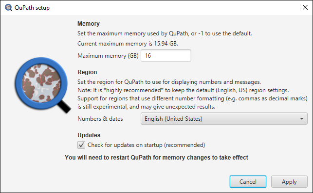

****
FAQs
****

This page contains answers to common questions that arise when using QuPath.

.. tip::

  See :doc:`../starting/help` for a full list of places to get help with QuPath.
  
.. admonition:: Even more questions & answers
  
  For a more extensive list of questions gathered during the NEUBIAS Academy webinar in April 2020, see `this thread on image.sc <https://forum.image.sc/t/neubias-academy-home-webinar-quantitative-pathology-bioimage-analysis-qupath-questions-answers/37387>`_.

=======
General
=======

I can't install QuPath!
=======================

See :doc:`../intro/installation` for details and troubleshooting.

How do I ask my own question?
=============================

First, please check this page in case your question has already been answered!

If not, use `the QuPath discussion forum at image.sc <http://forum.image.sc/tags/qupath/>`_.

.. tip::

  The following tips will improve your chances of receiving a useful answer on the forum.

  * Make sure you **use the *qupath* tag** with your post
  * **Be specific!** Broad questions lead to lots of guesswork and back-and-forth discussion to try to ascertain what you really want. Try to already include the key information in your first post.
  * If your question is about how to analyze your images:

    - **Include screenshots and example images!** If you are not able to share your own image (e.g. you don't have permission), you can link to similar images online. Otherwise the discussion can be very long as people trying to help have to guess how your images look, and may be completely wrong.
    - **Mention the QuPath version you are using**
    - **Describe clearly what you have already tried**
    - **Describe what you want to achieve at the end** - *not* just any specific step you are stuck with. There might be a better/more efficient way to achieve your end goal that you haven't considered, making the awkward step unnecessary.

How do I report a bug?
======================

You can open a `GitHub issue <http://github.com/qupath/qupath/issues>`_ - but please do try to make sure it really *is* a new issue, and follow the template provided.
Many 'issues' are really better topics for forum discussions.

.. admonition:: Questions and Issues

  **Please don't open a GitHub Issue to ask a question!**
  Issues are intended only for bug reports and act as a todo list for software changes - using them for general questions makes this harder to manage and harder to find answers in the future.

  If you aren't sure if you have a question or a bug, or you can't provide clear steps to reproduce the problem you see, use `the forum <http://forum.image.sc/tags/qupath/>`_.

How do I interpret a cryptic error?
===================================

When you encounter an error, the first thing to do is often check the contents of :menuselection:`View --> Show log`.

This logs everything QuPath considered important since it was opened.
Scroll down to the bottom of this log, and look for the last occurrence of a line starting ``ERROR:``.

After this you will generally see a short message (which may or may not look very helpful) and a lot more lines often beginning with ``at`` and then some reference to a line of code.

This information can be very helpful for debugging the error, and you can copy and paste it from the log and post it as a question on the forum.

Please include *all* the lines after ``ERROR:``.
Often, the most important one isn't the first: rather, it is the line that occurs highest in the log and starts with ``at qupath.[other things]``.
This represents the last line of *QuPath* code that was run before the error occurred - everything else happened elsewhere (e.g. deep in the bowels of Java).
This gives the best clue as to what exactly within QuPath triggered the problem.

.. note::

  If you don't see any lines starting with ``at qupath`` then the error may have occurred somewhere else and may not be fixable within the QuPath code - although that should be rare.

How do I find the command I'm looking for?
==========================================

Type :kbd:`Ctrl + L` to bring up the *Command List*.
See :doc:`shortcuts` for this and other shortcuts.

Can I cite QuPath in a publication?
===================================

Please do! See :doc:`../intro/citing`.

How do we know we can trust the analysis results?
=================================================

Excellent question - stay skeptical!

Image analysis lets you generate numbers, but these can be sensitive to how precisely you do the analysis (with or without machine learning).
QuPath gives you the tools to make the measurements and to visualize them, but the meaning and validation is up to the user.

This is why image analysis results (from any software) should be carefully validated and treated with caution.
Doing this is challenging because the 'truth' can be hard to define.
One way is to compare with expert evaluation.
Another (in some cases) is to use clinical outcome.
Both these have limitations; validation is almost always hard – but crucial.

There is also the possibility of bugs in any software.
If you find any discrepancies, please report them so they can be investigated and fixed if necessary.

==============
Running QuPath
==============

What are the minimum requirements to run QuPath?
================================================

QuPath should work on 64-bit Windows, Linux and Mac (32-bit is not supported).

Apart from that, QuPath works best if you have plenty of RAM (≥ 16 GB) and a fast multicore processor (e.g. Intel Core i7).
If you have an older/less powerful computer then QuPath should still work, but you will be more limited in what you can do before the software slows down or throws memory errors.

Things that require a lot of memory include:

* Performing analysis that involves creating a large number of objects (e.g. > 100,000 cells)
* Analyzing multiplexed data (e.g. 16-bit images with > 4 channels)
* Working with large, non-pyramidal images
* Working with z-stacks of whole slide images

Does QuPath use my graphic card (GPU)?
======================================

Generally no... our current focus is the stability and functionality – and finding efficient ways to do things that don’t require any particular hardware.
But we realise that will have limits and we are certainly also thinking about GPUs.

However, note that many bottlenecks depend upon things that cannot be solved by the GPU alone (e.g. reading image tiles, the user interface thread).
Therefore the real-world impact on performance may be quite modest for many applications.

The interactive machine learning uses OpenCV as the processing library, which uses the CPU (but highly-optimzed).
It is designed so that other machine learning libraries could potentially be used, if suitable extensions are written.

Why do I see a warning when I try to install QuPath?
====================================================

See :ref:`Installation`.

.. _Set max memory:

Why can I not set the maximum memory?
=====================================

QuPath offers a dialog to set the maximum memory on first startup, or through :menuselection:`Help --> Show setup options`.
This *should* work, but sometimes does not -- possibly due to permissions issues meaning that the necessary config file cannot be overwritten successfully.

To set the memory limit manually, find the `.cfg.` file within your QuPath installation (something like `QuPath-0.2.0.cfg`) and open it in a plain text editor (e.g. Notepad, Atom).

The default is to use 50% of available memory, specified under `JavaOptions`:

.. code-block:: bash

  [JavaOptions]
  -XX:MaxRAMPercentage=50

You can change this to a fixed maximum size via the `-Xmx` Java option, e.g. to give 12 GB use:

.. code-block:: bash

  [JavaOptions]
  -Xmx12G
  
.. tip::
  
  On a Mac, you'll need to right-click on *QuPath.app* and choose :menuselection:`Show package contents`. |br|
  The config file is inside the *Contents/app* directory.

Can QuPath be run in batch mode from the command line?
======================================================

Yes! See :ref:`Command line`.

Why does QuPath recommend using US English settings on startup?
===============================================================

For consistency.
Lots of subtle and thorny issues can happen when representing numbers in different ways, in particular when switching between using dots or commas as the decimal separator.

For example, ``1,001`` can either be a fairly large number or a small number depending upon where on the world it is read.

In some cases, QuPath has to use the 'dot' representation for decimals (e.g. when scripting), since this is Java's preferred form, and trying to work around this proved too difficult.
However, forcing everyone to use US English for everything (including exporting results) isn't a perfect solution, especially if other software (e.g. your preferred spreadsheet application) uses something else.

Therefore QuPath does not (currently) insist on its preference for US English... but gives a warning to be **very** cautious about how numbers are represented and interpreted.

There is a more detailed technical description about the issues involved `here <https://github.com/qupath/qupath/issues/29>`__.

Is there a way to make projects self-contained, using the relative paths to images?
===================================================================================

QuPath projects currently use a kind of hybrid approach already: storing both the absolute and relative paths to the image files.

When you open an image, it checks both.
If you move a project, but maintain the relative locations, QuPath *will* still prompt you to update the paths - but it will prepopulate all the paths for you, so you just need to accept the changes by clicking one button.

This is because QuPath politely doesn’t want to change the paths stored in the `.qpproj` file without permission.

=============
Image formats
=============

Why can't QuPath open my image?
===============================

QuPath depends on other open source readers to support images of different types.

See :doc:`../intro/formats` for details about which formats are supported, and to what extent.

Why does my image open but look weird?
======================================

See `Why can't QuPath open my image?`_

Is it possible to view slide labels?
====================================

Yes, see `this answer <https://github.com/qupath/qupath/issues/36#issuecomment-268772402>`__.

Does QuPath edit the original image files?
===========================================

QuPath doesn’t edit the original image files.
It also doesn’t save the image data in its own files; rather, QuPath stores its data along with a URI that links back to the original image.

============
Using QuPath
============

How can I set the display range (brightness/contrast) exactly?
==============================================================

Double-clicking on the *Min/Max display* labels should work, as discussed `here <https://github.com/qupath/qupath/issues/26>`__.

Why are some commands marked as 'Deprecated'?
=============================================

The 'deprecated' flag acts as a warning that the days of that command are numbered... it is likely to be removed in a later version.

The reason for this is usually that it a) isn't considered terribly useful, or b) has been replaced by a better alternative, c) *will* be replaced by a better alternative soon.
Removing old commands helps make QuPath more maintainable, and creates space for new features to be added without the menus becoming excessively clogged up.

If you find a command you particularly need has been marked as deprecated, feel free to ask on the forum why and discuss its future.

Why can I not rotate my image more than 90 degrees?
===================================================

:menuselection:`View --> Rotate image` allows you to rotate an image but *only for display*. This means that all coordinates assume the image origin is still at the top left at the original orientation.

A common reason for wanting to change the rotation by more than 90 degrees is because a slide may have been scanned at the 'wrong' orientation.
:menuselection:`View --> Rotate image` should *not* be used in this case - what is really required is for QuPath to treat the image entirely as if it has been rotated, with coordinates adjusted accordingly.

There is another trick available for this...
👇

My image has the wrong orientation. How can I fix it?
=====================================================

When importing an image into an project, there is a :guilabel:`Rotate image` option.
This can be used to rotate the image as it is being imported, so that QuPath will treat it from the beginning as if the actual image stored within the file had a different orientation.

How do I create a new annotation inside an existing one using the *Brush* or *Wand*?
====================================================================================

If you click inside an existing annotation using the *Brush* or *Wand*, it will typically select that annotation and start to edit it - rather than allowing you to create a new annotation.
This is intended behavior, which makes it easier to refine annotations using these tools.

However, you *can* create new annotations with the *Brush* or *Wand* inside annotations you *lock* the existing annotations first, see `here <https://github.com/qupath/qupath/issues/179>`__.

How can I create annotations with a fixed size?
===============================================

Use :menuselection:`Objects --> Annotations... --> Specify annotations`.

See also `this blog post <https://petebankhead.github.io/qupath/scripting/2018/03/09/script-create-fixed-size-region.html>`_ for a scripting alternative.

Can QuPath handle the alignment of consecutive sections?
========================================================

This is a common question, to which the answer is 'not really'.

Currently, you can only `view the consecutive sections side-by-side <https://github.com/qupath/qupath/wiki/Multiple-images>`_, and potentially transfer annotations between them... although this is only likely to be very meaningful/useful if you have already registered the images in some other software, and written out whole slide images that are 'perfectly' aligned.

=======================
Scripting & development
=======================

Where are the QuPath javadocs?
==============================

At the time of writing, QuPath's javadocs aren't hosted anywhere - but it is planned to put them online at some point once they have been cleaned up accordingly.
See `here <https://github.com/qupath/qupath/issues/230>`__ for the request.

In the meantime, check :ref:`Building javadocs` for instructions how to build them yourself.

How do I read a *.qpdata* file in Python/C++/R?
===============================================

The short answer is that you can't - at least not without prohibitive difficulty.

``.qpdata`` files currently use Java serialization, which is very Java-specific and not very portable.
This is a pragmatic solution for QuPath, but isn't intended to be read elsewhere.

In the future, QuPath might switch to using an alternative, more accessible and maintainable format.

In the meantime, you can write *export scripts* to run within QuPath to export data however you need it.
See, for example, :doc:`../scripting/overview` or :doc:`../advanced/exporting_annotations`.

============
Contributing
============

How can I contribute to QuPath?
===============================

See the `Contributing guidelines`_.

.. _Contributing guidelines: https://github.com/qupath/qupath/blob/master/CONTRIBUTING.md

One of the most helpful things you can do is to participate on the `discussion forum <http://forum.image.sc/tags/qupath/>`_ to answer questions as well as asking them.

Or if you're looking for a PhD, postdoc or research software engineer position look out for opportunities to join the core team in Edinburgh!
