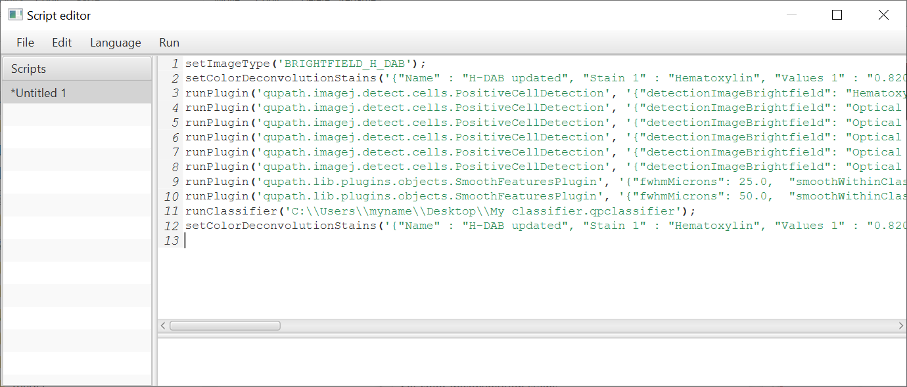

********************
Workflows to scripts
********************

Being able to log commands in the form of a :doc:`workflow based upon the Command history <workflows>` is a reasonable first step towards achieving reproducibility in analysis, since at least it records what has been done to an image.
However, it would be rather unpleasant and slow to have to refer to this workflow and simply repeat all the same steps for every new image that should be analyzed.

Fortunately, there is a solution to this: turn the **Workflow** into a **Script**, and tell QuPath to run this script over all other images that should be analyzed in the same way.
This makes it possible to automate some or all of the analysis across multiple images.

Generating scripts
==================

The `Command history` and any `Workflow panels` all have a :guilabel:`Create script` button below them.
Pressing this results in a script being generated like that shown below.

  A script generated from a `Workflow`

If the `Workflow` has been edited, then these edits will be reflected in the script.
If not, everything will be shown.

Running a script for a single image
-----------------------------------

To run a script for an image, it is simply a matter of opening both the image and the script, and selecting :menuselection:`Run --> Run` from the menu above the **Script Editor** (i.e. the window containing the script).

Assuming all goes smoothly, the commands within the script will all be applied - in order - to the new image.

If only part of a script should be run, rather than the entire thing, then this can be arranged by selecting the relevant part, and choosing :menuselection:`Run --> Run selected` instead.

Running a script for multiple images
------------------------------------

In order to run the same script over multiple images, it is necessary to first make sure all the images are stored in the same :doc:`project <../tutorials/projects>`.

If so, then simply choose :menuselection:`Run --> Run for project`.
This will bring up a window containing all the images in the project on the left side, and an empty list on the right.
This makes it possible to select images from the list on the left, and move them over to the right to indicate that they should be processed with the script.
If necessary, all the images can be brought over to the right list if they all should be processed.

Dialog box used to select images when running a script across multiple images in a project.
Note there is a small 'filter box' underneath the list on the left: this can be used to 'filter out' images that do *not* contain a specific piece of text that is entered in the box.

.. warning::
  The :menuselection:`Run --> Run for project` command will not only run the script for each selected image, but also save results (i.e. the *.qpdata* file) - overwriting any existing ``.qpdata`` file for that image.
  This is usually - but not always - what is intended.

.. tip::
  Sometimes, it is better to run a script and *not* save the results - either because the image data won't have changed (e.g. the script just exports summary data, but does no further processing or analysis), or because the changes shouldn't be stored.

  In this case the :menuselection:`Run --> Run for project (without save)` is a better choice.

Warnings for workflows
======================

Workflows are an essential part of enabling reproducible analysis within QuPath - but be aware that they should be used with caution and attention.

This subsection describes a few of the things to look out for.

Not every command is logged in the *Command history*
----------------------------------------------------

The scripts described in this section are generated based on the `Command history` (with or without editing).

However, **you should be aware that not every command that can possibly be run from within QuPath can (or even should) be logged in the Command history.**

Therefore, if you want your analysis to be reproducible, you need to pay attention to which commands you use... and the order in which you use them.

This might not be immediately obvious, but there are good reasons for it.

For example, whenever annotations are drawn by hand on an image, these are not logged because they are assumed to be only relevant for the current image.
The fact that the objects appear in the hierarchy means their existence is recorded in another way.
Commands that operate on such selected objects (e.g. to merge the annotations) are also generally not logged - because these are specific to whichever objects happen to be selected at the time.

This is usually what is wanted: the same specific annotations likely wouldn't make sense on any other image.
Steps that are manual in one image will likely have to be manual on another image.

On the other hand, commands used for tasks such as setting stain vectors, detecting cells, computing textures or applying a classifier *are* logged.

The *Command history* can get full of junk
------------------------------------------

The fact that the `Command history` can't be easily edited is good for the integrity of its recollection of the past.
It's not so good, however, whenever commands are run in strange orders or with different settings, resulting in a whole lot of unnecessary processing - which shouldn't need to be applied to the next set of images.

For example, suppose that cell detection was run across all annotations within an image, and found not to do well enough.
It is then run again across all annotations, to produce better results.

A script based on the `Command history` would run cell detection twice - but *the results of the first cell detection would just be discarded after the second cell detection*.
Therefore, it would be a complete waste of time to run the first cell detection... it would make a lot more sense to just remove that line from the script.

Therefore it's a good idea to learn enough about what the scripts mean to be able to read them, and to make any minor edits (e.g. deleting lines) as required.

Combining manual and automated analysis
=======================================

Taking into consideration the warnings made above, it's often not the best idea to try to run a single script that automates absolutely every part of the analysis of a large number of images.
Sometimes it's better to break the analysis up into smaller pieces - some of which are implemented using a script, and some of which are performed manually.

To understand how this works, it is crucial to know that, when a script is applied to a project, then *the version of the image data that is processed is the last one that was saved*.
This means that any objects that have previously been added to the image, and saved, will also be available to the script when it runs.

As an example, let's imagine that there's an application where cells should be detected and classified within specific annotations.
In this example, it is too awkward to try to automatically identify and create the annotations, and so instead they need to be drawn anew on every single image to be analyzed.
The process could then be as follows:

1. Create a :doc:`Project <../tutorials/projects>` containing all the images to analyze

2. Perform all the manual steps on the first image (e.g. to draw annotations in regions of interest)

3. Perform all the 'loggable' steps within the same image (e.g. to detect and score cells), and generate a script. At some point near the beginning of the script you will probably need a line reading ``selectAnnotations();``. This is where all the annotations are selected for processing.

4. Perform all the manual steps needed across the other images, i.e. drawing annotations as required to define the regions of interest. Save the ``.qpdata`` file for each image.

5. Run the script generated in step (3) for all the other images in the project.

There can of course be variations on this approach, e.g. where several automated steps are applied first using one script, then some manual steps, and finally some more automated steps with another script.
