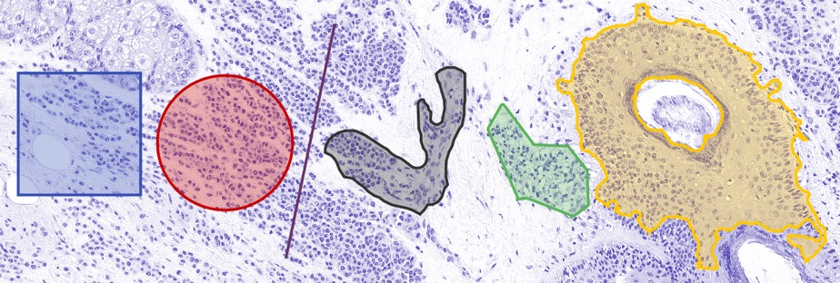

*****************
Annotating images
*****************

.. include:: ../tools.txt

Drawing regions of interest (ROIs) is a frequent task within QuPath.  Uses include:

* To measure lengths or areas
* To define regions in which analysis should be applied, e.g. cell detection
* To select training regions for a classifier

This section describes the main tools that are available.

.. NOTE::
  When you use these tools, you create **Annotation objects**.
  These differ from **TMA core objects** (defining tissue microarray cores) and **Detection objects** (for small detected items, e.g. nuclei or cells).
  You may ignore this distinction without trouble, but if you care to know more why this is and what it means, it is described in more detail in the :doc:`../concepts/index` section.

  Annotations made using different drawing tools (left to right): |br|
  Rectangle, Ellipse, Line, Brush, Polygon, Wand.

Annotation tools
================

|rectangle| Rectangle tool
--------------------------

The most basic drawing tool is the *Rectangle tool*.  Click on the starting point within the image and drag the mouse to the opposite corner of the desired rectangle, then release.  Holding :kbd:`Shift` down while drawing a rectangle will constrain the shape to be square.

.. tip::

  If you'd like to draw a rectangle around the entire image, use :menuselection:`Objects --> Annotations... --> Create full image annotation`.

|ellipse| Ellipse tool
----------------------

The *Ellipse tool* works in much the same way as the *Rectangle tool*, except that it will end up providing an elliptical region instead. Holding :kbd:`Shift` down while drawing an ellipse will constrain the shape to be circle.

.. tip::

  Rather than drawing rectangles or ellipses, :menuselection:`Objects --> Annotations... --> Specify annotation` can be used to set coordinates exactly - and thereby give more control over the exact size and/or location.

|line| Line tool
----------------

Lines can be drawn using the *Line tool*, by clicking once for the starting point, and *double-clicking* for the end point.

|polygon| Polygon tool
----------------------

The *Polygon tool* is a good standard for drawing around regions.  It can be used in one of two ways:

* Click where each vertex should be
* Click and drag to draw a continuous line (which will be split into spaced vertices by QuPath)

The former is better if you might want to edit the polygon later, but dragging vertices to different places.
The latter if better if you have a steady hand and want to draw a more detailed region.
It's possible to switch while drawing the same region.

If you *start* a polygon by clicking and dragging, then the polygon is complete when the mouse button is released.
Otherwise, the ROI is finished by *double-clicking* on the image at the location where the final point should be.

|brush| Brush tool
------------------

The *Brush tool* is probably the drawing tool I use the most for annotating regions.  The idea is simple: it each click of the brush selects a small circle, but by dragging the mouse across the image then a region is 'painted' that way.

This would have limited call for excitement, but the *Brush tool* within QuPath has a few particularly useful features:

* *The size of the brush adapts according to magnification*.  In other words, if you zoom in then the brush effectively paints small regions - while zoomed out it can quickly mark in large areas.
* *Holding down the* :kbd:`Alt` *key while using the brush causes it to 'subtract' regions*... basically acting as an eraser (or painterly equivalent).
* *The brush can refine ROIs drawn with other tools*.  This works either in additive (normal) or subtractive (:kbd:`Alt` pressed) mode - enabling ROIs to be cleaned up to be much more precise, and also to create holes within existing ROIs.

You can change the absolute size of the brush in the settings, and also optionally turn off the size adaption according to zoom.

|wand| Wand tool
----------------

The *Wand tool* is like a more enthusiastic brush tool.  Not content with painting only a small circular region, it will spread out into a much larger circle - but only for so long as the pixels have intensities similar to the one that was clicked on.

This provides a very powerful way to annotate regions quickly and with a high level of accuracy... provided they are substantially darker or lighter than the surroundings.  It can also work well in selecting dense areas of cells surrounding by more space.  But if the contrast is lower, the wand can appear to go out of control... and it's best to revert back to the 'standard' *Brush tool*.

.. tip::
  Like the *Brush tool*, the *Wand tool* adapts according to magnification: zoom out to select large regions, zoom in to select smaller, more detailed regions.

  Additionally, the *Wand tool* is influenced by any color transforms that have been applied - so these can be used to adjust the image so the areas of interest have higher contrast.  See [[Changing colors]] for more information.

|points| Points tool
--------------------

This is something of a special case, covered in :doc:`cell_counting`.

Locking & unlocking
===================

Annotating can be a laborious process.
For that reason, losing or accidentally editing annotations can be rather upsetting.

To help reduce this risk, annotations can be *locked* or *unlocked*.
You can access this by right-clicking on a selected annotation.

Setting properties
==================

Annotations can also have properties set.
For analysis purposes, the most important of these is usually the :doc:`classification <../tutorials/cell_classification>`.
But for display, there are also *name* and *color* properties.

You can set these quickly for a selected annotation by pressing the :kbd:`Enter` key.

The name can be shown or hidden in the viewer using :menuselection:`View --> Show names`, or the shortcut :kbd:`N`.

Other ways to annotate
======================

There are other, faster, fancier ways to create similar *Annotation objects*, i.e. by thresholding, pixel classification, or by temporarily dipping into another tool, such as ImageJ.

These will be discussed elsewhere...
