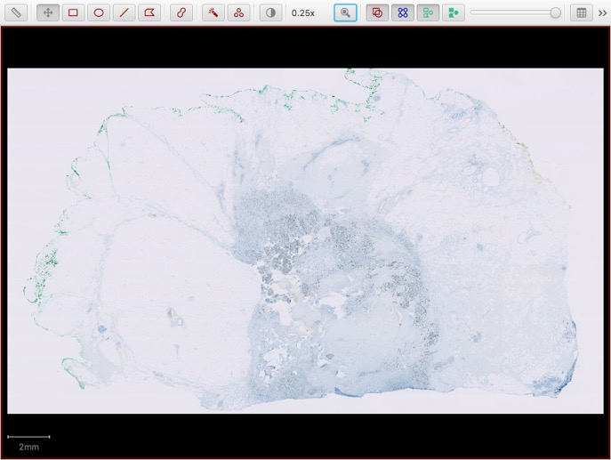
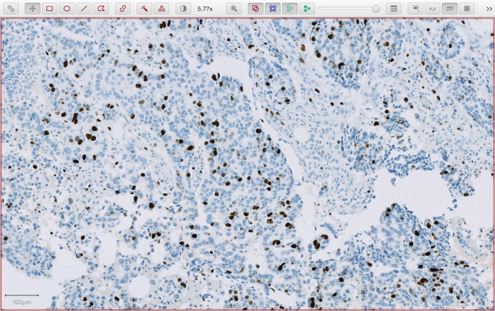
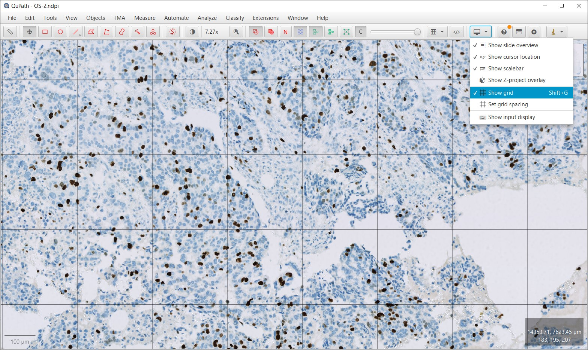
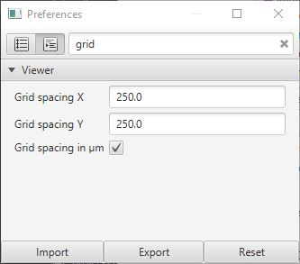
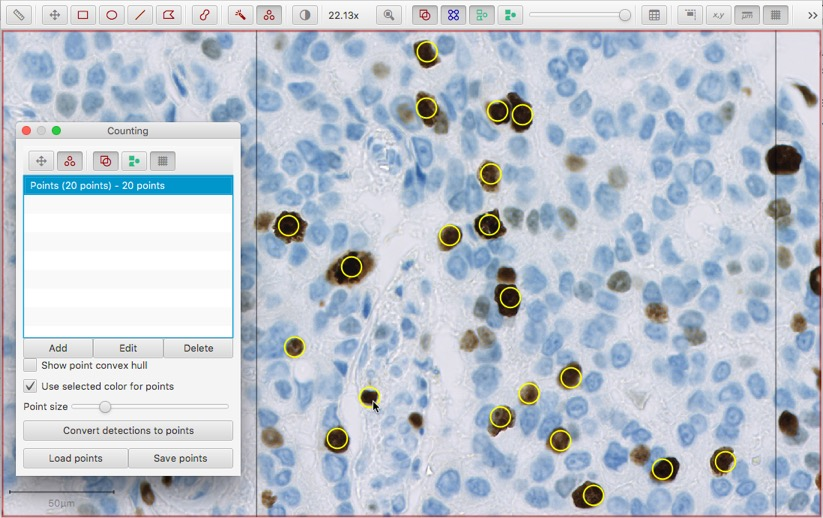
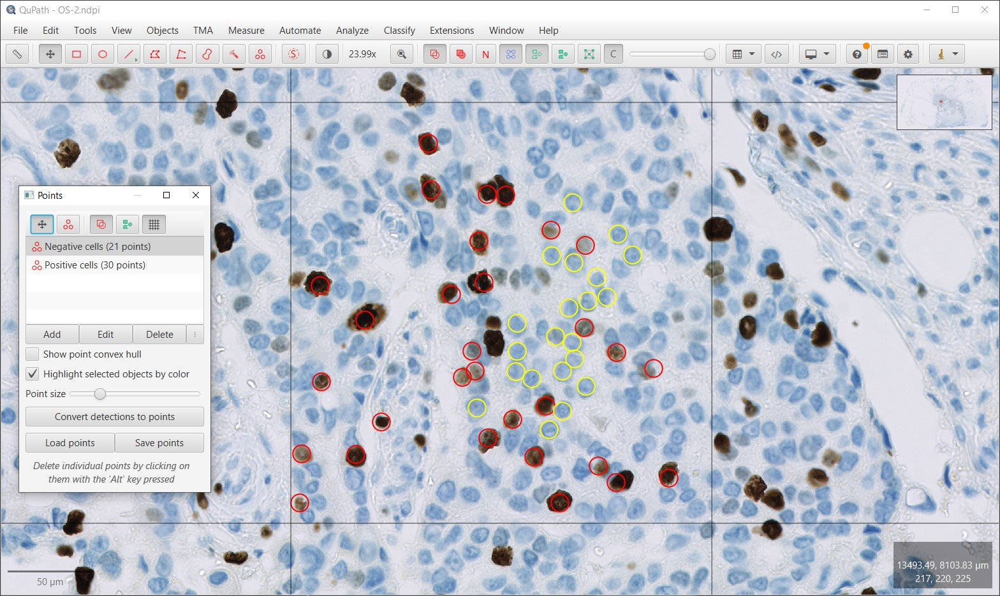

**********************
Manual counting
**********************

.. include:: ../tools.txt

Counting is a common task in pathology, and in bioimage analysis more generally.

This section describes how QuPath can be used to *manually* count cells of different types - here, *positive* (brown) and *negative* (blue) tumor cells stained for Ki67.

.. note::
  The Ki67 image used in several of the figures below is from the `OpenSlide freely-distributable test data (OS-2.ndpi) <http://openslide.cs.cmu.edu/download/openslide-testdata/Hamamatsu/>`_.

The tools described here can be used for all kinds of manual counting tasks.
However, we will return to this application in the sections :doc:`../tutorials/cell_detection` and :doc:`../tutorials/cell_classification` to show how more sophisticated tools within QuPath can be used to automate some or all of the specific task of cell counting.

  Ki67 (OS-2.ndpi)

Choosing a region
====================

The first task is to find a suitable region in which cells should be counted, using the controls described in :doc:`viewing` to browse around the slide.

  Selected region for counting

Having done this, it is optional - but helpful - to overlay a grid on top of the image to assist with counting in a fixed area.
This can be done simply by clicking the **Show grid** toolbar button |icon_grid|.

  Applying a counting grid

If necessary, the grid spacing can be adjusted under :menuselection:`Edit --> Preferences...` |icon_cog|.

  Set counting grid spacing

Clicking cells
==============

To begin counting in earnest, choose the **Point tool** in the toolbar |icon_points|.
This will automatically open up a *Counting panel* containing a list of separate point annotations.
You can then begin to click on the image, and a point will be created for each click.

.. Note::
 At this stage, you should only click on cells that are of the same class (e.g. positive).

  Starting to count

After you have clicked for a while, you may want to start counting cells of a different class (e.g. 'negative').
Pressing the *Add* button in the counting panel will start a new annotation to collect your new set of points, but it's likely you'll want to distinguish between points more clearly.
You can do this by double-clicking on an entry in the counting panel, and setting a more informative name and color.
Whenever you click on the image, you will add points to whichever entry in the list is selected.

  Continuing counting

Saving & exporting
====================

Once you're finished, you may only need to read off the number of points from the list.
If you :doc:`save the image data as normal <first_steps>`, the points will be included in the ``.qpdata`` file and can be recovered that way if necessary.
This is the preferred method of saving if you want to continue working on the data with QuPath.

However, you can also select the *Save points* option in the counting panel if you would like to export the coordinates of all your points for import elsewhere.
This will save the coordinates in a simple tab-delimited format that may be useful to get the data into another software application.

.. TIP::
  Manual counting is generally not very pleasurable - although it can be necessary when considerable human expertise is needed.
  The following tips and hidden features may help (they assume that you have selected the |icon_points| tool).

  * If you click on an existing point, within the same collection of points currently selected in the counting panel list, you can drag the point to move it to a new location.
  * If you click on an existing point, within the same collection of points currently selected in the counting panel list, while holding down the :kbd:`Alt` key, the point will be deleted.
  * If you click on an existing point, within the *a different* collection of points to the one currently selected in the counting panel list, while holding down the :kbd:`Alt` key, *the collection of points containing the one that was clicked will become selected*. This gives a fast way to switch between counting e.g. positive and negative cells, without needing to go back to the list - just *Alt + click* on the nearest cell belonging to the collection you want to switch to.

.. tip::
  :guilabel:`Show point convex hull` can be used to check for errant clicks.
  This will draw a shape around all the points you've drawn - which can help determine if there is a wild outlier somewhere else.

  .. figure:: images/counting_convex.jpg
    :class: shadow-image
    :width: 60%
    :align: center

    Viewing the convex hull of a collection of points, showing that a red point has been added somewhere way out to the right - beyond the current field of view.
