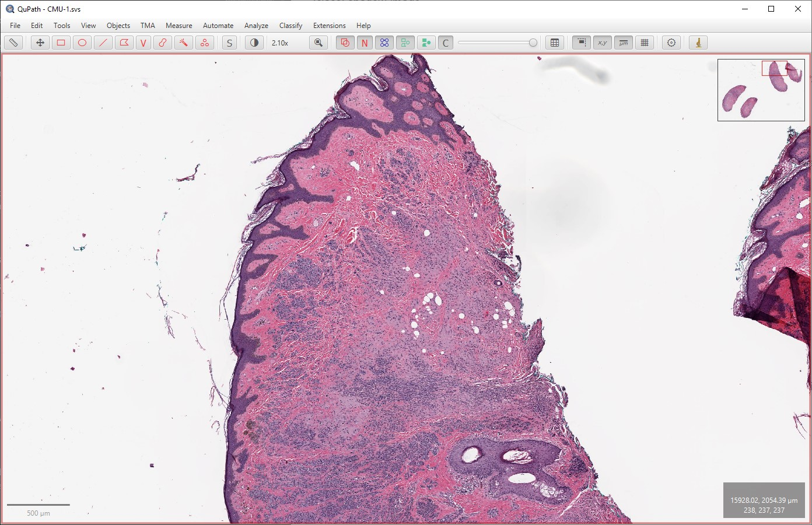

**************
Viewing images
**************

.. include:: ../tools.txt

The *Viewer* is the main QuPath component in which images are shown.

This section describes the controls and shortcuts that can enable you to use the viewer efficiently to move around images and draw annotations.
If you would like to know more about changing how pixels are displayed (including adjusting the brightness and contrast), check out the [[Changing colors]] section.

Using a mouse (default mode)
============================

Panning
-------

Select the *Move* tool |icon_move|, then click on the image and drag to move it.

If another tool is currently selected, press :kbd:`Spacebar` to temporarily activate the *Move* tool.
Releasing the :kbd:`Spacebar` returns to the previously selected tool.

Alternatively, to move quickly to a specific region simply click on the area you wish to navigate to in the *overview* shown in the top right corner.

  Clicking on the image overview (top right) shifts to view another part of the image.

Zooming
-------
Use the scroll wheel to zoom in and out.

The location of the cursor determines where will be centered whenever zooming - so it is a good idea to put the cursor on top of the area that you would like to zoom to.

.. TIP::
  **If everything seems inverted:**

  In some cases, it may appear that scrolling makes things move in the opposite direction from what is expected.
  This can happen, for example, when using a Mac with *Scroll direction: natural* turned off in the *System Preferences*.

  If this affects you, open QuPath's *Preferences* panel |icon_cog| (:menuselection:`Edit --> Preferences...`) and change the setting for *Invert scrolling*.
  It should behave better afterwards.

Using a trackpad (or touch-sensitive mouse)
===========================================

Of course, the mouse controls also work with trackpads.
However additional *touchpad gestures* can be activated under :menuselection:`Tools --> Multi-touch gestures`.
These can be used to turn on 'pinch-to-zoom', and free up the scrolling motion to navigate the slide.
This can also enable rotation.

.. tip::
  It is possible to use at least some of the gestures with a touch-sensitive mouse, e.g. the *Apple Magic Mouse*.
  For example, turning on the scroll gestures only provides an efficient alternative method to navigate images.
  Just don't forget to hold down the :kbd:`Shift` key when scrolling to zoom in and out.

Using a keyboard
================

:kbd:`Up / Down / Left / Right`
-------------------------------
For most images, scroll the image in the direction pressed.
For a TMA image, select the next core in the direction pressed.

:kbd:`Shift + Up / Down`
------------------------
Zoom in or out.

:kbd:`Enter`
------------
The action depends on the object currently selected:

* If an annotation is selected, a dialog box will be shown to set the annotation properties
* If a TMA core is selected, a dialog box will appear to allow notes to be entered quickly
* Otherwise, the viewer will be centered on the object (think: *'center on enter'*)

:kbd:`Spacebar`
---------------
Temporarily turn on the *Move* tool (as described above).

Other input devices
===================

Touchscreens
------------
Gesture controls can also be applied to touchscreens.
Customize with :menuselection:`Tools --> Multi-touch gestures`.

Graphics tablets
----------------
If you have a compatible pressure-sensitive graphics tablet, QuPath's *Brush* tool is able to adapt size according to pressure - with the help of an extension based on `JPen <http://jpen.sourceforge.net/html-home/>`_.

.. NOTE::
   So far, this has been tested only with Wacom tablets (Intuos and Cintiq).
