********************
Cell classification
********************

.. include:: ../tools.txt

.. warning::
  This replaces the -- now deprecated -- detection classifier that was previously available in QuPath, and described `here <https://github.com/qupath/qupath/wiki/Classifying-objects>`_.
  It is recommended to limit the use of the old detection classifier because it will be removed in future versions.
  

:doc:`cell_detection` looked at computing Ki67 labelling indices by counting positive and negative cells within user-defined regions of interest.
These regions had to be drawn very carefully to try to ensure that they only included tumor cells, and excluded other cell types that should not contribute to conventional scoring of Ki67.

This section builds upon this by showing how QuPath can be trained to distinguish between different cell types itself.
This provides an alternative method of analysis that avoids the requirement to laboriously draw around every region that should be scored.
Instead, all cells can be detected, and then QuPath can be requested to calculate scores based only on the cells that are relevant for the application -- automatically identifying and excluding the others.

As before, the concepts described in this section are general within QuPath.
They can be applied for the *classification* of all *detections* within QuPath, and not only for classifying different cell types.

.. note::
  
    It is a good idea to read through the :doc:`cell_detection` section before this one.

Annotate the main region of interest
====================================

The first step is to draw a generous annotation that corresponds to a region of interest within which cells should be detected.
This can be done very quickly, and should include a mixture of both tumor and non-tumor cells for the classification to be meaningful.

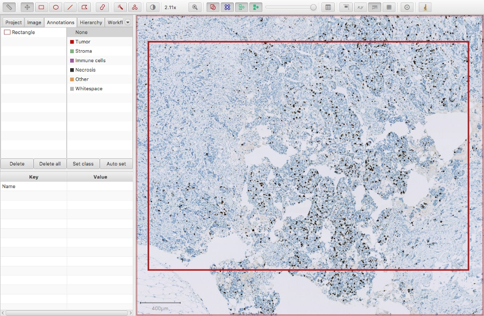

  Ki67 image

.. tip::
  
    See :doc:`thresholding` for other ways to define the region of interest automatically.
  
    You can also create an annotation corresponding to the entire image using :menuselection:`Objects --> Create full image annotation` -- but generally this is a bad idea, since it can lead to a lot of unnecessary processing and memory use within areas of the image that are not relevant.

Run *Cell detection* command
============================

With the annotation selected, the :menuselection:`Analyze --> Cell detection --> Cell detection` command can be used to detect cells.

.. admonition:: Cell detection or Positive cell detection?
  
  In :doc:`cell_detection`, we used the :menuselection:`Analyze --> Cell detection --> Positive cell detection` command.

  It does not really matter which command is applied in this case.
  *Positive cell detection* does exactly the same thing as *Cell detection*, but has the extra step of classifying all cells as positive or negative immediately according to staining intensity.
  This is most useful if all detected cells should be considered the same.

  Since in this case we need to classify cells as tumor or non-tumor first, we will postpone considering staining intensity until the end, whenever we know the cell types.
  Therefore there is no need to look at staining intensity now.
  For that reason, I've used the slightly-simpler *Cell detection* command.

If the annotation is large enough, QuPath will break it into smaller regions that it can process in parallel.
This improves the speed and reduces the memory requirements.
In this case, QuPath will overlap the regions and then try to resolve cells detected on region boundaries to avoid weird artefacts in these areas (e.g. cells being cut in half, or detected twice).

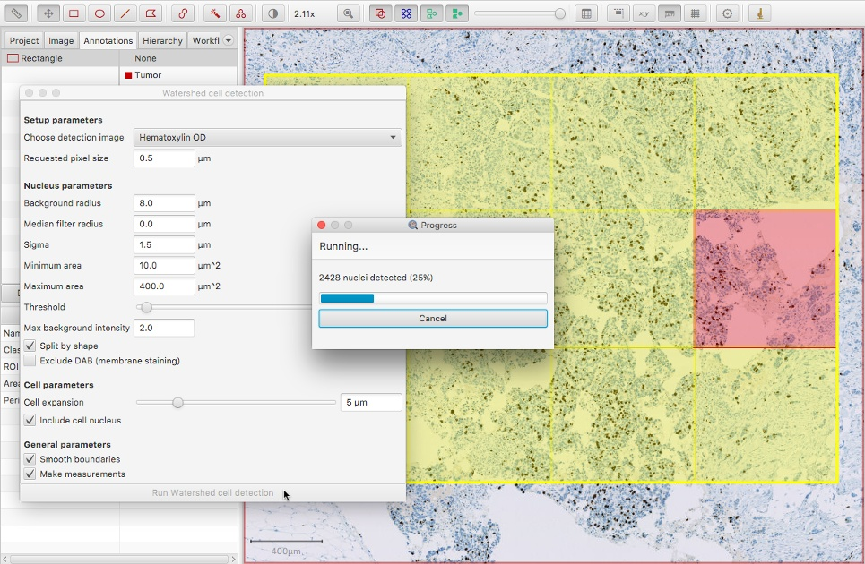

  Ki67 parallel cell detection

The resulting cell detection is shown below.

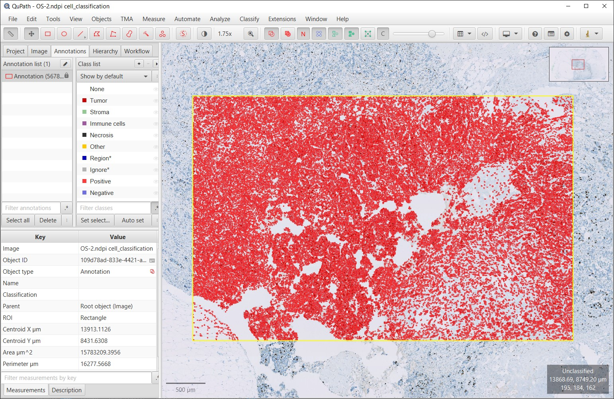

  Detected cells

View cell measurements (if you want)
====================================

QuPath's ability to distinguish between different cell types depends upon which measurements have been made.

One way to view the measurements is by generating a results table, as described in :doc:`cell_detection`.

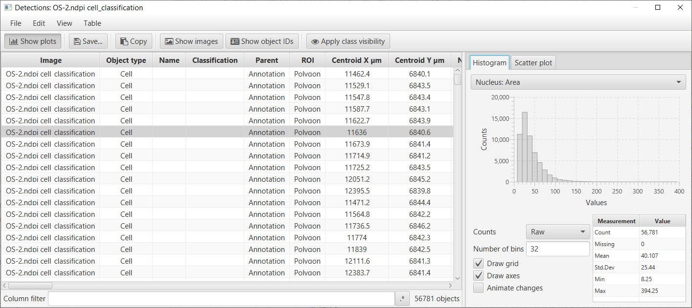

  Results table showing cell features

However, another way to visualize cell measurements is by using the :menuselection:`Measure --> Show measurement maps` command.

This creates a kind of 'heatmap' visualization, in which each cell is color-coded according to its value for a particular measurement.
The measurement can be selected from a list, and sliders can be used to adjust how colors are mapped to measurement values.

A particularly useful measurement for the purposes of tumor cell identification is the *Nucleus/Cell area ratio*.
This tends to be higher for tumor cells, because tumor nuclei tend to be larger than non-tumor nuclei, and more densely packed.
The *Nucleus/Cell area ratio* incorporates both of these characteristics in a single measurement.

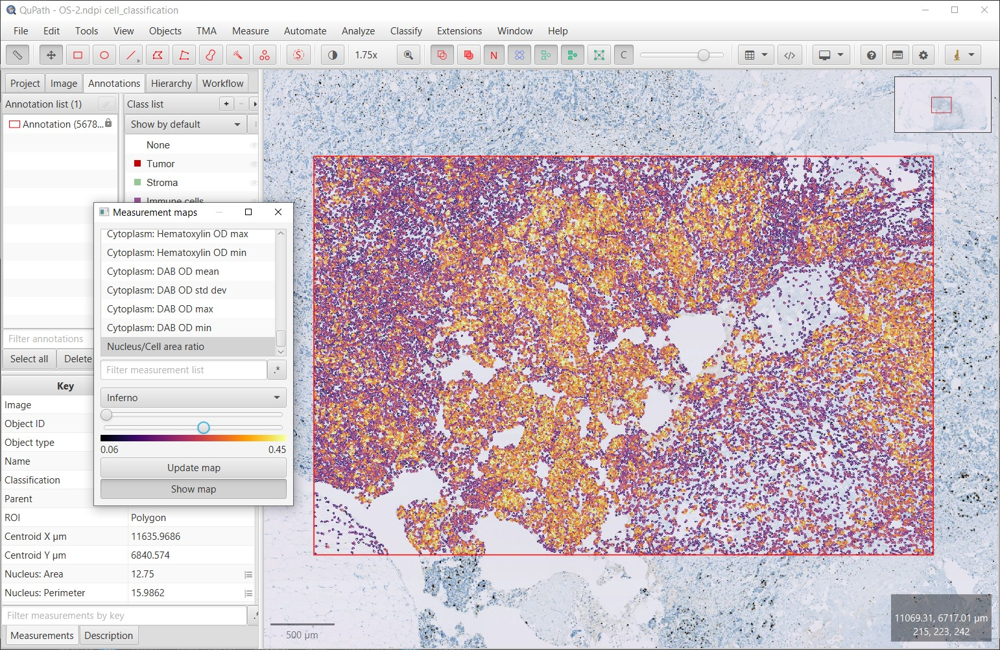

  Measurement map for Nucleus/Cell area ratio

Calculate additional features
=============================

Despite the usefulness of *Nucleus/Cell area ratio* for identifying tumor cells, on its own it is not enough.
One reason is that dense populations of immune cells can also have high values for this measurement.
Ultimately we will need to rely upon combinations of measurements.

Another reason for the limited usefulness of the *Nucleus/Cell area ratio* is that the measurement is rather 'noisy'.
This can be seen in the image above, where overall tumor cells have higher values (i.e. more yellow/white in areas of tumor), but there is considerable variation on a cell-by-cell-basis.

Therefore, to help QuPath perform an accurate classification it is useful to supplement the existing measurements of individual cells with some additional features that take into consideration more contextual information.

Some commands that enable this are found in the :menuselection:`Analyze --> Calculate features` menu.
One approach is to calculate textures from the image surrounding each cell.
This can be very effective, although computationally quite demanding whenever there are very large numbers of cells.

A much faster alternative, which can give very good results, is to simply 'smooth' the existing measurements with the :menuselection:`Analyze --> Calculate features --> Add smoothed features` command.
This will supplement the existing measurements with new measurements calculated by taking a weighted average of the corresponding measurements of neighboring cells.

The weighting depends on distance, i.e. cells that are further away have less contribution to the result.
Technically, distance is based on centroids and the weighting is calculated from a Gaussian function, where the parameter required in the dialog box is the `full-width-at-half-maximum <https://en.wikipedia.org/wiki/Full_width_at_half_maximum>`_ of the Gaussian function.
Less technically, putting higher numbers into the dialog box results in more smoothing.
This reduces the noisiness of the measurements more effectively, but also makes it more difficult to distinguish smaller areas containing particular cell types.

.. figure:: images/ki67_auto_smooth_features.jpg
  :class: shadow-image
  :align: center

  Smooth features dialog

After applying smoothing with the parameters shown above, clicking :guilabel:`Update map` within the *Measurement map* dialog causes the new measurements to appear.
The smoothed version of *Nucleus/Cell area ratio* is shown below.
Again, higher values are seen in areas of tumor -- but now these are much more homogeneous.
This will help QuPath to identify all the cells within tumor areas correctly.

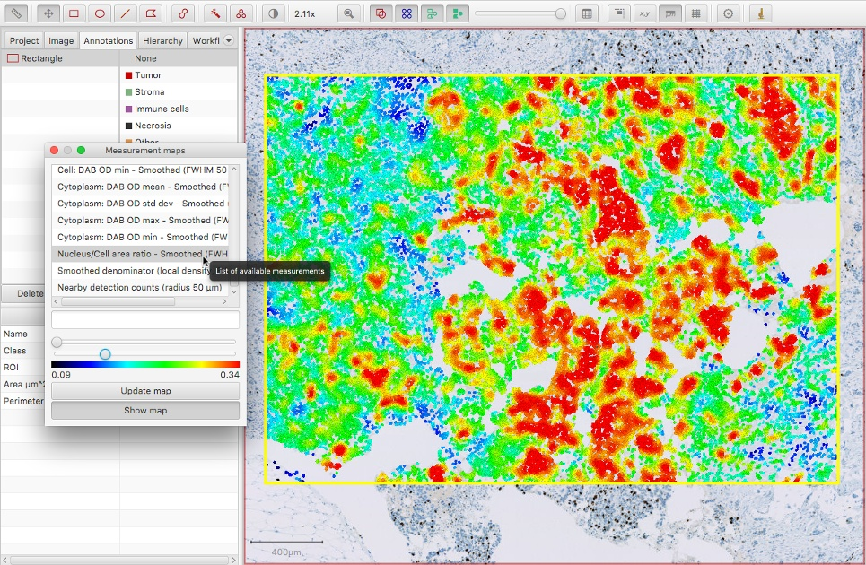

  Measurement map for smoothed Nucleus/Cell area ratio

Annotate regions containing different cell types
================================================

The next step is to begin annotating regions according to how the cells contained within them should be classified.

This requires creating annotations as normal, using any of the tools (apart from the *Line*) described in :doc:`../starting/annotating`.
It does not matter whether the cells are shown or hidden on the image at the time; it can be helpful to toggle the detections on and off with the *Show/hide detection objects* command |icon_detections| while annotating.

After an annotation has been drawn, select the *Annotations* tab in the *Analysis pane* to the left, click on the appropriate classification from the list on the top right, and press the :guilabel:`Set class` button.
You should see the number increase beside the class that you selected.
This is the number of annotations that you have drawn and assigned to this class.

.. tip::
  
  Double-clicking on the list of classification allows you to change their colors, while right-clicking brings up more options (including to add new classifications).

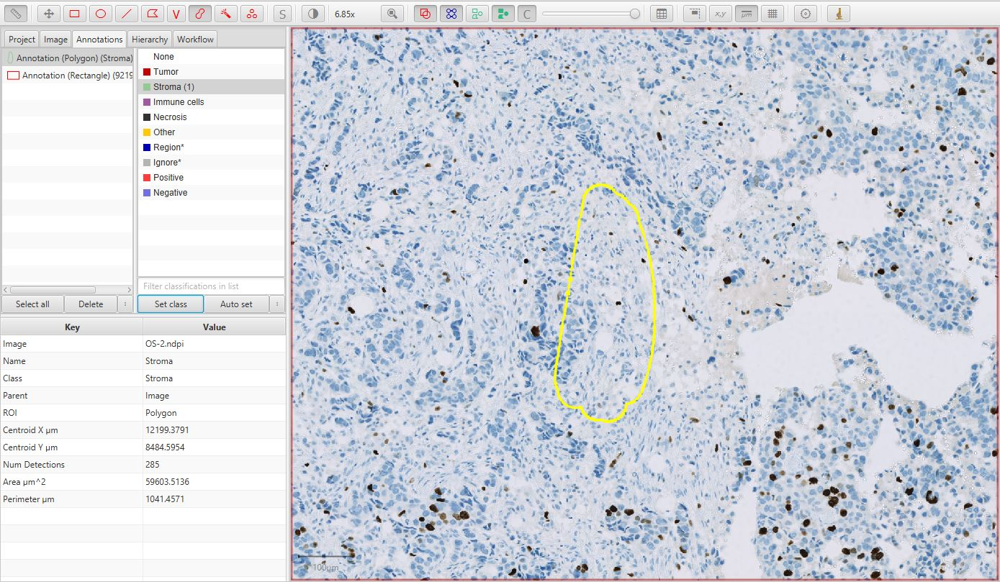

  Training cell classification

Continue creating annotations and assigning their classes.
Right-clicking on the image after drawing the annotation can offer an easier way to set the class, without needing to move the mouse to the other side of the screen and press the :guilabel:`Set class` button on the left.

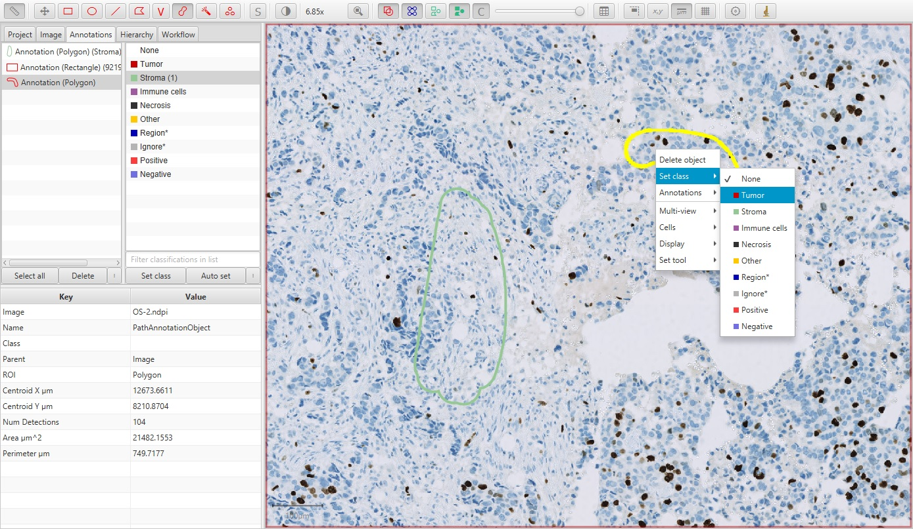

  Training cell classification with right-click

Train a cell classifier based on annotations
============================================

Once you have several annotations with different classes, it is time to create the classifier to see how well QuPath can distinguish the cells.

To do this, go to :menuselection:`Classify --> Object classification --> Train object classifier`.
Pressing :guilabel:`Live update` will train up a classifier that QuPath will then apply to all cells within the image.

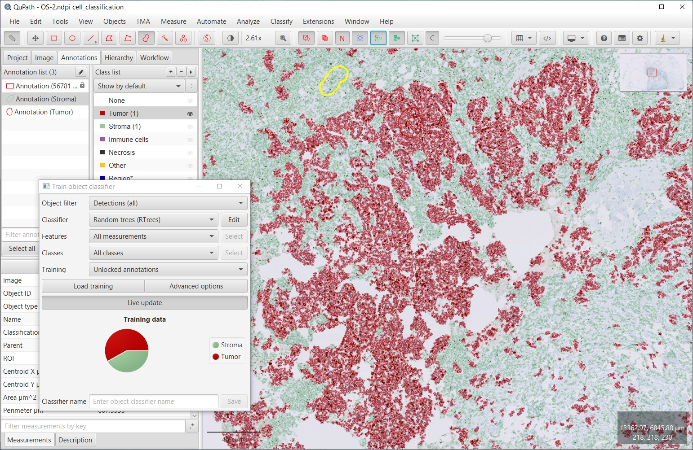

  Training cell classification with live update

.. tip::
  
  Make sure to toggle the detections on (*Show/hide detection objects* command |icon_detections|), otherwise you will not be seeing any of the cells nor the classification displayed.

If your computer is sufficiently fast, or your number of annotations sufficiently small, :guilabel:`Live update` will constantly update the classifier as you draw more annotations and set their classes.

.. tip::
  
  The default *Random Trees* classifier tends to get a good combination of speed and accuracy - although you can choose others if you wish.

.. tip::
  
  Holding down shift while right-clicking on the image provides a third way to set the class of an annotation that is selected, by opening a small 'ring' menu.

  .. figure:: images/ki67_auto_training_ring.jpg
    :class: shadow-image
    :width: 90%
    :align: center

    Training cell classification with shift + right-click
      
.. admonition:: Improving the classifier 
   
  The choice of annotations are important for classifier performance, but there are other customizations available if you need them.

  By default, all measurements that are available when the classifier is first built will be used.
  However, if you choose :guilabel:`Selected measurements` under *Feature*, you can press :guilabel:`Select` and select exactly which measurements you want to be used for the classification instead.

  You also have the :guilabel:`Filtered by output classes` option, which will come in handy for :doc:`multiplex_analysis`.
  If you add extra measurements later (e.g. by running *Add smoothed features* again with different settings), they should appear automatically in the feature list.

  :guilabel:`Load training` tells the classifier to use annotations from the selected images to train the classifier.
  :guilabel:`Advanced options` can generally be ignored; it enables feature normalization, but this should not matter for the random trees classifier.

Save the classifier
===================

Once the classifier is sufficiently accurate, you can save it by supplying a name and pressing :guilabel:`Save`.
This will allow you to load it again later on via :menuselection:`Classify --> Object classification --> Load object classifier`, whenever you wish to classify other detections.

Apply intensity classification
==============================

Once you are satisfied with QuPath's ability to identify tumor cells, it is now time to apply DAB staining intensity classification.
To do so, you can run the :menuselection:`Classify --> Object classification --> Set cell intensity classifications`.

Here, select *Nucleus: DAB OD mean* as the feature used for the intensity classification.

Make sure that :guilabel:`Single threshold` is selected and then adjust *Threshold 1+* until the resulting positive/negative sub-classification of tumor cells matches with the brown vs blue appearance of the nuclei within the image.

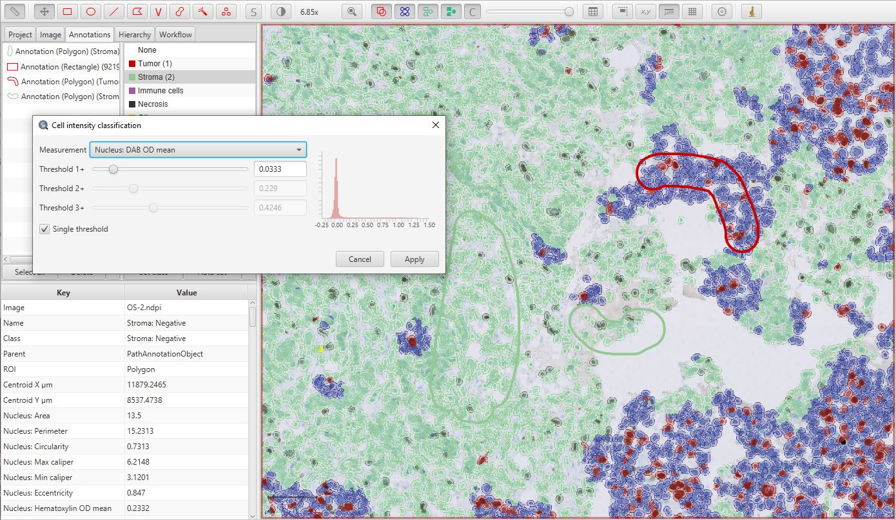

  Intensity classification

.. tip::

  If you want to update the intensity classification threshold later, without needing to go through the whole detection classification thing, you can simply re-run the *Set cell intensity classifications* command.
  This will overwrite the intensity classification threshold (positive/negative) without changing the main classification (*Tumor*, *Stroma* etc.).

  For more thoughts and tips on assigning intensity-based classifications, see `this blog post <https://petebankhead.github.io/qupath/tips/2018/03/22/setting-positive.html>`_.

.. tip::
  
  You can set up to three intensity thresholds, to categorize cells as *Negative*, *1+, *2+* and *3+* (i.e. weak, moderate or strongly positive).
  If you do this, QuPath will automatically calculate H-scores, in the range 0--300.

View the results
================

That's it!  If you select the original, large annotation containing all the cells then the Ki67 labelling index show appear in the lower measurements section of the *Annotations* tab on the left of the screen as *Positive %*.
You can also generate results tables if necessary.

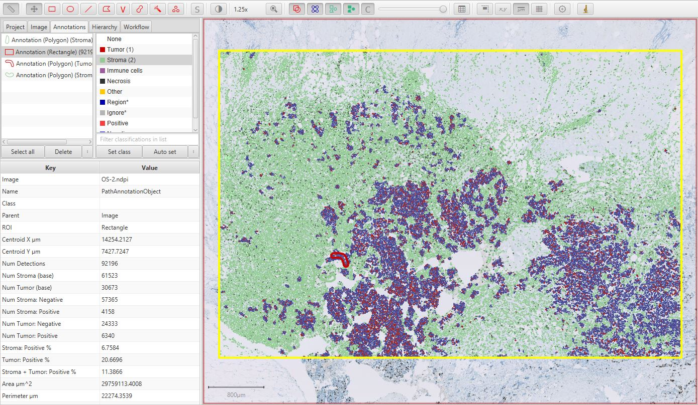

  Ki67 analysis results with cell classification

Provided that you saved your classifier, you can apply it to a similar image in the future. To do so, you can run the cell detection and feature calculations as before, and then apply your pre-trained classifier with :menuselection:`Classifier --> Load object classifier`.

Or see also the :doc:`../scripting/index` section for more information about how to batch process larger numbers of images in a reproducible way.
