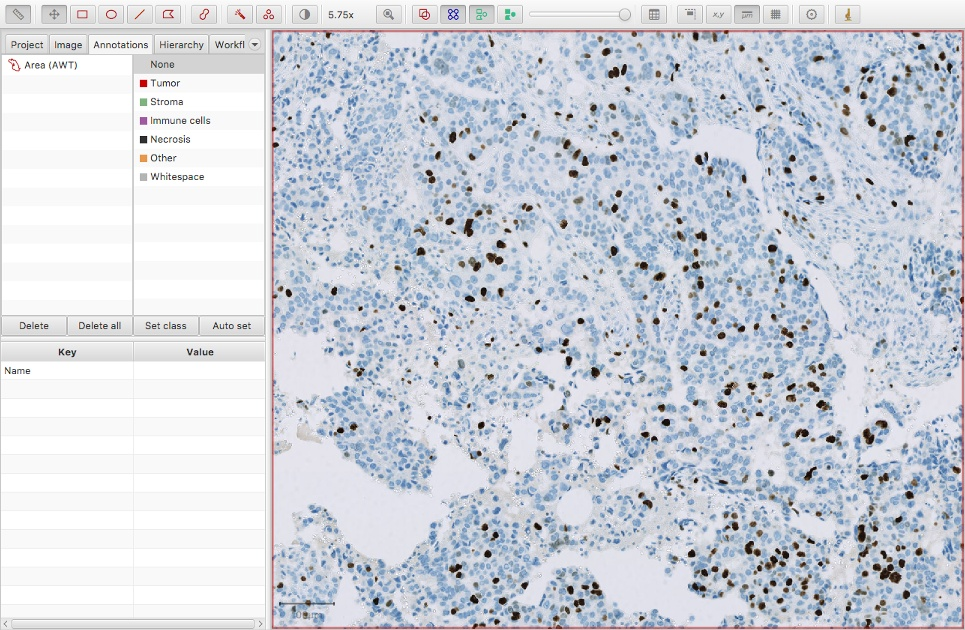
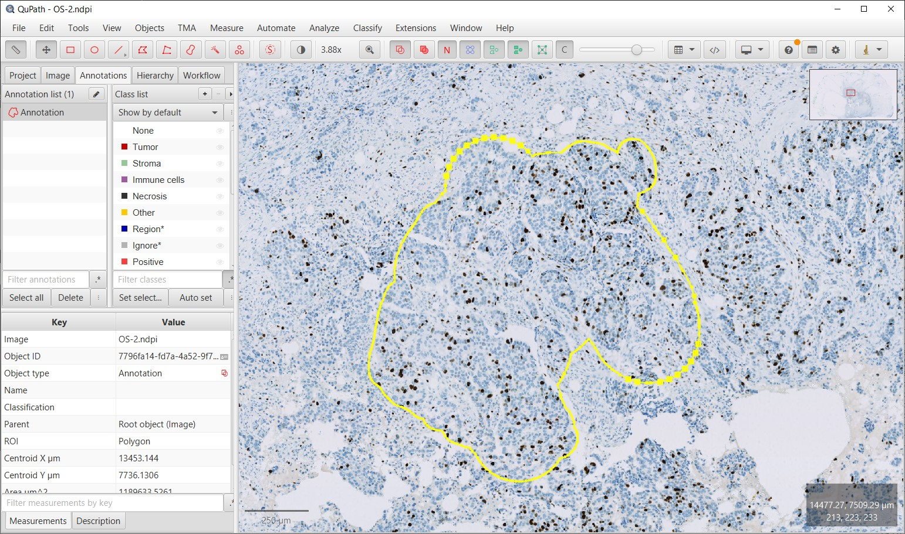
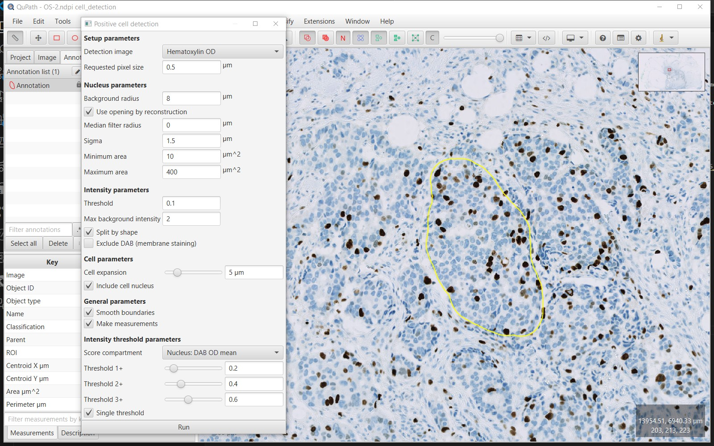
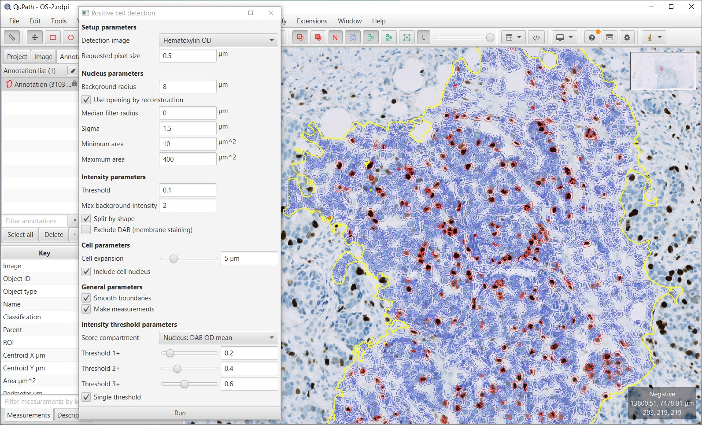
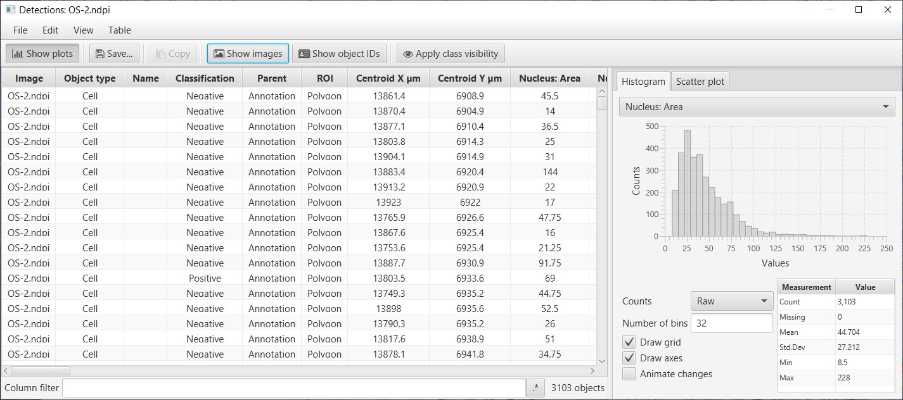
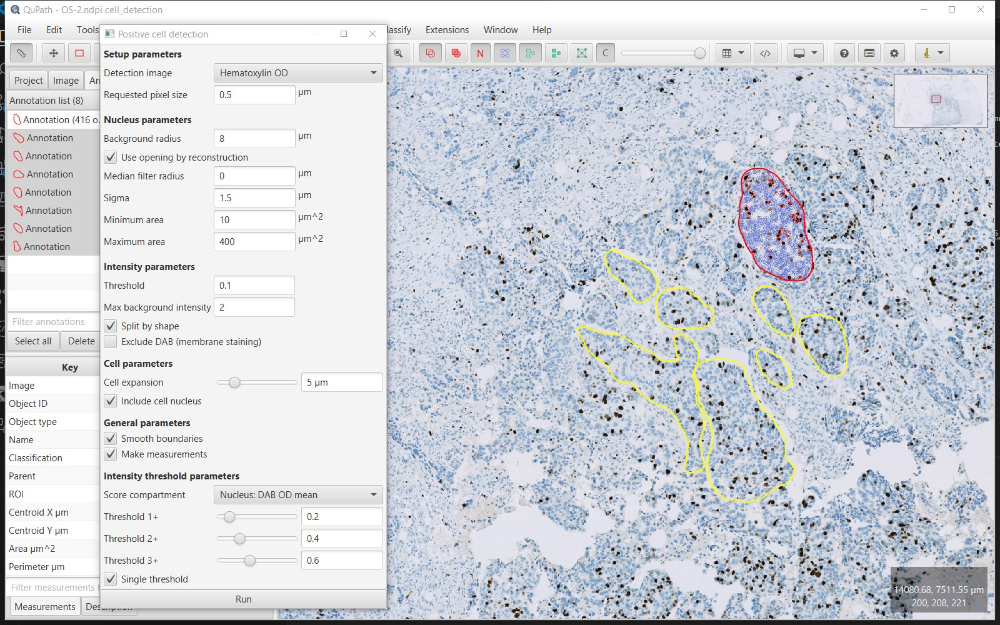
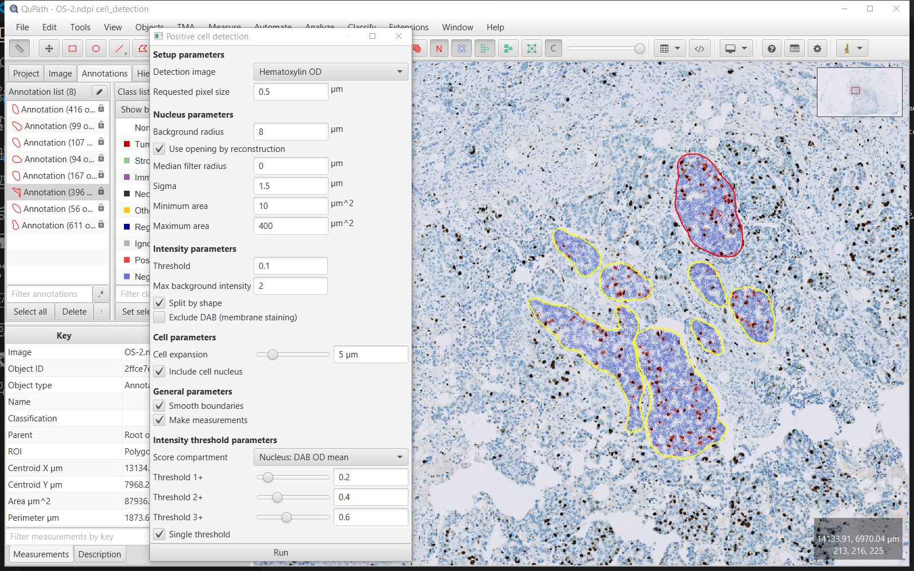
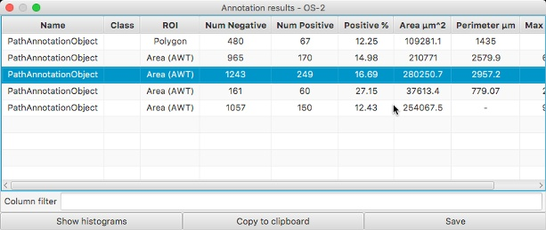

**************
Cell detection
**************

.. include:: ../tools.txt

Previous sections described some of QuPath's tools for manually drawing regions and counting objects inside them.
While this approach may be fine for some applications, the laborious manual counting step does not scale well to handling large numbers of objects.
Here, we look at how QuPath's detection capabilities can be used to obtain results much more quickly and reproducibility - and often with higher accuracy, and less bias.

While this section focusses on detecting cells, the concepts introduced here are more general, and can be applied in QuPath for other kinds of tasks were 'detecting objects' is required.

.. note::
  The Ki67 image is from the `OpenSlide freely-distributable test data (OS-2.ndpi) <http://openslide.cs.cmu.edu/download/openslide-testdata/Hamamatsu/>`_.

The overall goal is to determine the percentage of tumor cells that are positive for Ki67 (i.e. brown), while ignoring non-tumour cells.
This is sometimes referred to as the 'Ki67 labelling index'.

.. note::
    Because Ki67 is a marker of cell proliferation, a higher Ki67 labelling index implies that the tumor cells are proliferating more rapidly.
    This has a relationship with the prognosis for the patient, and in some cases may inform the most appropriate choice of treatment.

    For more information on Ki67 in breast cancer, see for example

    * Dowsett, Mitch, et al. 2011. "Assessment of Ki67 in Breast Cancer: Recommendations from the International Ki67 in Breast Cancer Working Group. *Journal of the National Cancer Institute* 103 (22): 1656–64. `doi:10.1093/jnci/djr393 <http://doi.org/10.1093/jnci/djr393>`_.

In this case, tumor cells are identified by manually drawing around them to create annotations, after which QuPath is able to very quickly detect the cells and calculate the positive percentage inside each annotation.
In :doc:`cell_classification` we will look at improving on this by training QuPath to identify tumor cells itself.

  Ki67 image

Annotate a region of interest
=============================

Using some of the tools introduced in :doc:`../starting/annotating`, create an annotation around a region containing tumor cells that should be detected and counted.

  Ki67 image with annotation

Run *Positive cell detection*
=============================

Run the :menuselection:`Analyze --> Cell analysis --> Positive cell detection` command.
This will bring up a dialog, where most of the options relate to how the cells are detected.
The default values are often good enough to get started.

The bottom of the dialog contains options that relate to how detected cells will be classified as either positive or negative.
The *Score compartment* value of *Nucleus: DAB OD mean* indicates that the decision will be based on the average DAB (brown) staining within the nucleus - which is appropriate in this case.
Other options are useful in cases where the biomarker of interest isn't localized to the nucleus.

Below this, up to three different thresholds can be set to categorize cells according to staining intensity, i.e. negative (blue), weakly positive, moderately positive and strongly positive.
However, in this case we are not interested in multiple intensity classifications, and instead only require a binary categorization of *Positive* vs *Negative*.
Therefore the *Single threshold* option should be ticked, and only the first threshold will actually be used.

  Positive cell detection dialog

After pressing the *Run* button on the dialog, the results should appear as below.
In this case, the original single 'annotation object' has been added to with 1088 'detection objects' (the cells).
While the annotation is selected, you can also see from the panel on the left that 12.4% of the detected cells are classed as positive.

.. note::
  For a quick recap on the difference between annotation and detection objects, see `Introducing objects <../starting/first_steps.html#introducing-objects>`_.

  Positive cell detection image results

If you find that the cells do not appear, check that you do not have detection objects hidden.
This is controlled with the *Show/hide detection objects* button on the toolbar |icon_detections|.
You can also control whether the detections are shown 'hollow' or 'filled' with the button beside |icon_detections_fill|.

It is a good idea to use these buttons (or their shortcuts :kbd:`D` and :kbd:`F`) to help confirm that the cells have been correctly detected.

View cell-by-cell results
=========================

It may be the case that 12.4% is already the final result that is required and the work is done.
However, QuPath provides the opportunity to look in more detail.

One way is to double-click on individual cells to select them (make sure the *Move* tool |icon_move| is selected in the toolbar, to avoid accidentally drawing on the image when clicking instead), in which case the results shown on the left panel should update to become the measurements for the selected cell.

Another way to view all the measurements of all the cells is by selecting :menuselection:`Measure --> Show detection measurements`; this command is also accessible from the *Measurement table* icon in the toolbar |icon_table|.

This should open up a results table with the measurements of all cells.
From this, it is possible to generate histograms, sort columns, select individual cells (which will then be selected on the image) and to export the measurements to a CSV file for use elsewhere.

  Cell detection results table

One particular use of this table is to help determine what threshold is most appropriate to apply to the *Nucleus: DAB OD mean* measurements to determine if a cell is positive or not.
Since this measurement is included in the table, a histogram can be generated for this value from all detected cells.
Because most cells in this example are negative, the image below shows a large peak around 0 and a long tail to the right.
A threshold of around 0.1 looks like it is likely to perform well (note, the threshold that was actually used was 0.2... therefore we should expect few, false positives, but we may have missed a small number of some true positive cells and instead classified them as negative).

.. note::
  The fact that a considerable number of the cells appear to have *negative* DAB OD staining (i.e. values below zero) - which ought not to be possible - the histogram suggests that the stain separation has not been perfect.

  A small proportion of negative values is generally tolerable because of the inherent limitations in trying to quantify DAB staining in imperfect images, however the situation can (and in this case probably should) be improved using the *Estimate stains* command.
  However, it is important to note that when the stain estimates are improved then all cell detection should be repeated.

Analyze additional annotations
==============================

If necessary, it is possible to then proceed to draw further annotations around areas of interest.
These can be processed one-by-one by running *Positive cell detection* on an annotation when it is selected, or else they can be processed all together (in parallel).
The easiest way to do the latter is to ensure that no annotations are selected (e.g. double-click a background area with the *Move* tool |icon_move| selected), and then press the :guilabel:`Run` button in the *Positive cell detection* dialog window.
QuPath will then prompt you to confirm if you want to run the detection for all *Annotations*.

  Positive cell detection in parallel for multiple annotations

The final result should look something like that below.

  Multiple annotations for Ki67 image

View results
============

Whenever you have multiple annotations, it can be helpful to generate a results table for these.
This is similar to creating a results table for detections, but requires the :menuselection:`Measure --> Show annotation measurements` command instead.
You can also access this command from the *Measurement table* icon in the toolbar |icon_table|.

  Annotation results table

Note that the figure above was taken before adding a fourth annotation (and detecting its cells).

.. tip::
  You can use the :guilabel:`Convert detections to points` button within the **Points tool** |icon_points| to generate an editable points annotation from the detected cells.
  This provides a 'semi-automated' alternative to manually clicking on every cell to generate counts whenever the automated detection alone is not quite accurate enough.

  See :doc:`../starting/cell_counting` for more info on manual counting.

  .. image:: images/convert_detections.jpg
    :width: 40%
    :align: center
