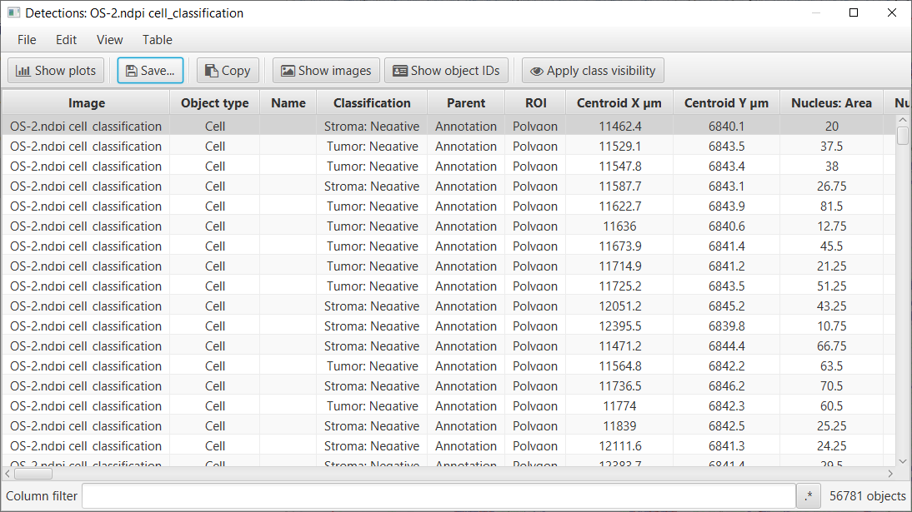

**********************
Exporting measurements
**********************

.. include:: ../tools.txt

There are 3 different ways to export measurements within QuPath, via:

1. the *measurement table*
2. the *measurement exporter*
3. a *script*

Which one to use is up to you and depends on what you want to do.

.. note::
  
  As a rule of thumb, if you have:

  * **a single image**: use the measurement table
  * **multiple images**: use the *Measurement Exporter* or a script

=========================
Via the measurement table
=========================

The measurement table allows you to export measurements from a single image, currently opened in the viewer.
It is therefore **not** recommended if you wish to export measurements for multiple images or across a whole project.
Nevertheless, it is a good method to get some direct visualisation of what will be exported, before actually exporting anything.

As mentioned in `Introducing objects <../starting/first_steps.html#introducing-objects>`_, you can create a measurement table by selecting the **Table** button in the toolbar |icon_table|.
After choosing the objects you wish to export (e.g. detections, annotations), a similar measurement table to the one below will be shown on screen.

  Saving cell detection measurements via the measurement table.

You can then save your measurement by pressing **Save** and choosing an appropriate name for your output ``.txt`` file.

.. note::
  
  This method creates a table with different columns, which all depend on the objects (and measurements) present in your image.

  If your analysis involves combining measurements from different images, it is recommended to use the Measurement Exporter, detailed in the next subsection.

============================
Via the Measurement Exporter
============================

The cleanest way to export different types of measurements in QuPath across multiple images is with the **Measurement Exporter**.

Provided that your images are stored in a :doc:`project <../tutorials/projects>`, you can access it through :menuselection:`Measure --> Export measurements` (as well as |icon_table| --> Export measurements).

.. figure:: images/measurement_exporter.png
  :width: 70%
  :align: center
  :class: shadow-image

  The Measurement Exporter

From there, you can decide from which image(s) the measurements will the be exported (similar to the :doc:`Run for project <../scripting/workflows_to_scripts>` command in the script editor).

Below the image selection, a small number of parameters will allow you to shape your output file as needed:

1. **Output file**: The desired `full path` location of your output file
2. **Export type**: The measurement type to be exported (e.g. cells)
3. **Separator**: The character that will be written to separate the measurement values (e.g. a tab)
4. **Columns to include** (optional): The list of measurements to include in the export (if left empty, all existing measurements are included)

.. note::
  If you wish to **only** export specific measurements, the :guilabel:`Populate` button is what you need.
  This will populate a list from which you can choose the exact columns to include in the export.
  This list is constructed after performing a scan of all the selected images to check which measurements exist, and should only take a couple of seconds.
  This means that you must have selected image(s) to do this.

  Note that if an image is missing measurements for a specified column, empty values will be written to the output file.

.. important::

  If you have an open image in an active viewer, be sure to always save your data before running the measurement exporter.
  A small red-colored warning will appear to remind you.

=============
Via scripting
=============

In cases where you would want to automate your analysis and exporting process, the Measurement Exporter can be easily used with scripting.
To do so, you can create a ``MeasurementExporter``, customize it the way you want it, then call ``exportMeasurements(outputFile)`` to start the export process.

The following script demonstrates a standard pipeline for exporting cell measurements from all the images in the current project to an output file ``measurements.tsv``.

.. code-block:: groovy

  import qupath.lib.gui.tools.MeasurementExporter
  import qupath.lib.objects.PathCellObject

  // Get the list of all images in the current project
  def project = getProject()
  def imagesToExport = project.getImageList()

  // Separate each measurement value in the output file with a tab ("\t")
  def separator = "\t"

  // Choose the columns that will be included in the export
  // Note: if 'columnsToInclude' is empty, all columns will be included
  def columnsToInclude = new String[]{"Name", "Class", "Nucleus: Area"}

  // Choose the type of objects that the export will process
  // Other possibilities include:
  //    1. PathAnnotationObject
  //    2. PathDetectionObject
  //    3. PathRootObject
  // Note: import statements should then be modified accordingly
  def exportType = PathCellObject.class

  // Choose your *full* output path
  def outputPath = "M:/measurements.tsv"
  def outputFile = new File(outputPath)

  // Create the measurementExporter and start the export
  def exporter  = new MeasurementExporter()
                    .imageList(imagesToExport)            // Images from which measurements will be exported
                    .separator(separator)                 // Character that separates values
                    .includeOnlyColumns(columnsToInclude) // Columns are case-sensitive
                    .exportType(exportType)               // Type of objects to export
                    .exportMeasurements(outputFile)        // Start the export process

  print "Done!"
