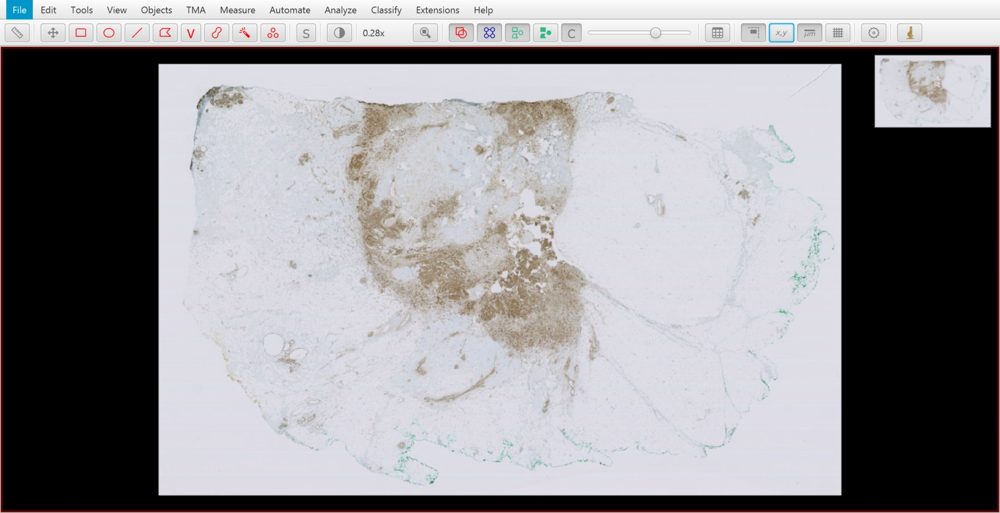
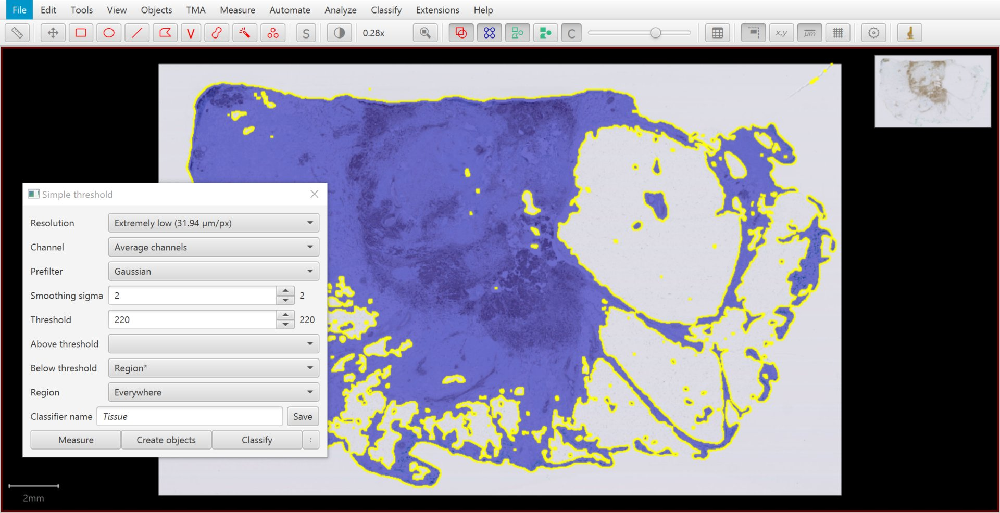
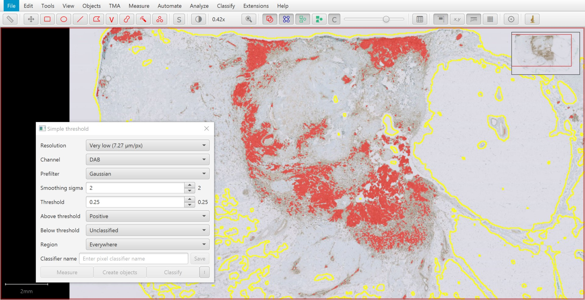
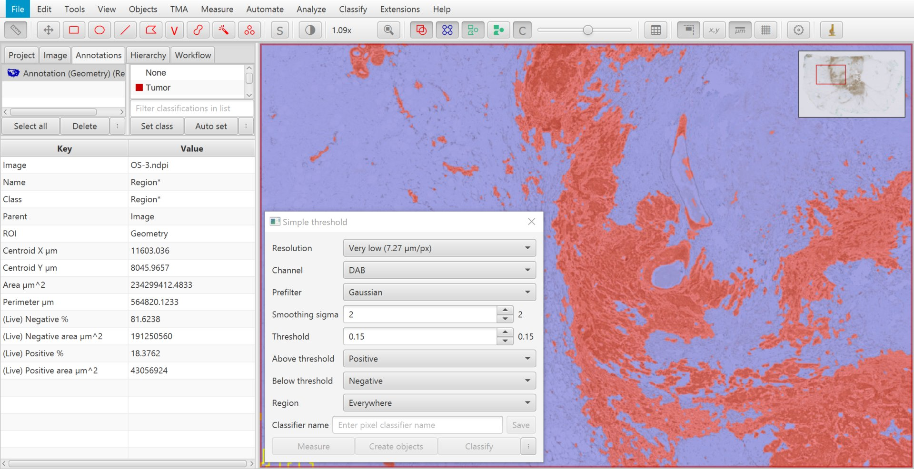
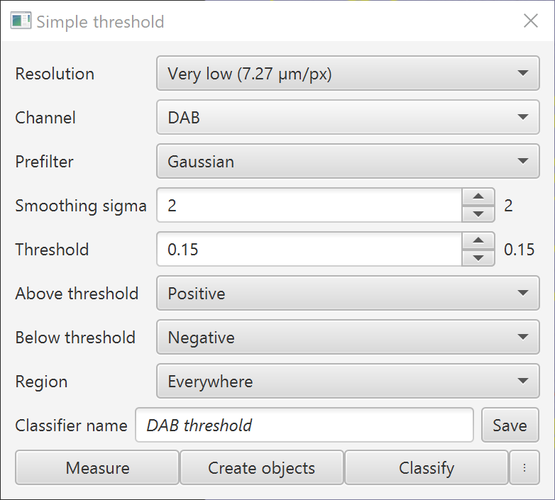
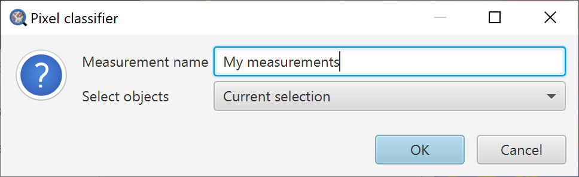
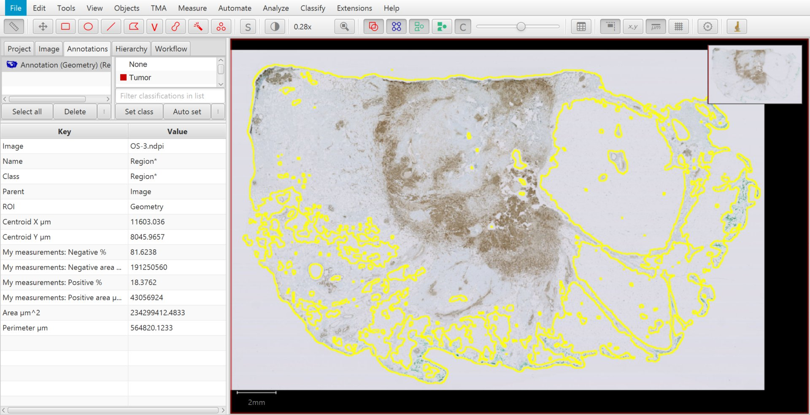

***************
Measuring areas
***************

Perhaps one of the earliest and most familiar applications of image analysis in pathology is to quantify stained areas, sometimes referred to as *positive pixel counting*.

We can apply this to :doc:`OS-3.ndpi <../intro/acknowledgements>` to answer the question: what is the area of the brown region, and what proportion of the tissue does it occupy?

  OS-3.ndpi

Define the region of interest
=============================

Absolute measurements of stained area are generally not very meaningful: they need to be normalized to something.

We can define the 'full' area of interest by drawing an annotation, or create one automatically around the entire tissue using the techniques described in :doc:`thresholding`.

  Tissue detected by thresholding.

Threshold stained areas
=======================

QuPath makes it easy to digitally separate stains by color deconvolution, as described in :doc:`separating_stains`.
*Create thresholder* allows you to use the stain separation along with thresholding.

In this case, set the :guilabel:`Channel` to :guilabel:`DAB` and *decrease the threshold value*.
The range of 'optical densities' after color deconvolution is typically (but not strictly!) around 0 -- 2, and an appropriate threshold might be around 0.25.

  Preview of stained area detection.

Viewing measurements
====================

Selecting the :guilabel:`Annotations` tab, you can see that QuPath is already generating live measurements of stained areas.
These are computed automatically while you adjust thresholding parameters.

These are important, because they allow you to see how your results will be impacted by changing thresholds and other parameters.

.. figure:: images/areas_threshold_25.jpg
  :class: shadow-image
  :align: center
  :width: 90%

  A higher threshold results in a lower stained percentage measurement.
  
.. admonition:: Why don't I see live measurements?

  You might find your live measurements are missing, or have the value `NaN` (not a number).
  There are a few reasons for this:
  
  * Depending upon the size of the region you are analyzing, power of your computer, and resolution of your analysis, it can take some time for these measurements to update. This happens live and in the background, while you do other things.
  * Meaurements are only provided if enough of the image has been classified... and this happens only for parts of the image that are currently visible. So you can zoom out if needed to enable more measurements to appear.
    

For so long as a assign only one classification (above or below the threshold), QuPath will only give area measurements for that classification.

If I would like to automatically generate measurements for the relative proportion of pixels above and below the threshold, I need to set classifications for both above and below the threshold.

For this reason, I have chosen to assign both *Positive* and *Negative* classifications.

  A lower threshold results in a higher stained percentage measurement.

.. tip::
  
  Classifications with names ending in an asterisk* are special -- see :ref:`Ignored* classifications`.  

.. admonition:: Why are the areas of my live measurements different from the areas of my annotations?
  
  The areas reported from pixel classification are based upon *counting pixels in the classified image*.
  The areas QuPath normally reports for annotations is based upon *the coordinates of their geometries*.
  
  Depending upon the resolution of the classification, the 'counting pixels' approach gives a rather lower-resolution approximation of the area that does not exactly match the geometry-based approach (but it should generally be close).

Generating results
==================

The live measurements will disappear when you close you the thresholder dialog.
At this point you *could* generate annotations from your thresholded brown regions to preserve the information -- but you typically do not have to.

Rather, you can save your thresholder and click :guilabel:`Measure`.

  Saving the thresholder.
  

You can then select what kinds of object you want to measure (e.g. annotations, or the full image again) and add some extra text to help you identify the measurements later.

  Add a name to distinguish your measurements.

The various measurement tables accessed through the :menuselection:`Measure` menu allow you to view and export the measurements at the end.

  Results of calculating the stained area percentage.
  The overlay is not displayed after the dialog is closed, but you can reload the threshold settings with :menuselection:`Load pixel classifier`.

.. admonition:: Image analysis & objectivity
  
  One of the claimed advantages of image analysis over visual assessment is that it is *objective*.

  I hope this tutorials helps demonstrate why *this is completely wrong*!
  
  Even for this very simple example, we need to make decisions:
  
  * At what resolution will we perform our detection?
  * What should be included in the tissue? Do we want areas of fat or not?
  * How to we define our stain colors?
  * What thresholds do we use?
  
  All of these can impact the results.
  Different people may (subjectively) make different decisions, and the results of their analysis will differ accordingly.
  
  QuPath does *not* answer these questions for you, but gives you the tools for you to construct your own analysis pipelines.
  
  *However*, while it is important to be aware that image analysis is not objective, this does not make it useless.
  Used cautiously -- and with careful validation -- image analysis *may* be faster, more reproducible, and more quantitative than visual assessment.
  
  
