********************
Pixel classification
********************

The thresholds we applied both in :doc:`thresholding` and :doc:`measuring_areas` introduce a bigger theme: *Pixel classification*.

In the same way that you can :doc:`train an object classifier <cell_classification>` in QuPath, you can also train a *pixel classifier*.

A *thresholder* is a pixel classifier.
In fact, it's the simplest one QuPath provides -- where the 'training' was simply adjusting parameters.
But pixel classifiers can also do much more sophisticated things.

.. tip::
  
  Please read :doc:`thresholding` and :doc:`measuring_areas` first!

Stained areas (again)
*********************

Returning to the example in :doc:`measuring_areas`, we could replace either of the thresholding steps with :menuselection:`Classify --> Pixel classification --> Train pixel classifier`.

This would allow us to identify regions not my manually defining thresholds, but rather through training by example.

You can get started quickly with :menuselection:`Train pixel classifier` by drawing two annotations in different parts of the image, and assigning classifications to these.
Press :guilabel:`Live prediction` and QuPath should already start showing its predicted classifications.

.. figure:: images/pixel_os3.jpg
  :class: shadow-image
  :align: center
  :width: 90%

  Pixel classification to find positive pixels.

You can proceed to add more annotations to refine these predictions.
When you are done, you can enter the classifier name, save it, and create measurements or objects -- :doc:`in exactly the same way as for thresholding <measuring_areas>`.

More complex classifications
****************************

Training a pixel classifier makes it possible to incorporate a lot more information than is possible with a simple threshold, and to determine the output in a much more sophisticated way.

This means it can be applied in cases where a threshold would just not be accurate enough.

We will explore this using the example image :doc:`OS-1.ndpi <../intro/acknowledgements>`, using pixel classification to identify what I (perhaps mistakenly, since I'm only a computer scientist) suppose to be tumor.
We will further look to identify everything else that is tissue, *and a third class* for the whitespace in the background.

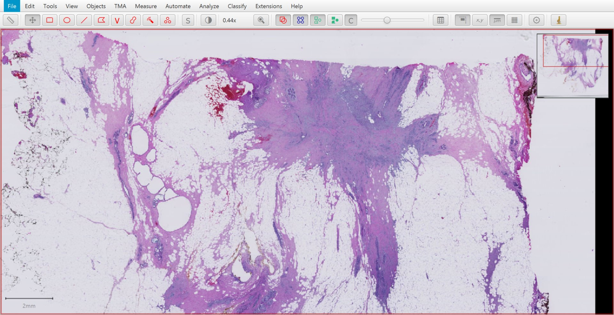

  OS-1.ndpi

Getting started
===============

As before, we begin by annotating **small** regions that correspond to the different classes we are interested in, and use :guilabel:`Live prediction` to get a first impression.

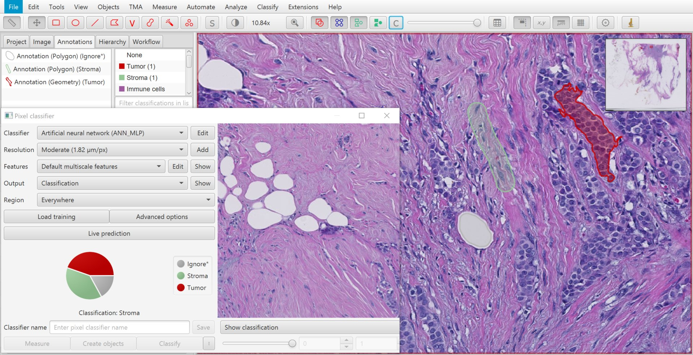

  Annotating regions for three classes (*Tumor*, *Stroma* and *Ignore**).

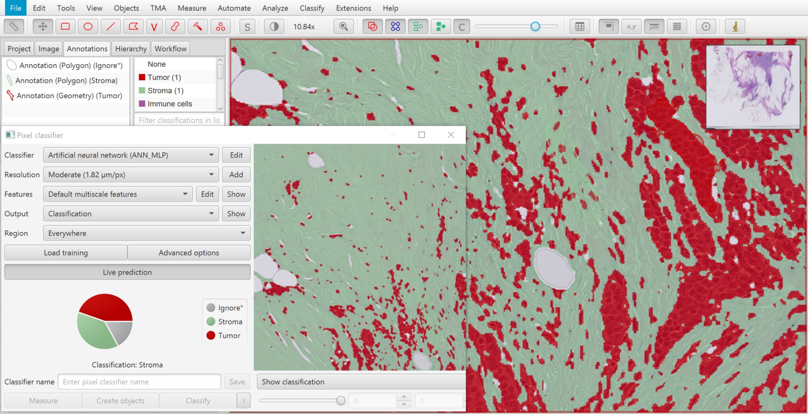

  Live prediction based on one annotation per class.

You should find it quickly get some parts right... but quite a lot wrong.
We can resolve some errors by adding more annotations, but this alone won't be enough.

Improving the classifier
========================

To use the pixel classifier effectively, we need to know:

1. How to choose regions for annotations
2. How to control the *other* options we have at our disposal to improve the classifier
3. When we've stretched the pixel classifier to its limit... and might need to supplement it with something else

Annotating effectively
----------------------

The pie charts in the screenshots show the relative proportion of training samples for each class.
This depends upon the number of annotations with each classification, and the size of those annotations.

You should usually aim to annotate your image so that you have:

* Small, diverse training samples
* Roughly the same number of training samples for each class

If you give the classifier lots of examples of pixels that look nearly the same, it will be harder to train it to identify anything else.

Adjusting other options
-----------------------

Some of the options available to customize the classifier during training are the same as those we met while :doc:`thresholding <thresholding>` (since a thresholder is just a simple pixel classifier), while others are not.

The options include:

* **Classifier**: The type of the classifier. *Artifical neural networks* are *Random trees* are generally good choices. *K nearest neighbor* can be appropriate if you will train from point annotations only (it can become *very* slow with large training regions). Press :guilabel:`Edit` to have more options for each.
* **Resolution**: Same as with the thresholder: controls the level of detail for the classification (and, relatedly, processing time and memory use).
* **Features**: Customize what information goes into the classifier (more information below).
* **Output**: All available classifiers can output a single classification per pixel. Some can also provide an estimated (pseudo)probability value for *each* available classification. This isn't a true probability, will be rescaled to the range 0-255, and requires more memory -- but can be useful in some cases to assess the confidence of the predictions.
* **Region**: As with the thresholder, this controls where the overlay previews the classification. It does not impact the results.

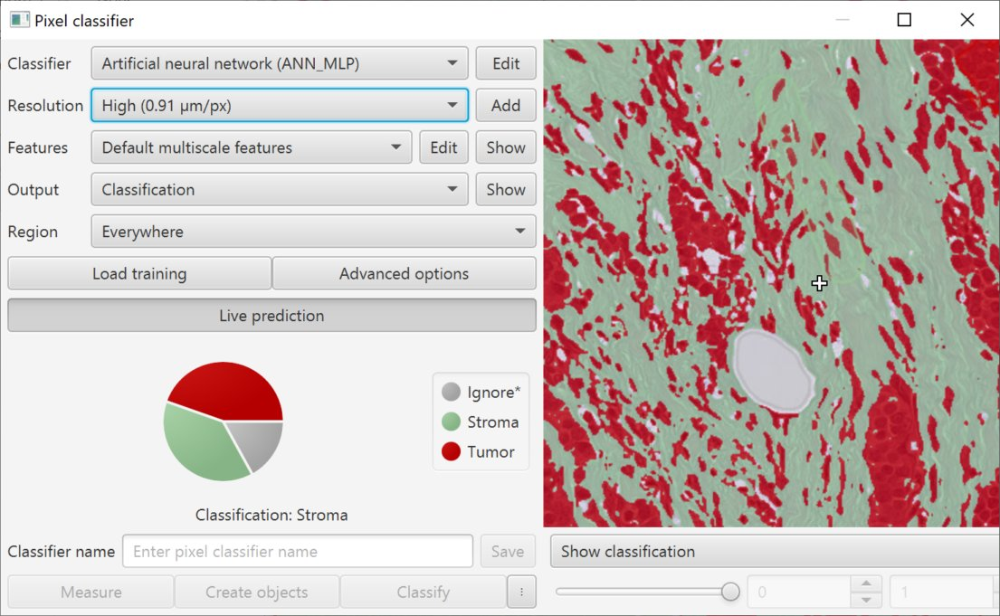

  Pixel classification dialog.

.. tip::
  
  The image preview in the dialog box shows the image *at the resolution at which it is being classified*.

.. tip::
  
  The :guilabel:`Show` buttons next to :guilabel:`Output` and :guilabel:`Features` can be used to extract an ImageJ stack, allowing these to be explored in more detail.

The first three options are that ones that impact the accuracy.
There are relatively few options for the classifier choice and resolution -- you can try a few and use what works best.

Selecting features takes a bit more thought.

Selecting features
------------------

The :guilabel:`Edit` button opens a dialog to select features.
These are essentially transformed versions of the image that will contribute to the final output of the classifier.

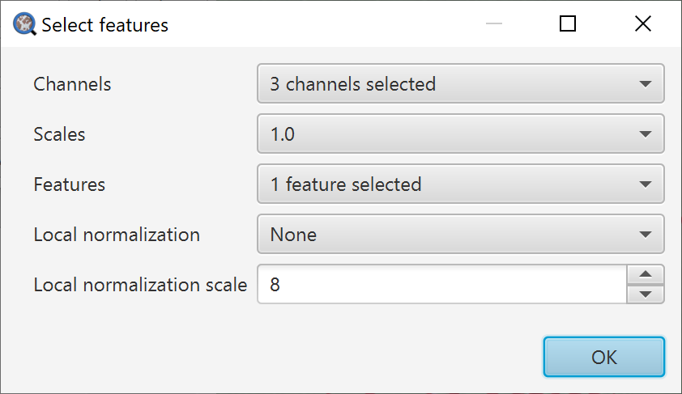
  
  Selecting features.

* **Channels**: Choose the channels that are relevant for what you want to detect. For example, if you are looking to identify brown staining, use **DAB**. The options that are available will depend upon the image type.
* **Scales**: Try choosing a few scales. These control different amounts of smoothing that may be applied to the input... which then impact how smooth the output looks.
* **Features**: The specific transforms that will be applied to the channels of the image selected before, and the requested smoothing scales.
* **Local normalization**: Generally best avoided. This can optionally apply some local background subtraction and normalization in an effort to handle image variations, but in practice it often does more harm than good. May be removed or replaced in a future version.

The best way to understand the specific features it to visualize them.
You can do that by choosing a few (not too many at a time, to avoid upsetting your computer) and using the drop-down menu below the preview image.

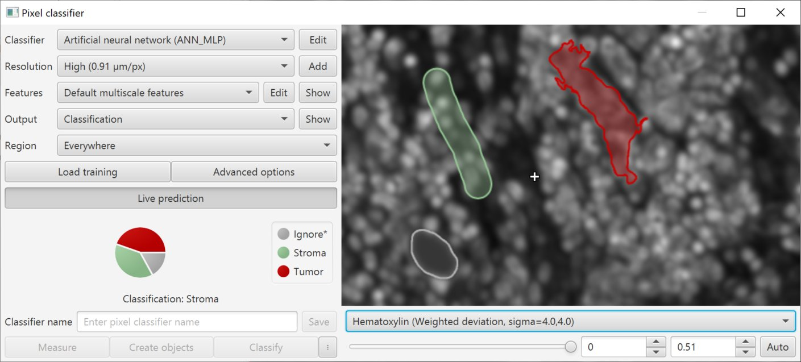

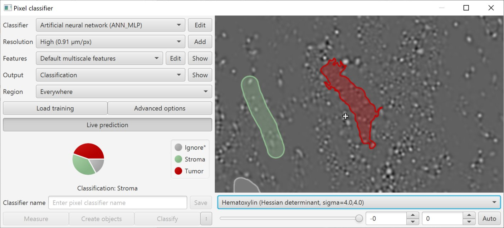

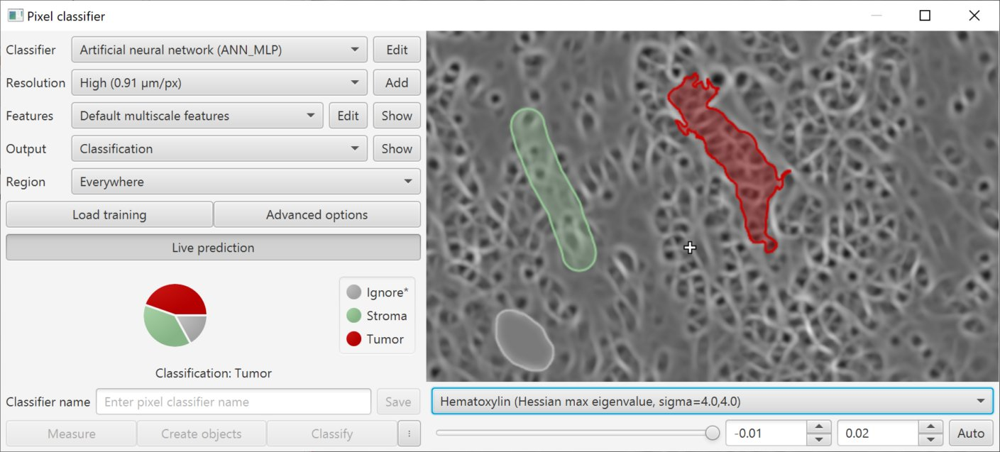

You will soon find that some features have a particular characteristic appearance, which makes them especially suited to some applications.

Here is rather informal definition of what specific features are likely to be helpful for identifying:

.. list-table:: The usefulness of features
  :header-rows: 1
  
  * - Feature
    - Purpose
    
  * - Gaussian filter
    - General-purpose (color & intensity)
    
  * - Laplacian of Gaussian
    - Blobby things, some edges
    
  * - Weighted deviation
    - Textured vs. smooth areas
    
  * - Gradient magnitude
    - Edges
    
  * - Structure tensor eigenvalues
    - Long, stringy things
  
  * - Structure tensor coherence
    - ‘Oriented’ regions (e.g. aligned cells, fibers)
    
  * - Hessian determinant
    - Blobby things (more specific than Laplacian)
    
  * - Hessian eigenvalues
    - Long, stringy things

.. tip::
  
  It can help to approach features with the expectation: *"less is more"*.
  
  In other words, it can be *much* more effective to use a smaller number of well-chosen features rather than throwing them all in to see what comes out the other end.

Knowing when to quit
====================

Applying the above knowledge, you should be able to generate an effective pixel classifier for many circumstances.

However, these classifiers are far from magical.
In the end, they *only* have access to local texture information.
That simply is not enough to accurately identify everything that you might wish.

For example, depending upon the input images, a reasonable expectation for a 'tumor classifier' created in this way might be that it can identify anything 'vaguely epithelial'
A very unreasonable expectation is that it might be able to reliably distinguish benign from malignant in a tricky case.

With that in mind, you may often need to apply your superior knowledge to annotate relevant regions of interest that contain only tissue components that can be reliably distinguished by the classifier.
You can then user the classifier to make fine-grained measurements within these regions -- but not depend upon it to make decisions that take years of training and experience.

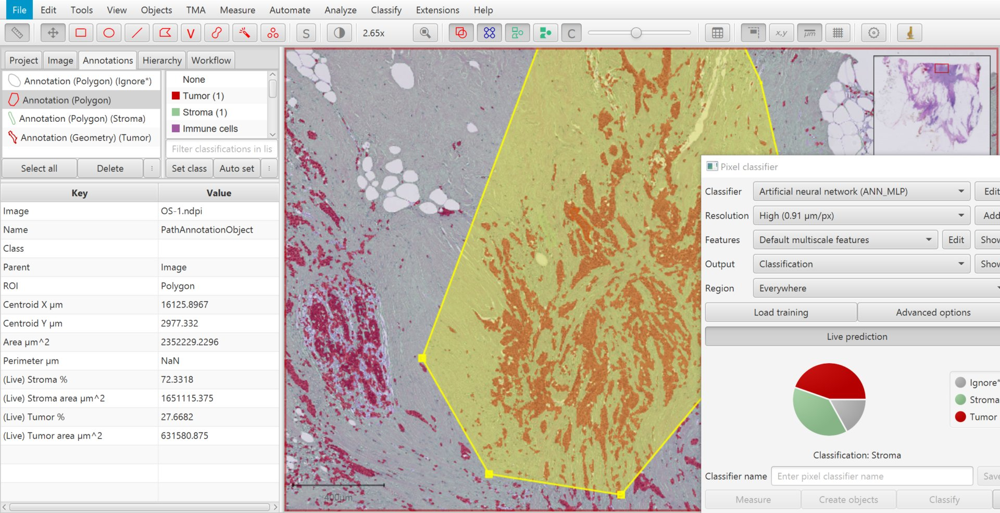
  
  Measuring within a defined region (excluding where the classifier is unreliable).
  
.. tip::
  
  The *Ignore** classification is important here, because *it does not contribute to the area measurements*.
  This means that the above classification computes the *Tumor %* as the proportion of *classified tissue* that is tumor -- not the proportion of the entire annotated area.
  
  See :ref:`Ignored* classifications` for more information.

Handling variation
******************

Variation represents probably the biggest challenge to applying image analysis and machine learning in practice.

It is quite unlikely that a classifier trained on a single image will perform very well on other images: it might easily be thwarted by even small variations, be those in staining, biology, imaging or something else.

There are two main ways you can train pixel classifiers across images in QuPath:

1. Create a classifier that has been trained upon annotations extracted from multiple images
2. Train using a single image that itself is composed from regions extracted from multiple images

.. tip:: 

  You can also use both approaches: create a classifier trained from annotations made on multiple images composed of pieces extracted from other images...
  

Train from multiple images
==========================

When training a classifier, simply press the :guilabel:`Load training` button, and select the images (within the same project) that you want to use for training.

These should already have been annotated, and these annotations saved within the project.

.. tip::
  
  Be aware that training using multiple images can require much more computational power and memory for QuPath to work with all the training data.
  
  This makes it *even more important* to create small and diverse annotations.

Create a training image
=======================

You can create a training image composed of pieces from other images within a project first by selecting the pieces you want.
You do this by annotating rectangles, and assigning them a classification so they can be identified later.

:menuselection:`Classify --> Training images --> Create region annotations` can help with this process.
Make sure that you save the data when you have made your annotations (i.e. :menuselection:`File --> Save`).

.. .. figure:: images/pixel_region_dialog.png
..   :class: shadow-image
..   :align: center
..   :width: 35%
  
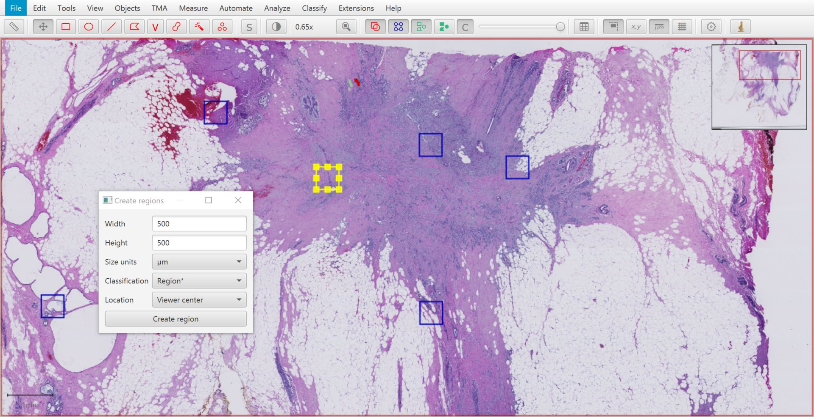

Then you can run :menuselection:`Classify --> Training images --> Create training image` and select the classification you used when annotating.

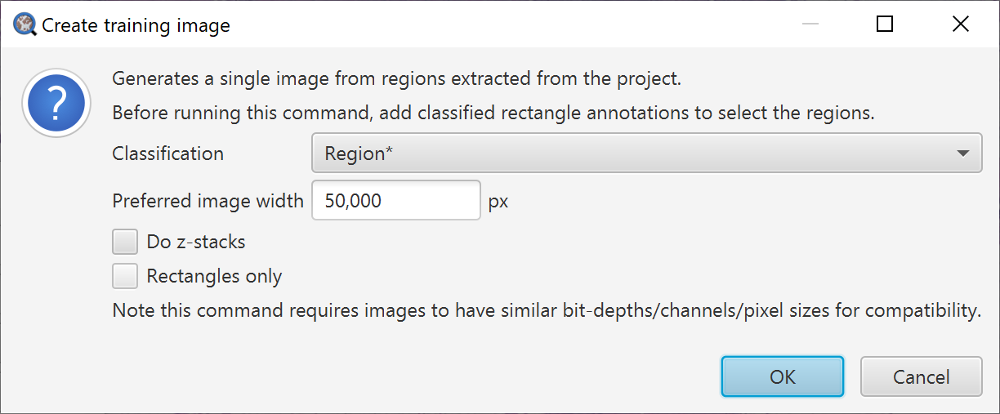

This will go through the images in your project, and extract annotations that have a specific classification -- and merge these together to form a single image, adding this image to your project.

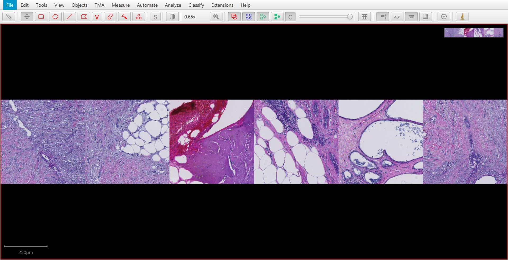
  
  A training image, created by stitching annotated regions together.

.. tip::
  
  The training image is not actually written to a new image file: rather, the pixels are still extracted from their original locations.
  
  This can be handy, but might result in poor performance if QuPath needs to read pixels from too many sources.
  In that case, :menuselection:`File --> Export image --> OME TIFF` can be useful to write the training image to a single (pyramidal) file.
