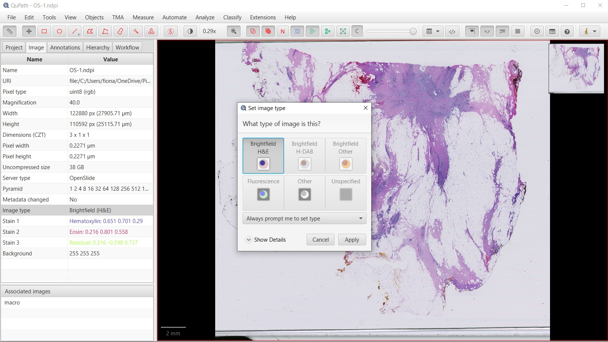
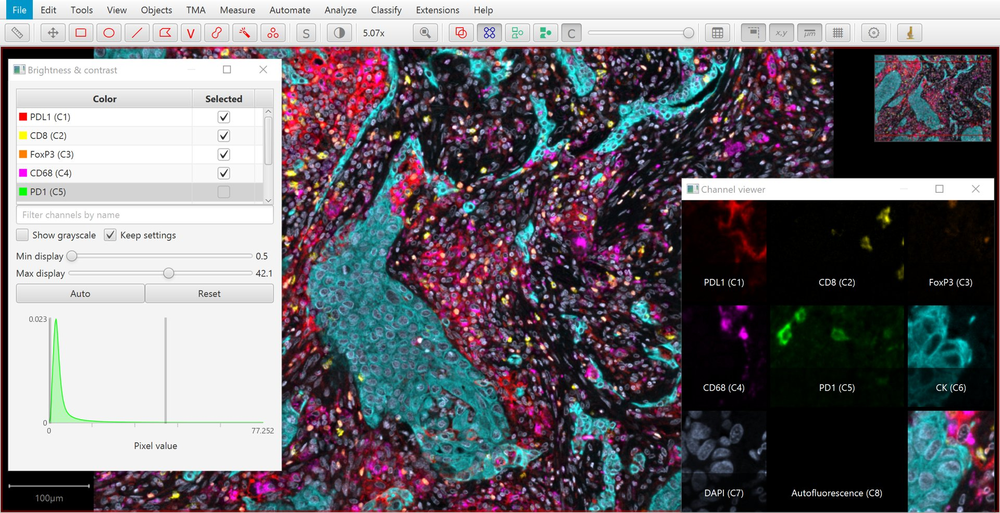
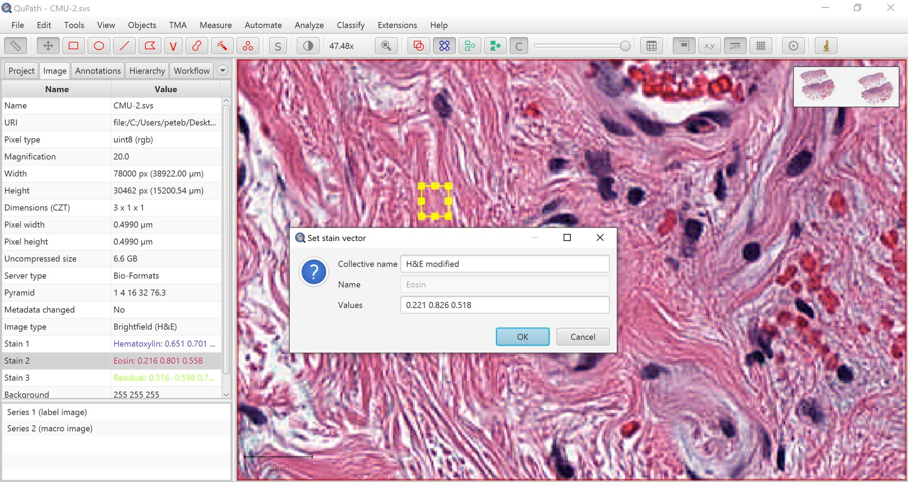
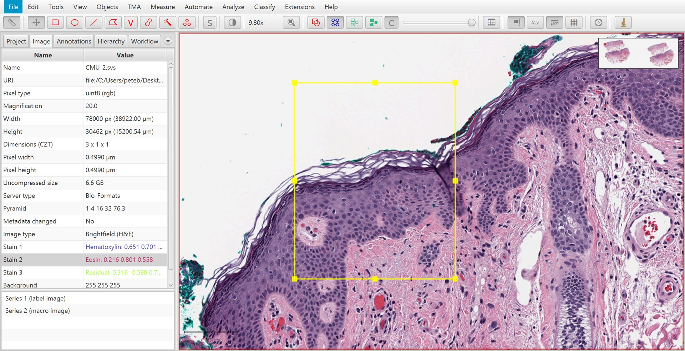
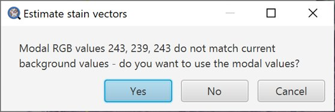
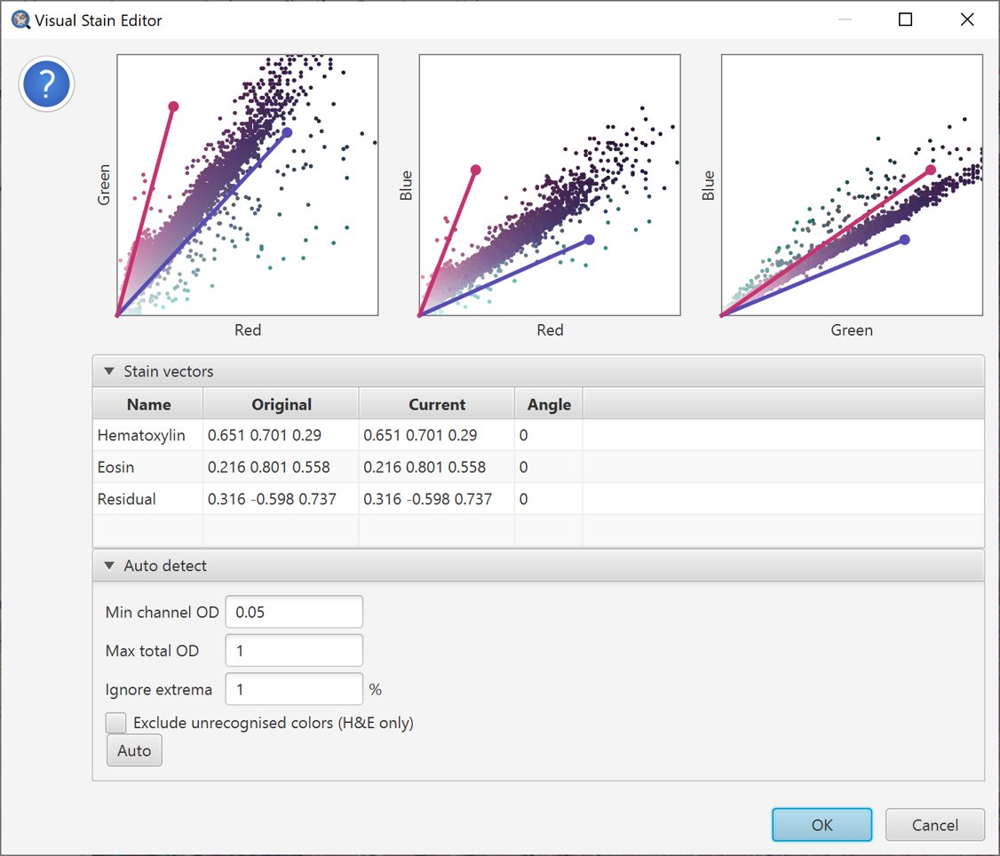
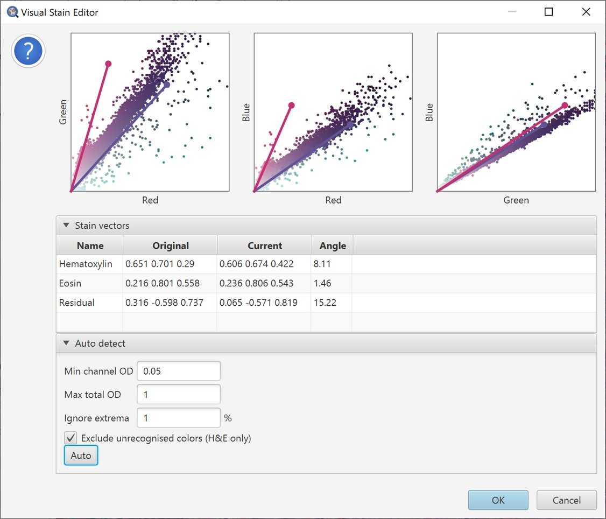

*****************
Separating stains
*****************

.. include:: ../tools.txt

QuPath supports images of different kinds.

Some commands will work on almost any kind of image without complaint, while some need to know a bit more about the image.
This information can be provided by :ref:`setting the image type <Setting the image type>`.

Typically the type will be either *Brightfield* or *Fluorescence*.

  Setting the image type.

.. tip::
  
  You should set the image type to be the closest match that QuPath offers - but it does not need to be exact.
  For imaging mass cytometry, for example, you might find *fluorescence* works ok.
  
  If the type is very wrong, double-click on it to make changes.
  
The main distinction is that *Fluorescence* indicates that the structures of interest have higher values than the background, *Brightfield* indicates that they have lower values (and are generally RGB).

The choice of image type also has an impact on how stains may be separated.
  

Fluorescence images
*******************

In the easier case of fluorescence images, QuPath assumes that each channel of the image corresponds to a different stain or marker of some kind.

Separating these simply involves splitting the channels.

The **Brightness/Contrast** |icon_contrast| command provides an easy way to visualize this separation, in addition to viewing different combinations of channels merged together.

  Brightness/Contrast tool and channel viewer with a multiplexed image.

.. tip:: 
  
  :menuselection:`View --> Mini viewers --> Channel viewer` can be used to visualize all separated channels simultaneously.

.. tip:: 
  
  A quick way to toggle a channel on or off is to simply press a number: :kbd:`1` to toggle the first channel, :kbd:`2` to toggle the second... and so on.

.. admonition:: Multispectral images

  If you require spectral unmixing, this should be performed beforehand.

Brightfield images
******************

Stain separation for brightfield is more difficult. |br|
QuPath uses the *color deconvolution* method introduced by Ruifrok and Johnston:

    * Ruifrok, A C, and D A Johnston. `Quantification of Histochemical Staining by Color Deconvolution <https://pubmed.ncbi.nlm.nih.gov/11531144/>`_. *Analytical and Quantitative Cytology and Histology*, 23 (4): 291–9.
    
Fundamentally, color deconvolution digitally separates up to three stains from an RGB image.
To do so, it is necessary to know:

    * The background values for each RGB channel (red, green and blue)
    * A *stain vector*, which characterizes the color for each stain

The **Brightness/Contrast** |icon_contrast| command can also be used to view this separation.
If only two stains are present, a third 'residual' stain is generated.

.. list-table::
  :header-rows: 0
  :align: center
    
  * - .. image:: images/stains_sep_orig.jpg
    - .. image:: images/stains_sep_h.jpg

  * - Original
    - Hematoxylin
    
  * - .. image:: images/stains_sep_e.jpg
    - .. image:: images/stains_sep_r.jpg

  * - Eosin
    - Residual

.. admonition:: Limits of color deconvolution

  Color deconvolution can be (somewhat) meaningfully applied when there are either **two or three stains** in a brightfield image.
  
  The technique has proven practically useful, but in general the output should **not be interpreted quantitatively**.
  It can help with detecting structures and determining stained areas.
  
  For cases where color deconvolution is not very useful (e.g. because more than three colors need to be considered), other techniques might be needed (e.g. :doc:`pixel classification <pixel_classification>`).

.. tip::
  
  Gabriel Landini has also provided a very useful ImageJ plugin to implement color deconvolution, and has written a description of the uses (and abuses) of the technique at https://blog.bham.ac.uk/intellimic/g-landini-software/colour-deconvolution/
  
  This is **highly** recommended reading, particularly as a warning against over-interpreting measurements made from DAB staining.  

Setting stain vectors
=====================

The stain vectors are key to color deconvolution.
They ought to give a normalized representation of the color of each 'pure' stain in the image, without regard for staining intensity.
A similar color vector characterizing the background encodes what 'no stain' looks like, and also plays an important role in the calculations.

When :ref:`setting the image type <Setting the image type>` to *Brightfield (H&E)*, *Brightfield (H-DAB)* or *Brightfield (Other)*, QuPath will set default stain vectors to characterize hematoxylin, eosin or DAB.
However, you may see better results with some commands (e.g. *Cell detection*) by setting the stain and background vectors explicitly to better match the actual staining in the image.

This requires two steps:
 
  1. Draw a *small* rectangle in an area that is representative of the stain you want to characterize -- or the background.
  2. Double-click on the corresponding stain (or background) under the :guilabel:`Image` tab and follow the prompts to update the vectors.

Repeat this for other stains if needed. 

  Manually selecting a region to set a stain vector.

.. tip::
  
  If you only have two stains, the third 'residual' stain is automatically generated.

Estimating stain vectors
========================

When setting stain vectors manually, each drawn rectangle should be as 'pure' as possible -- any mixture of other stains will reduce the accuracy.
This can be difficult (or impossible) to achieve exactly.

This is not necessarily very problematic in practice *if you heed the warnings not to interpret 'intensity' values generated from color deconvolution quantitatively*.
However, one may naturally wish to be as accurate as possible.

In cases where there are *precisely two* stains involved, :menuselection:`Analyze --> Preprocessing --> Estimate stain vectors` can be used to help improve the stain separation.

Find a representative region
----------------------------

Before running *Estimate stain vectors*, you should first find a representative region containing relatively clear examples of the stains that you want - *along with an area of background, if possible*.
Then draw a rectangle annotation around this region.

  Manually selecting a region to for automated stain estimation.
  
.. tip::
  
  If you choose a very large region, QuPath will have to downsample it to look for the stains.
  Since downsampling means averaging adjacent pixels - which dilutes the useful information - it's best to avoid it as far as possible.
  
  In other words, you should try to choose a small region containing all the information you need.

Run *Estimate stain vectors*
----------------------------

Now you are ready to actually run the :menuselection:`Analyze --> Preprocessing --> Estimate stain vectors` command.

If the background contained in the region you have drawn does not match with the background values QuPath is currently using, it will prompt you whether you want to update the stored values.

Assuming that the region you have drawn *does* contain a representative area of background, you should probably click :guilabel:`Yes`. 
If not, click :guilabel:`No`.

Check scatterplots
------------------

QuPath now builds scatterplots to help view the regionships between the red, green and blue values for each pixel.

Because it's quite hard to work with a 3D scatterplot, QuPath shows this in the form of three separate 2D scatterplots, systematically showing each color plotted against one of the others.

Additionally, QuPath draws colored lines to indicate the existing stain vectors.

  Initial scatterplot for stain estimation.

The scatterplots for the original stain vectors in the example image are shown above.
Ideally, the stain vectors should tightly surround the majority of the scattered points.

However, here that is not the case.
Quite a few points seem to be pulled too far towards the 'green' axis compared to the stain vectors, and the vectors seem too widely separated in the *Red* vs. *Blue* plot.

The vectors do not appear to be wildly inaccurate, but there is some room for improvement.

Pressing the :guilabel:`Auto` button tells QuPath to try to make a better choice of stain vectors based upon the information in the selected region.
They will automatically adjust, and the changes shown in the scatterplots.

.. figure:: images/stains_estimate_scatter_bad.jpg
  :class: shadow-image
  :align: center
  :width: 60%

  Auto-estimate stains.
  
In this case, we can see that there appear to be some unexpected colors (e.g. greenish pixels) -- which have played havoc with the estimate, and potentially made it even worse.

We can try to address this by adjusting parameters.
A natural choice in this case is to select :guilabel:`Exclude unrecognised colors (H&E only)`, which eliminates anything that is not reddish/pinkish/blueish.

  Auto-estimate stains with unrecognized colors removed.

The resulting vector estimates look more reasonable.

.. tip::
  
  QuPath makes its decision based on the parameters given below the plots.
  Hovering the cursor over the parameters will show some more information about what they do, and you can try adjusting them and press :guilabel:`Auto` again to see their effect.

Set a name for the updated stains
---------------------------------

If you are happy with the results, press :guilabel:`OK` and then enter a name to identify your new stain vectors when prompted.

This name can help identify your stains later, e.g. within scripts.
For this reason, is **strongly** recommended to add an informative (and unique) name at this point.

View the results
----------------

Now, the dialog window will disappear and you will be returned to the original image.
Typically this does not look different at all, however the stain vectors in the *Image* panel will be updated to reflect the changes.
This can be visualized using the *Brightness/Contrast* method described above.

.. list-table::
  :header-rows: 0
  :align: center
    
  * - .. image:: images/stains_estimate_orig.jpg
    - .. image:: images/stains_estimate_h.jpg

  * - Original
    - Hematoxylin
    
  * - .. image:: images/stains_estimate_e.jpg
    - .. image:: images/stains_estimate_r.jpg

  * - Eosin
    - Residual

.. tip::
  
  As with fluorescence, typing a number can be used to quickly display a particular stain.
  In this case, :kbd:`1` will show the original image, :kbd:`2` hematoxylin, :kbd:`3` eosin and :kbd:`4` the residual image. 

.. admonition:: Questions & Answers
  
  **Why does *Estimate stain vectors* matter?**

  If the stain vectors are sufficiently wrong, then commands that make use of cell detection (e.g. cell detection) may perform badly, because information from different stains is being mixed up.

  The can also lead to strange or impossible results, such as cells being measured as having 'negative' amounts of particular stains.

  **When should *Estimate stain vectors* be applied?**

  This command should be used at the very first stage of analysis, *before* detecting or measuring anything.

  This is because currently all measurements are made based upon whatever stain vectors were set when the measurement command was run (i.e. the measurements don't automatically update).

  **Do I need to apply *Estimate stain vectors* to every image?**

  No.
  Firstly, running the command at all only makes sense for brightfield images with chromogenic stains (e.g. H&E, or hematoxylin and DAB).

  Secondly, if you have a large image set containing multiple images acquired with similar staining, then you are likely to want to estimate the stain vectors only on one 'typical' image, and then use the same vectors across all images.

Setting stains for a project
============================

Whenever the image type and stain vectors are set, this is recorded in the :doc:`command history <../scripting/workflows>`.
Using this, you can quickly generate a script that should contain two lines, e.g.

.. code-block:: groovy

  setImageType('BRIGHTFIELD_H_DAB');
  setColorDeconvolutionStains('{"Name" : "H-DAB adjusted", "Stain 1" : "Hematoxylin", "Values 1" : "0.65111 0.70119 0.29049 ", "Stain 2" : "DAB", "Values 2" : "0.26917 0.56824 0.77759 ", "Background" : " 255 255 255 "}');

These lines represent the stain information.
This can be applied to all images in a project using :menuselection:`Run --> Run for project`.
