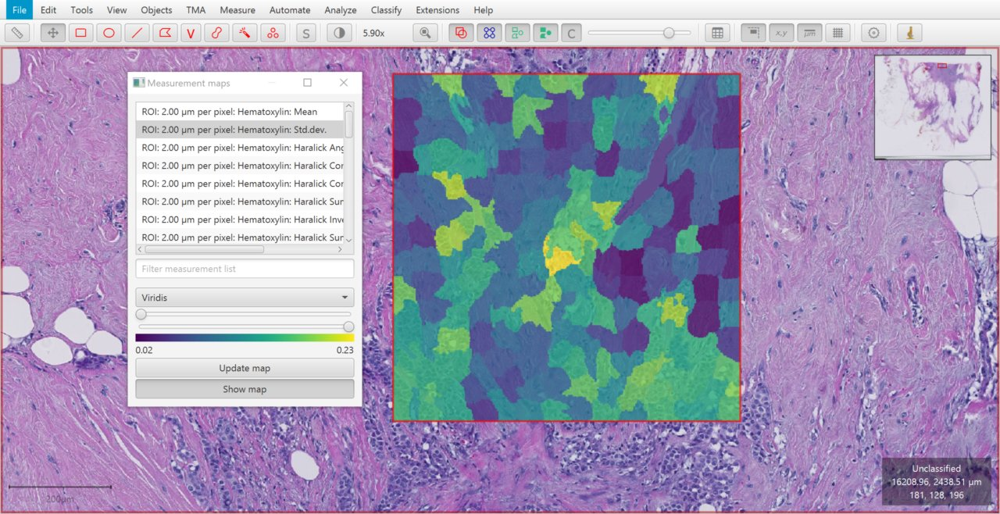
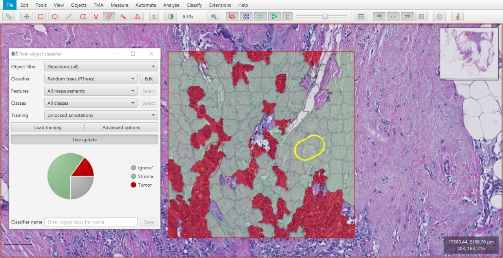

***********
Superpixels
***********

Object classification has been around (in some form) since the first version of QuPath.
Pixel classification is new in v0.2.0.

Before pixel classification was developed, there was an intermediate step that allowed you to apply object classifiers to pixels... kind of.

To do this, you have to first group your pixels into tile objects -- known as *superpixels*.
These superpixels may then be classified, and merged together to form annotations.

.. admonition:: Definitions
  
  In this discussion, the terms 'superpixel' and 'tile' may often be used interchangeably. |br|
  However, to be more precise:
  
  * The general image processing term is *superpixel*.
  * The QuPath object term is *tile*.
  
  A superpixel is represented in QuPath by a tile... which is a special type of detection object.
  
.. note::
  
  This section exists to plug a gap in the documentation, and explain what these options do.
  In practice, superpixels are usually much more awkward to use than pixel classification -- requiring more steps and more computation.
  
  If you can solve your analysis problem without superpixels, then you probably should.
  

Generating superpixels
**********************

QuPath has two superpixel-generating commands:

* :menuselection:`Analyze --> Tiles & superpixels --> DoG superpixel segmentation`
* :menuselection:`Analyze --> Tiles & superpixels --> SLIC superpixel segmentation`

The first is a custom method within QuPath.
The second is based on a publication (with some minor adaptions); you should cite the paper if you use it:

    * Radhakrishna Achanta, Appu Shaji, Kevin Smith, Aurelien Lucchi, Pascal Fua, and Sabine Süsstrunk. `SLIC Superpixels Compared to State-of-the-art Superpixel Methods <https://doi.org/10.1109/TPAMI.2012.120>`_. *IEEE Transactions on Pattern Analysis and Machine Intelligence*, vol. 34, num. 11, p. 2274 - 2282, May 2012.
    
A third command, :menuselection:`Analyze --> Tiles & superpixels --> Create tiles`, creates square tiles within a region.
These can also be used in the same way as superpixels.

Try any/all of these and explore different parameters.

.. list-table::
  :header-rows: 0
  :align: center
    
  * - .. image:: images/superpixels_orig.jpg
    - .. image:: images/superpixels_dog.jpg
    - .. image:: images/superpixels_slic.jpg
    - .. image:: images/superpixels_tiles.jpg

  * - Original
    - DoG superpixels
    - SLIC superpixels
    - Tiles
  

.. tip::

  How you generate your superpixels -- and how big they are -- is important.
  
  Keep in mind that a superpixel can only have *one* classification in the end -- so all pixels within a superpixel should be part of the same structure/region.
  Therefore the (in)accuracy of superpixels will already put a limit on the accuracy of the final result.

Adding features
***************

At first, your superpixels are 'empty': they have none of the features a classifier needs to do its job.

Add some using :menuselection:`Analyze --> Calculate features --> Add intensity features`.

.. tip::
  
  Be sure to select your tiles/superpixels/detections before adding measurements.
  The same command can be used to add measurements to other kinds of object (e.g. annotations) depending upon what is selected -- but that won't help us here.

  .. figure:: images/superpixels_features.jpg
    :class: shadow-image
    :align: center
    :width: 75%

  
  Visualizing measurements added to superpixels using *Add intensity features*.

Training a classifier
*********************

Having created superpixels and given them measurements as features, you can train an object classifier using :doc:`exactly the same process as for cells <cell_classification>`.

  
  Classified superpixels.

Merging tiles
*************

You can generate some measurements from superpixels just as they are -- but be aware that automatically-generated object measurements like *Positive %* will be based upon *counts*, not their areas.
This is one reason why the pixel classifier is usually preferable.

Rather than direct measurement, superpixels are used more often as a method to generate annotations, by merging superpixels with the same classification.

The command to do this is :menuselection:`Analyze --> Tiles & superpixels --> Tile classsifications to annotations`.
