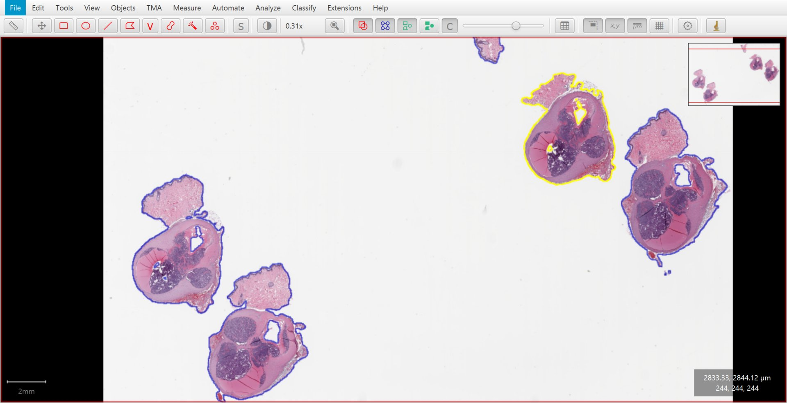
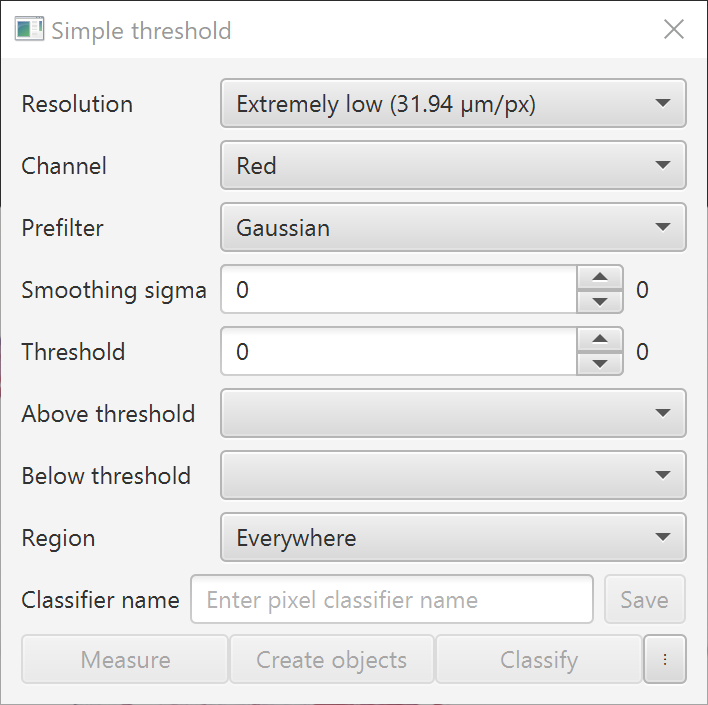
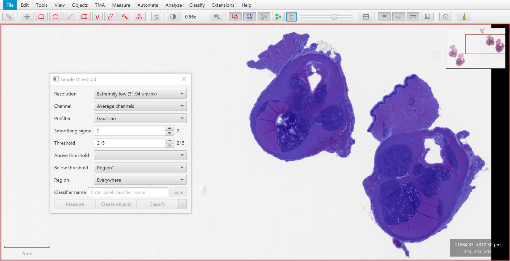
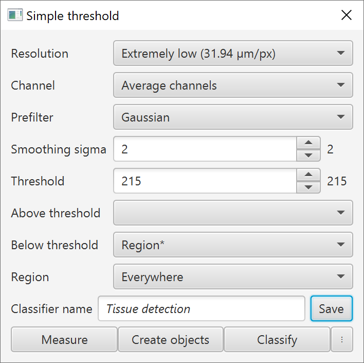
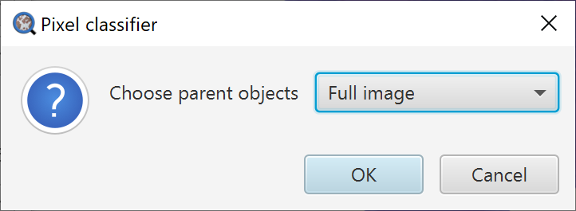
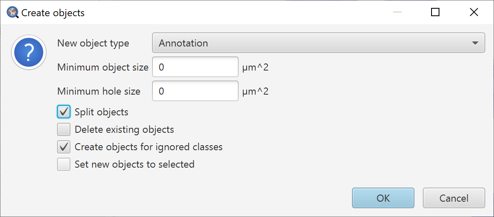

****************
Detecting tissue
****************

Often, we want to create annotations around regions that are *clearly* different from their surroundings: either brighter or darker.

The *Wand* tool helps, but still involves manually drawing.
Setting a *threshold* is usually a better way.

.. admonition:: Why do I need to know this?
  
  Thresholding may become one of the QuPath commands you use most often.
  It provides a way to define regions of interest without needing to manually annotate everything.

Thresholders in QuPath
======================

At its most basic level, thresholding distinguishes between two classes of pixels: those with values above the specified threshold, and those with values below.

However, there are a few things that complicate matters:

* If your image is very large -- which is often the case in QuPath -- you probably don't want to apply the threshold at *every* pixel... there could be billions of them, and it would take a long time, a lot of memory, and result in horribly intricate regions being detected.
* Thresholding (at least simple thresholding) assumes 'one' value being thresholded for each pixel coordinate... but if your image has multiple channels, then there might effectively be multiple values for each coordinate
* Images aren't perfect, and original pixel values are often noisy. Thresholding them directly can give a messy, fragmented result.

A *thresholder* in QuPath is something that can apply a threshold to an image while addressing all of these problems.

Thresholds in action
====================

You can create a thresholder using the *Create thresholder* command.

There are three main purposes for this: to create objects (usually annotations), to add measurements to objects (can be anything), and to classify objects (only detections).

The most common of these is to create objects, so it is the one we will worry about first.

  Tissue detected by thresholding.
  
.. tip::
  
  A *thresholder* in QuPath is a special example of a *pixel classifier*... which is why you'll see both terms appearing.

Adjusting parameters
====================

When running the command, you'll be confronted by the following dialog.

  Dialog box for *Create thresholder*.

You can adjust a number of parameters:

* **Resolution**: Defines the resolution of the image that is thresholded -- and thus how 'blocky' the output is. This will almost always be *lower* than the full resolution of the image. In general, choose the lowest resolution that you consider 'accurate enough'.
* **Channel**: Defines the image channel that will be thresholded. This can also include channels that have been generated computationally, e.g. by color deconvolution, or averaging other channels. Use the *Brightness/Contrast* pane to visualize how some of these channels look; you want one that gives good contrast for what you want to detect.
* **Prefilter & Smoothing sigma**: Defines how the image is smoothed before thresholding. You probably want to choose 'Gaussian' and explore a few sigma values (e.g. 0--5).
* **Threshold**: Defines the threshold; pixels with values above and below can be treated differently. To get an idea of a suitable threshold, move the cursor over the image and check the values shown in the bottom right of the viewer.
* **Above threshold**: Defines the classification of the objects created from pixel values *above* the threshold. You can leave it blank, or choose *'Unclassified'* if you don't want to detect anything above the threshold.
* **Below threshold**: Defines the classification of the objects created from pixel values *below* the threshold. You can leave it blank, or choose *'Unclassified'* if you don't want to detect anything below the threshold.
* **Region**: This doesn't impact the results; rather, it controls how much of the image QuPath thresholds when you are adjusting settings and previewing the results. Rather than thresholding the whole image (especially if your resolution is high), you can restrict QuPath to threshold only around objects or annotations.

When you adjust these settings, you should see an overlay that color-codes pixels according to the above/below threshold classifications.

  Previewing the thresholded image.

.. tip::
  
  You can toggle the overlay on and off by pressing the :guilabel:`C` button in the toolbar (for *classification*... for reasons we shall see later).
  
  You can adjust the overlay opacity using the slider at the top, or by scrolling with the :guilabel:`Ctrl` or :guilabel:`Cmd` key pressed.
  
.. tip::
  
  The settings shown in the screenshot are a reasonable starting point for any brightfield whole slide image -- then adjust the smoothing and threshold if you need to.
  

Saving your thresholder
=======================

Once you are happy with the look of the preview overlay, it's time to do something with it.

However, before you can, QuPath *strongly* encourages you to save your thresholder as a classifier.
This is for your own good, so that the settings can be recorded and :doc:`available for scripting later <../scripting/workflows>`.

Keep QuPath happy by entering a classifier name and pressing :guilabel:`Save`.
The buttons below should become magically activated.

  Saving a thresholder to a project.

.. tip::
  
  Ok, QuPath *will* allow you to apply a threshold without saving your thresholder -- but this option is hidden under the :guilabel:`⋮` button.
  Beware that doing this can thwart attempts to generate scripts using the thresholder later.
  
.. tip::
  
  You can reload a saved thresholder with :menuselection:`Classify --> Pixel classification --> Load pixel classifier`.

Creating objects
================

Now you can finally click on :guilabel:`Create objects`.
But your choices are not over.

You can decide whether to create objects across the full image, within annotated regions, or within the *selected* annotated region.

In this case, because we have no existing annotations, our only option is :guilabel:`Full image`.

  Choose the parent objects within which to threshold, or the full image.

After this, there is just one final set of options to navigate, which offers more fine-grained control over exactly what kind of objects will be created -- and the extent to which small fragments and holes will be cleaned up.

.. tip::
  
  To decipher :guilabel:`Create objects for ignored classes`, see :ref:`Ignored* classifications`.
  
  (Summary: if you want to create objects for a class that ends with an asterisk, select this option.)

The final result should be the detected tissue regions, as classified QuPath annotations.

  The end result of tissue detected by thresholding.
